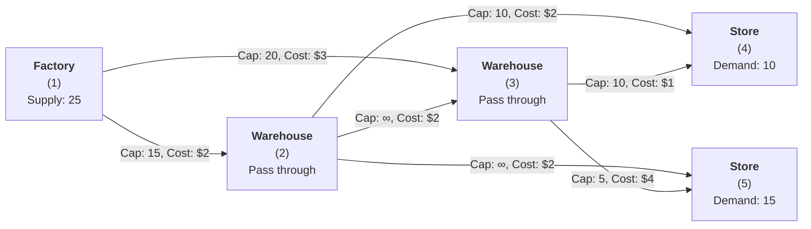
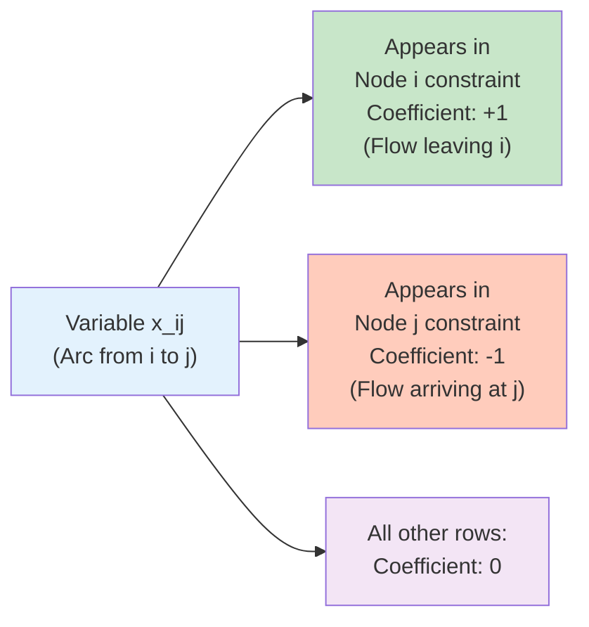
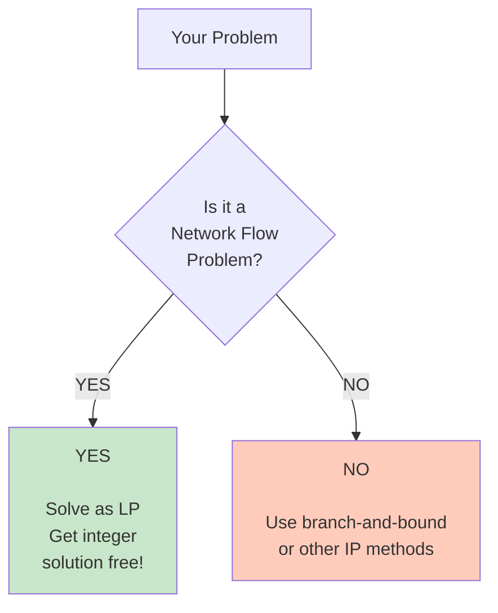
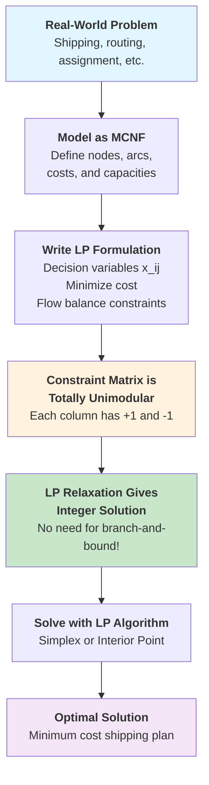

# Network Flow in Integer Programming

## Overview

Network flow problems represent a special class of integer programming problems with unique mathematical properties. Unlike typical integer programs, network flow problems produce integer solutions when solved using linear programming relaxation—a remarkable characteristic that bridges linear and integer programming.

## Fundamental Concepts and Terminology

### Networks and Graphs

A **network** (or **directed graph**) consists of:
- **Nodes** (also called vertices): Points representing locations such as factories, markets, or distribution centers
- **Arcs** (also called edges or links): Connections between nodes representing routes or transportation paths

**Directed vs. Undirected Arcs**: 
- A **directed arc** from node $u$ to node $v$ denoted $(u, v)$ means flow can only move in one direction
- An **undirected arc** between nodes $u$ and $v$ denoted $[u, v]$ allows flow in both directions
- In MCNF problems, all arcs are directed, meaning travel from A to B is distinct from travel from B to A
- Two nodes may have arcs in both directions with different costs and capacities

**Directed Network**: A network whose arcs are all directed. In contrast, an **undirected network** (sometimes called a graph) has undirected arcs.

### Paths, Routes, and Cycles

**Path (or Route)**: A sequence of connected arcs from node $s$ to node $t$:
$$s \to v_1 \to v_2 \to \cdots \to v_k \to t$$

For a path to be valid, each arc must connect the destination of the previous arc to the source of the next arc.

**Simple Path**: A path that does not repeat any nodes (i.e., not a cycle)

**Cycle (or Circuit)**: A path where the starting node and ending node are the same. For example:
$$v_1 \to v_2 \to v_3 \to v_1$$

**Acyclic Network**: A network that contains no cycles. In acyclic networks, you can never return to a previously visited node by following directed arcs.

### Flows, Weights, and Capacities

**Flow**: The action of sending items through an arc. The **flow size** is the number of units sent.

**Network Flow**: A complete flow plan consisting of:
- The amount of flow on each arc
- The collection of all individual arc flows from sources to destinations
- A solution to the routing and shipping plan

Example: Shipping 5 units on arc A, 3 units on arc B, and 2 units on arc C creates a network flow that totals 10 units from source to sink.

**Weight**: A numerical value associated with each arc, typically representing:
- Cost per unit of flow (most common in MCNF)
- Distance or travel time
- Other metrics of effort or expense

**Weighted Network**: A network where every arc has an associated weight or cost.

**Capacity Constraint**: An upper bound on the amount of flow that can traverse an arc. Represents:
- Physical limitations (e.g., truck capacity, pipe diameter)
- Infrastructure constraints (e.g., number of flights available)
- Business constraints (e.g., supplier quotas)

The lower bound on flow is typically zero but can be positive in specialized applications.

**Capacitated Network**: A network where at least one arc has a capacity constraint.

### Supply and Demand

For each node $i$ in the network, we assign a **supply quantity** $b_i$:
- **Supply Node** ($b_i > 0$): A node that generates or has available units to ship (e.g., factories or warehouses)
- **Demand Node** ($b_i < 0$): A node that requires delivery of units (e.g., markets or customers)
- **Transshipment Node** ($b_i = 0$): A node with neither supply nor demand, serving only as an intermediate routing point (e.g., distribution centers)

The fundamental principle: **Total supply must equal total demand**
$$\sum_i b_i = 0$$

## What is Network Flow?

Network flow problems involve routing products, information, or resources through a network from supply nodes to demand nodes while optimizing some objective (cost, time, capacity) subject to constraints.

### Basic Components

**Nodes and Edges**: A network consists of nodes (vertices) connected by directed edges (arcs). In a basic flow problem:
- **Supply Nodes** ($b_i > 0$): Points where products originate (e.g., factories)
- **Demand Nodes** ($b_i < 0$): Points where products are delivered (e.g., markets)
- **Transshipment Nodes** ($b_i = 0$): Intermediate routing points

**Edge Attributes**:
- **Cost** ($c_{ij}$): The price per unit of flow on an arc (e.g., $2 per unit)
- **Capacity** ($u_{ij}$): The maximum amount that can flow through an arc (e.g., 50 units maximum)

### Practical Example

Imagine shipping 100 units from factory S to market T:
- Route via Node A: $2 per unit, capacity of 50 units
- Route via Node B: $4 per unit, capacity of 100 units
- Additional routing options with varying costs and capacities

The challenge is to find the combination of routes that minimizes total shipping cost while respecting all capacity constraints and meeting the demand of 100 units.

## Minimum Cost Network Flow (MCNF)

### Problem Definition

The Minimum Cost Network Flow problem is about finding the cheapest way to send products from suppliers to customers through a network, while respecting limits on each route.

### How to Set Up the Problem: Step by Step

**Step 1: What do we need to decide?**

For every route (arc) in the network, we need to decide: **how many units should we send on this route?**

We call this $x_{ij}$ — the amount flowing from node $i$ to node $j$.

**Step 2: What's our goal?**

Minimize the total cost of shipping everything:
$$\text{Minimize: Total Cost} = \sum \text{(cost per unit)} \times \text{(units sent)}$$

For example: If it costs $2 per unit on route $(1,2)$ and we send $x_{12}$ units, that costs $2 \times x_{12}$.

**Step 3: What are the limits?**

Each route has a **capacity limit** — the maximum amount you can send:
- Route $(1,2)$ can carry at most 15 units
- Route $(1,3)$ can carry at most 20 units
- And so on...

**Step 4: What are the balance rules?**

This is the most important constraint. Here's the simple idea:

**Supply Node (Factory):**
All 25 units produced must leave through the outgoing routes.

**Demand Node (Store):**
Must receive exactly the required units from incoming routes.

**Transshipment Node (Warehouse):**
Whatever comes in must go out—nothing gets lost or stored.

### A Simple Example: The 5-Node Network

Imagine we have:
- **Node 1**: A factory with **25 units to ship out**
- **Nodes 2 and 3**: Warehouses (they just pass things along)
- **Node 4**: A store that **needs 10 units**
- **Node 5**: Another store that **needs 15 units**

**The Network Structure:**



**Arc Details (Capacity, Cost per unit):**
- Node 1 → Node 2: (15, $2)
- Node 1 → Node 3: (20, $3)
- Node 2 → Node 3: (unlimited, $2)
- Node 2 → Node 4: (10, $2)
- Node 2 → Node 5: (unlimited, $2)
- Node 3 → Node 4: (10, $1)
- Node 3 → Node 5: (5, $4)

The network has these routes:
- From factory (1) to warehouse 2: can send up to 15 units, costs $2 per unit
- From factory (1) to warehouse 3: can send up to 20 units, costs $3 per unit
- From warehouse 2 to warehouse 3: can send unlimited, costs $2 per unit
- From warehouse 2 to store 4: can send up to 10 units, costs $2 per unit
- From warehouse 2 to store 5: can send unlimited, costs $2 per unit
- From warehouse 3 to store 4: can send up to 10 units, costs $1 per unit
- From warehouse 3 to store 5: can send up to 5 units, costs $4 per unit

**The formulation**:

*What we're minimizing (total cost)*:
$$2x_{12} + 3x_{13} + 2x_{23} + 2x_{24} + 2x_{25} + 1x_{34} + 4x_{35}$$

*The constraints*:

**Capacity limits** (can't send more than capacity):
- $x_{12} \leq 15$, $x_{13} \leq 20$, $x_{24} \leq 10$, $x_{34} \leq 10$, $x_{35} \leq 5$

**Balance constraints** (everything is conserved):

- **Node 1 (factory)**: All 25 units must leave
  $$x_{12} + x_{13} = 25$$

- **Node 2 (warehouse)**: Whatever comes in must go out
  $$x_{12} = x_{23} + x_{24} + x_{25}$$

- **Node 3 (warehouse)**: Whatever comes in must go out
  $$x_{13} + x_{23} = x_{34} + x_{35}$$

- **Node 4 (store)**: Must receive exactly 10 units
  $$x_{24} + x_{34} = 10$$

- **Node 5 (store)**: Must receive exactly 15 units
  $$x_{25} + x_{35} = 15$$

**Why is this simple?**

Each constraint just says:
- Supply nodes: "Ship out everything you have"
- Demand nodes: "Receive everything you need"
- Middle nodes: "Don't lose anything—what comes in goes out"

That's it! The solver finds the cheapest way to make all these balance equations work while respecting the capacity limits.

### The Complete LP Formulation (Written Out in Full)

Here's what all these constraints look like when we write them all together:

**Minimize:**

$$2x_{12} + 3x_{13} + 2x_{23} + 2x_{24} + 2x_{25} + x_{34} + 4x_{35}$$

**Subject to (Flow Balance Constraints):**

$$x_{12} + x_{13} = 25$$

$$-x_{12} + x_{23} + x_{24} + x_{25} = 0$$

$$-x_{13} - x_{23} + x_{34} + x_{35} = 0$$

$$-x_{24} - x_{34} = -10$$

$$-x_{25} - x_{35} = -15$$

**Capacity Constraints:**

$$0 \leq x_{ij} \leq u_{ij} \quad \forall \text{ arcs}$$

**Notice the patterns:**

**1. Number of equality constraints = Number of nodes**
- 5 nodes → 5 constraints
- Each constraint represents one node's balance rule

**2. Number of variables = Number of arcs**
- 7 decision variables ($x_{12}$ through $x_{35}$) → 7 arcs
- Each variable represents the flow on one route

**3. The Special Structure: Every variable appears in EXACTLY TWO constraints, with coefficients $+1$ and $-1$**

Let's look at a few examples:

- **Variable $x_{12}$** (flow from node 1 to node 2):
  - Node 1 constraint: coefficient $+1$ (leaving node 1)
  - Node 2 constraint: coefficient $-1$ (arriving at node 2)
  - Appears in no other constraints

- **Variable $x_{34}$** (flow from node 3 to node 4):
  - Node 3 constraint: coefficient $+1$ (leaving node 3)
  - Node 4 constraint: coefficient $-1$ (arriving at node 4)
  - Appears in no other constraints

- **Variable $x_{25}$** (flow from node 2 to node 5):
  - Node 2 constraint: coefficient $+1$ (leaving node 2)
  - Node 5 constraint: coefficient $-1$ (arriving at node 5)
  - Appears in no other constraints

**Why does this always happen?** Because each arc connects exactly two nodes:
- One node where flow leaves it ($+1$)
- One node where flow arrives ($-1$)
- No arc can involve a third node!

This structural pattern is **fundamental to network flow problems** and is not a coincidence. It's **always true** for MCNF formulations.

### Visual Representation of the Constraint Matrix

Here's how the constraint matrix looks. Each **row** is a constraint (node), each **column** is a variable (arc):

```
                x₁₂  x₁₃  x₂₃  x₂₄  x₂₅  x₃₄  x₃₅ | RHS
    ────────────────────────────────────────────────────
    Node 1:    +1   +1    0    0    0    0    0  | 25
    Node 2:    -1    0   +1   +1   +1    0    0  | 0
    Node 3:     0   -1   -1    0    0   +1   +1  | 0
    Node 4:     0    0    0   -1    0   -1    0  | -10
    Node 5:     0    0    0    0   -1    0   -1  | -15
```

**The Critical Pattern:** Look at each column (each variable):



**Why this pattern is crucial:**
- Each arc connects exactly TWO nodes
- Flow leaving one node (+1)
- Flow arriving at another node (-1)
- No arc involves a third node (all zeros elsewhere)

This structure is called **Totally Unimodular (TU)** and is the mathematical key to why MCNF problems have integer solutions!

### A Remarkable Structural Property

The MCNF LP formulation has a unique and special structure in its flow balance constraint matrix. When we examine the constraint matrix formed by the flow balance equations only:

**Key Observation**: Each variable $x_{ij}$ (representing flow on arc $(i,j)$) appears in exactly **two** flow balance constraints:
- One constraint for the originating node $i$ with coefficient $+1$ (outgoing flow)
- One constraint for the receiving node $j$ with coefficient $-1$ (incoming flow)

For example, variable $x_{25}$ (flow from node 2 to node 5):
- Appears in Node 2's constraint with coefficient $+1$ (shipping out)
- Appears in Node 5's constraint with coefficient $-1$ (shipping in)

This is **not a coincidence**—it is a fundamental property of flow networks:

$$\text{Each arc connects exactly two nodes} \implies \text{Each variable appears in exactly two equations}$$

### Constraint Matrix Structure

When written in matrix form with rows as nodes (constraints) and columns as arcs (variables), the flow balance constraint matrix has the following property:

$$\text{Every column contains exactly one } +1 \text{ and exactly one } -1 \text{, and zeros elsewhere}$$

This special structure is called **totally unimodular** and is the key reason why MCNF exhibits the remarkable integer property discussed in the introduction.

### LP vs. Integer Program

**Important Note**: When we formulate MCNF as shown above without requiring $x_{ij}$ to be integers, we have a **linear programming formulation**. This is a true LP problem solvable by standard LP algorithms.

However, MCNF can also be viewed as an **integer program** if we require:
$$x_{ij} \in \mathbb{Z}_+ \quad \forall \text{ arc } (i,j)$$

The remarkable fact is that the LP relaxation of this IP always yields integer-valued solutions, making the integer requirement redundant for solving purposes.

## Special Classes of Network Flow Problems

Network flow encompasses several important problem variants:

### 1. Maximum Flow Problem
**Objective**: Maximize the total flow from source to sink subject to capacity constraints

**Application**: Determining maximum data transmission rate through a network, or maximum production throughput in a supply chain

### 2. Shortest Path Problem
**Objective**: Find the minimum-cost path from source to sink, ignoring capacity constraints

**Application**: Navigation systems, routing protocols, finding the cheapest transportation route

### 3. Transportation Problem
**Setting**: Multiple suppliers, multiple customers, with defined supply and demand quantities

**Objective**: Minimize total transportation cost while satisfying all supplies and demands

**Application**: Distribution networks, manufacturing logistics

### 4. Transshipment Problem
**Extension**: Intermediate nodes can both receive and redistribute goods

**Application**: Hub-and-spoke logistics networks, supply chain optimization

### 5. Assignment Problem
**Setting**: Matching n workers to n tasks on a one-to-one basis

**Objective**: Minimize total cost while assigning each worker to exactly one task

**Application**: Job allocation, project scheduling, matching problems

## The Remarkable Integer Property

### Key Insight

MCNF problems have an exceptional property: **When formulated as integer programs and solved using linear programming relaxation, the optimal solution is always integer-valued.**

This is extraordinary because:
- Most integer programs, when relaxed to linear programs, yield fractional solutions
- Fractional solutions require branch-and-bound algorithms to find integer solutions
- MCNF problems bypass this complexity entirely

### Why This Matters

1. **Computational Efficiency**: LP solvers can be used directly without integer-specific algorithms
2. **Theoretical Connection**: Demonstrates a deep link between linear and integer optimization
3. **Practical Impact**: Large-scale network problems become computationally tractable

## Total Unimodularity: Why Network Flow Problems Have Integer Solutions

### The Problem We're Solving

**In most integer programs:** You set $x_{ij}$ to be integers, solve it, and get **fractional answers** like $x_{12} = 3.7$. You need branch-and-bound to get integers.

**In network flow problems:** You set $x_{ij}$ to be integers, but **you automatically get integers**! No branch-and-bound needed. Why?

**Answer:** The constraint matrix is **totally unimodular (TU)**. When this happens, you get integer solutions "for free."

### A Simple Concrete Example

Let's compare two LP problems and see the difference.

**Problem 1: Regular LP (NOT totally unimodular)**

Minimize: $2x_1 + 3x_2$

Subject to:
- $2x_1 + 3x_2 = 10$
- $x_1, x_2 \geq 0$

The constraint matrix is:

```
A = [ 2   3 ]
```

**Solving this LP:** The solution is $x_1 = 5, x_2 = 0$ or $x_1 = 0, x_2 = 3.33$ or $x_1 = 2.5, x_2 = 1.67$, etc.

If we insist $x_1, x_2$ must be integers, we need to search: only $x_1 = 5, x_2 = 0$ works.

---

**Problem 2: Network Flow LP (Totally unimodular)**

Minimize: $2x_{12} + 3x_{13}$

Subject to (flow balance):
- Node 1: $x_{12} + x_{13} = 5$
- Node 2: $-x_{12} = -2$
- Node 3: $-x_{13} = -3$

The constraint matrix is:

```
    x₁₂  x₁₃
A = [ 1    1 ]  (Node 1)
    [-1    0 ]  (Node 2)
    [ 0   -1 ]  (Node 3)
```

**Solving this LP:** The solution is automatically $x_{12} = 2, x_{13} = 3$ (all integers!)

Even without asking for integers, the LP solver gives you integers!

### Why Does This Happen? The Pattern

Look at the constraint matrix:

```
    x₁₂  x₁₃
A = [ 1    1 ]  (Node 1)
    [-1    0 ]  (Node 2)
    [ 0   -1 ]  (Node 3)
```

**The special structure:**
- Column 1 ($x_{12}$): has a $+1$ in row 1 and $-1$ in row 2, zeros elsewhere
- Column 2 ($x_{13}$): has a $+1$ in row 1 and $-1$ in row 3, zeros elsewhere

**Each variable (column) has:**
- Exactly ONE $+1$ (where it leaves a node)
- Exactly ONE $-1$ (where it arrives at a node)
- All other entries are ZERO

This special structure is what makes the matrix "totally unimodular."

### What Does "Totally Unimodular" Actually Mean? (Simple Version)

**Unimodular:** A square matrix with determinant $\pm 1$ (not 2, not 0.5, just $+1$ or $-1$)

**Totally Unimodular:** Every square piece of the matrix is unimodular


# Understanding Total Unimodularity (TU) — Proper, Simplex-Accurate Explanation

This explanation avoids the common but incorrect shortcut (x = A^{-1}b) and instead uses the **correct simplex interpretation**. It shows why **total unimodularity guarantees integer solutions** for linear programs with integer right-hand sides.

---

## 1. How Simplex Actually Computes a Solution

In a linear program of the form:

[
Ax = b, \quad x \ge 0,
]

simplex does **not** compute (x = A^{-1}b). Instead, it works by selecting a **basis**.

### A basis is:

* A set of (m) columns of (A) (where (A) has (m) constraints)
* Forming a square, invertible matrix (B)

### Simplex computes:

[
x_B = B^{-1} b, \qquad x_N = 0.
]
Where:

* (x_B) are the **basic variables** (one per column in the basis)
* (x_N) are **nonbasic variables**, set to zero

This is how every basic feasible solution is obtained.

---

## 2. Why Determinants Matter

Now consider a basis matrix:

[
B = \begin{bmatrix} a & b \ c & d \end{bmatrix}.
]

Its inverse is:

[
B^{-1} = \frac{1}{\det(B)}
\begin{bmatrix}
d & -b \
-c & a
\end{bmatrix}.
]

### Two key observations:

1. **The numerator is always an integer matrix** (because it contains only sums and products of the entries of (B))
2. **All fractions come only from the denominator** — the determinant

So:

* If (\det(B) = \pm 1), then (B^{-1}) is an **integer matrix**
* If (b) is integer, then (x_B = B^{-1}b) is also integer
* If (\det(B) = 2, 3, 4, 5, \dots**, fractions appear

---

## 3. What "Totally Unimodular" Actually Means

A matrix (A) is **totally unimodular (TU)** if **every square submatrix** (including every possible basis matrix (B)) has determinant:

[
\det(B) \in {-1, 0, +1}.
]

### Why this matters:

If every basis matrix satisfies (\det(B) = \pm 1), then:

* Every (B^{-1}) is an **integer matrix**
* Every basic feasible solution (x_B = B^{-1}b) is **integer (when b is integer)**
* Therefore, **the LP has an integer optimal solution without needing integer programming**

This is the core reason behind integrality in:

* Network flow problems
* Matching problems
* Transportation problems

These models have TU matrices by structure.

---

## 4. Example: Determinant = 1 vs Determinant = 5

### If (\det(B) = 1):

[
B^{-1} =
\begin{bmatrix}
d & -b \
-c & a
\end{bmatrix}
]
All integer entries.

### If (\det(B) = 5):

[
B^{-1} =
\frac{1}{5}
\begin{bmatrix}
d & -b \
-c & a
\end{bmatrix}
]
Fractions appear → (x_B) may be fractional even if (b) is integer.

This small 2×2 example demonstrates the general principle.

---

## 5. Final Summary (Simplex-Correct)

| Concept          | Meaning                               |
| ---------------- | ------------------------------------- |
| Simplex computes | (x_B = B^{-1} b), not (A^{-1}b)       |
| TU matrix        | Every basis has determinant ±1        |
| Determinant ±1   | Basis inverse is integer              |
| Integer (b)      | Produces integer basic solutions      |
| Result           | The LP solution is guaranteed integer |

Total unimodularity is therefore a **structural guarantee** of integrality, derived directly from how simplex computes basic feasible solutions using basis inverses.

If every basis keeps you in the integer lattice, the entire LP stays integer.

---

If you'd like, I can also create a **visual diagram**, a **geometric interpretation**, or a **PhD-level explanation** of TU and integrality.


**Why does this matter?** When solving linear programs with simplex, we compute:
$$x = A^{-1} b$$

If the determinant of $A$ is $\pm 1$, then $A^{-1}$ has nice integer properties, and $x$ stays integer!

### Easy Example: Checking Unimodularity

**Example 1: Simple $2 \times 2$ matrix**

```
M = [ 2  3 ]
    [ 1  4 ]
```

$\det(M) = 2 \cdot 4 - 3 \cdot 1 = 8 - 3 = 5$

Not unimodular! (Determinant is 5, not $\pm 1$)

**Example 2: Network flow $2 \times 2$ matrix**

```
M = [ 1   1 ]
    [-1   0 ]
```

$\det(M) = 1 \cdot 0 - 1 \cdot (-1) = 0 + 1 = 1$

Unimodular! (Determinant is exactly $+1$)

### The Magic Formula (Don't Memorize, Just Understand)

In the simplex method, the solution is computed as:

$$x = A^{-1} b$$

For a $2 \times 2$ matrix:

$$A^{-1} = \frac{1}{\det(A)} \begin{bmatrix} d & -b \\ -c & a \end{bmatrix}$$

**When $\det(A) = 1$:**

```
A⁻¹ = [ d  -b ]
      [-c   a ]
```

All entries are integers! So if $b$ is integer, then $x = A^{-1} b$ is also integer.

**When $\det(A) = 5$:**

```
A⁻¹ = (1/5) [ d  -b ]
            [-c   a ]
```

Now you divide by 5, getting fractions. So $x$ can be fractional.

### Why Network Flow Matrices Are Always Totally Unimodular

**The key insight:** Each arc connects exactly TWO nodes.

When you write the flow balance equations:
- Column for arc $(i,j)$ has $+1$ in row $i$ (flow out of $i$)
- Column for arc $(i,j)$ has $-1$ in row $j$ (flow into $j$)
- All other entries are $0$

This structure (called **network structure**) is ALWAYS totally unimodular!

It's a mathematical fact: If you build a matrix from a network like this, it's automatically TU.

### The Golden Rule: Get Integers For Free!

**IF your problem is a network flow problem:**
- Supplies and capacities are all integers
- You use the standard network formulation

**THEN:**
- Solve it as an LP (no integers required!)
- The solution will automatically be integer
- No branch-and-bound needed
- Much faster to solve!

### Real-World Implication



**The bottom line:** Network flow problems are special because their constraint matrix structure automatically guarantees integer solutions. You don't need to ask for integers—you get them automatically!

## Why Network Flow Matters

Network flow problems appear in diverse applications beyond logistics:

- **Telecommunications**: Routing data packets through networks
- **Supply Chain**: Optimizing distribution networks
- **Manufacturing**: Production planning and scheduling
- **Finance**: Cash flow management
- **Biomedical**: Organ transplant matching
- **Sports**: Tournament scheduling

A single network flow model can represent problems from vastly different domains through appropriate interpretation of nodes, edges, costs, and capacities.

## Course Focus

While network flow could easily constitute an entire semester-long course, this module focuses on:

1. **Formal Definitions**: Understanding the structure of various network flow problems
2. **Theoretical Properties**: Why MCNF problems yield integer solutions naturally
3. **Fundamental Algorithms**: Core solution methods and their intuition
4. **Problem Recognition**: Identifying when a real-world problem can be modeled as network flow

Understanding these foundations enables you to recognize network flow structure in complex problems and leverage highly efficient specialized algorithms rather than treating them as generic integer programs.

## Key Takeaways

- Network flow problems model the routing of resources through networks with costs and capacities
- Minimum Cost Network Flow is the most general form, encompassing maximum flow, shortest path, and assignment problems
- MCNF problems are integer programs that always yield integer LP solutions
- This exceptional property results from total unimodularity of the constraint matrix
- Network flow appears in applications across logistics, telecommunications, manufacturing, and beyond

## The Big Picture: From Problem to Solution



---

**The Magic:** Unlike most integer programs that require branch-and-bound or other IP algorithms, MCNF problems can be solved directly as LPs because the totally unimodular structure **guarantees integer solutions automatically**!
