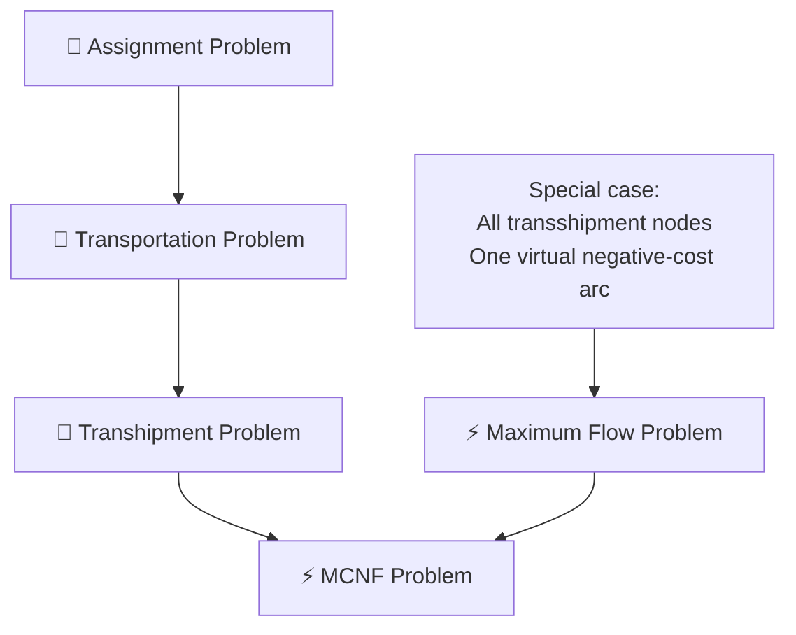

# ⚡ Maximum Flow Problem: Complete Guide

> A comprehensive guide to maximum flow problems with mathematical formulations, algorithms, and real-world applications in network capacity planning and resource allocation.

[](https://github.com)
[](https://github.com)
[](https://github.com)

## 📋 Table of Contents

| Section | Topic | Key Concepts |
|---------|-------|-------------|
| 1️⃣ | [Problem Definition](#1️⃣-problem-definition) | Capacity, Flow, Source-Sink |
| 2️⃣ | [Mathematical Formulation](#2️⃣-mathematical-formulation) | MCNF reduction, Virtual arc |
| 3️⃣ | [Connection to MCNF](#3️⃣-connection-to-mcnf) | Negative cost transformation |
| 4️⃣ | [Solving Algorithms](#4️⃣-solving-algorithms) | Ford-Fulkerson, Push-Relabel |
| 5️⃣ | [Real-World Applications](#5️⃣-real-world-applications) | Network capacity, Emergency evacuation |
| 6️⃣ | [Mathematical Properties](#6️⃣-mathematical-properties) | Max-flow min-cut theorem |

---

## 📝 Variable Notation Guide

### 🎯 **Key Variables (VERY Different from Shortest Path!)**

| **Variable** | **Meaning** | **Example** | **Range** |
|--------------|-------------|-------------|-----------|
| $u_{ij}$ | **CAPACITY** of arc $(i,j)$ (NOT distance!) | $u_{12} = 10$ means "max 10 units through arc 1→2" | $\geq 0$ |
| $X_{ij}$ | **ACTUAL FLOW** through arc $(i,j)$ (NOT binary!) | $X_{23} = 7$ means "7 units flowing 2→3" | $[0, u_{ij}]$ |
| $s$ | Source node (origin) | Where flow originates | Single node |
| $t$ | Sink node (destination) | Where flow terminates | Single node |
| $f$ | **TOTAL FLOW VALUE** | Maximum flow from $s$ to $t$ | $\geq 0$ |

### ⚡ **Max Flow vs Shortest Path: The Key Differences**

| **Aspect** | **Shortest Path** | **Maximum Flow** |
|------------|-------------------|------------------|
| **Goal** | Find cheapest route | Find maximum throughput |
| **Arc Data** | Distance/cost $d_{ij}$ | Capacity limit $u_{ij}$ |
| **Variables** | Binary: $X_{ij} \in \{0,1\}$ | Continuous: $X_{ij} \in [0, u_{ij}]$ |
| **Flow Amount** | Exactly 1 unit | As much as possible |
| **Question** | "Which path to take?" | "How much can we push through?" |
| **Real Example** | "Fastest route to work" | "Max water through pipes" |

---

## 1️⃣ Problem Definition

> **Core Concept:** Push as much "stuff" as possible through a network with capacity limits

### 🚰 **Think of Water Pipes!**

**Imagine:** You have a network of water pipes connecting a reservoir (source) to a city (sink). Each pipe can only handle a certain amount of water per hour (capacity). **Question:** What's the maximum water flow you can achieve?

### 🆚 **How This Differs from Shortest Path**

| **Shortest Path Problem** | **Maximum Flow Problem** |
|---------------------------|-------------------------|
| 🎯 **Goal:** Find the cheapest/fastest route | 🎯 **Goal:** Push maximum amount through network |
| 📏 **Arc Info:** Distance/time/cost | 🚰 **Arc Info:** Capacity (max flow limit) |
| 🔢 **Flow:** Exactly 1 unit | 🔢 **Flow:** As much as possible |
| ❓ **Question:** "Which path should I take?" | ❓ **Question:** "How much can I send?" |
| 🚗 **Example:** GPS navigation | 🚗 **Example:** Traffic capacity planning |

### Problem Statement

**Given:**
- A directed network $G = (V, A)$ with nodes $V$ and arcs $A$
- **Capacity** $u_{ij} \geq 0$ for each arc $(i,j) \in A$ (NOT distance!)
- Source node $s$ and sink node $t$

**Find:** Maximum total flow from $s$ to $t$

### 🌟 Real-World Interpretation

| **Context** | **Source ($s$)** | **Sink ($t$)** | **Capacity ($u_{ij}$)** | **Goal** |
|-------------|------------------|----------------|------------------------|----------|
| **Water Distribution** | Reservoir | City | Pipe capacity | Max water delivery |
| **Traffic Networks** | Highway entrance | Exit | Road capacity | Max vehicle flow |
| **Data Networks** | Server | Client | Bandwidth | Max data transfer |
| **Emergency Evacuation** | Danger zone | Safe area | Route capacity | Max people evacuated |

### 💧 **Concrete Example: Water Distribution**

```
Reservoir(s) --[4]-> Pump1 --[6]-> City(t)
     |                 |              ^
     |[8]             |[2]           |[9]
     |                 v              |
   Pump2 ----[3]-> Pump3 ----[5]-> Pump4
```

**Numbers in [brackets] = pipe capacity (max flow per hour)**

**Question:** What's the maximum water flow (units/hour) from reservoir to city?

**Key Insight:** Unlike shortest path where we send exactly 1 unit, here we want to send AS MUCH AS POSSIBLE!

**Possible Flows:**
- Path 1: s→Pump1→t can carry min(4,6) = 4 units
- Path 2: s→Pump2→Pump3→Pump4→t can carry min(8,3,5,9) = 3 units  
- **Total:** We can potentially send 4+3 = 7 units simultaneously!

---

## 2️⃣ Mathematical Formulation

> **Key Insight:** Transform maximization into minimization using a clever virtual arc trick

### 🔗 **The MCNF Connection: Why We Need a Trick**

**🤔 Problem:** MCNF is a **minimization** problem, but we want to **maximize** flow!

**💡 Brilliant Solution:** The "Virtual Arc Trick"

**Step 1:** Add a virtual arc from sink $t$ back to source $s$
**Step 2:** Give this virtual arc a **negative cost = -1** (we "earn money" for each unit)
**Step 3:** Set all real arcs to have **zero cost**
**Step 4:** Make all nodes **transshipment** (supply/demand = 0)

**🎯 Result:** To minimize cost, we want to maximize flow through the virtual arc!

### 🔄 **The Magic Transformation**

| **Original Max Flow** | **MCNF Transformation** |
|-----------------------|-------------------------|
| Maximize flow $s \to t$ | Minimize negative cost |
| Capacity constraints | Same capacity constraints |
| Source creates flow | All nodes are transshipment |
| Sink consumes flow | Flow cycles: $s \to t \to s$ |
| No costs on arcs | Virtual arc has cost = -1 |

### Decision Variables

**🚰 Real Flow Variables:**
$$X_{ij} = \text{actual flow through arc } (i,j) \quad \forall (i,j) \in A$$

**🔄 Virtual Flow Variable (The Key!):**
$$X_{ts} = \text{flow through virtual arc from } t \text{ back to } s$$

**💡 Key Insight:** $X_{ts}$ = total flow from $s$ to $t$ in the original problem!

### Objective Function

$$\text{Minimize } Z = -X_{ts}$$

**💰 Economic Interpretation:** 
- We "earn $1" for each unit that completes the cycle $s \to t \to s$
- To minimize negative cost, we want to maximize $X_{ts}$
- **Result:** Maximizing $X_{ts}$ = maximizing flow from $s$ to $t$!

**🎯 Simple Translation:** 
- Minimize $-X_{ts}$ = Maximize $X_{ts}$ = Maximize total flow

### Constraints

#### 1. **Flow Conservation at All Nodes:**

**🔄 All nodes are transshipment (including source and sink!):**
$$\sum_{j: (i,j) \in A} X_{ij} - \sum_{k: (k,i) \in A} X_{ki} = 0 \quad \forall i \in V$$

**🎯 What this means:**
- **At source $s$:** Flow out to network = Flow in from virtual arc
  $$\sum_{j} X_{sj} = X_{ts}$$
- **At sink $t$:** Flow in from network = Flow out through virtual arc  
  $$\sum_{k} X_{kt} = X_{ts}$$
- **At other nodes:** Perfect flow conservation (flow in = flow out)

**💡 Key Insight:** The virtual arc "completes the circuit" - whatever flows from $s$ to $t$ must return from $t$ to $s$!

#### 2. **Capacity Constraints:**

**🚰 Real arcs have capacity limits:**
$$0 \leq X_{ij} \leq u_{ij} \quad \forall (i,j) \in A$$

**🔄 Virtual arc has unlimited capacity:**
$$X_{ts} \geq 0 \quad \text{(no limit on return flow)}$$

**💡 Why unlimited?** The virtual arc represents "total flow achieved" - we don't want to artificially limit this!

### 📊 Complete MCNF Formulation

$$\boxed{
\begin{aligned}
\text{Minimize} \quad & -X_{ts} \\
\text{Subject to:} \quad & \sum_{j} X_{ij} - \sum_{k} X_{ki} = 0 \quad \forall i \in V \\
& 0 \leq X_{ij} \leq u_{ij} \quad \forall (i,j) \in A \\
& X_{ts} \geq 0
\end{aligned}
}$$

### 🎯 Why This Works

**Economic Interpretation:**
- We "earn $1" for each unit of flow that completes the cycle $s \to t \to s$
- To maximize earnings, we push as much flow as possible through the network
- The bottleneck determines maximum achievable flow

---

## 3️⃣ Connection to MCNF

### 🔗 Relationship to Network Flow Hierarchy


```mermaid
graph TD
    A["🎯 Assignment Problem"] --> B["🚚 Transportation Problem"]
    B --> C["🏢 Transhipment Problem"]
    C --> D["⚡ MCNF Problem"]
    
    E["⚡ Maximum Flow Problem"] --> D
    E1["Special case:<br/>All transshipment nodes<br/>One virtual negative-cost arc"] --> E
```

### Mathematical Comparison

**General MCNF:**
- Arbitrary supply/demand at nodes: $b_i \in \mathbb{R}$
- General arc costs: $c_{ij} \in \mathbb{R}$
- Capacity bounds: $L_{ij} \leq X_{ij} \leq U_{ij}$

**Maximum Flow as MCNF:**
- All nodes are transshipment: $b_i = 0 \quad \forall i$
- Original arcs have zero cost: $c_{ij} = 0$
- Virtual arc has negative cost: $c_{ts} = -1$
- Simple capacity bounds: $0 \leq X_{ij} \leq u_{ij}$

---

## 4️⃣ Solving Algorithms

### 1. Ford-Fulkerson Algorithm

**Core Idea:** Repeatedly find augmenting paths and push flow until no more paths exist

**Algorithm Steps:**
1. Initialize all flows to zero
2. While there exists an augmenting path from $s$ to $t$:
   - Find path with positive residual capacity
   - Determine bottleneck capacity along path
   - Augment flow by bottleneck amount
3. Return total flow

**Complexity:** $O(f \cdot |A|)$ where $f$ is maximum flow value

### 2. Edmonds-Karp Algorithm

**Improvement:** Use BFS to find shortest augmenting path

**Complexity:** $O(|V| \cdot |A|^2)$

### 3. Push-Relabel Algorithm

**Different Approach:** Maintain flow excess at nodes and push toward sink

**Complexity:** $O(|V|^2 \cdot |A|)$ for basic version, $O(|V|^3)$ for highest-label variant

### 4. Dinic's Algorithm

**Block Flow Approach:** Build layered network and find blocking flows

**Complexity:** $O(|V|^2 \cdot |A|)$

---

## 5️⃣ Real-World Applications

### 1. 🚨 Emergency Evacuation Planning

**Problem:** Evacuate maximum people from disaster zone to safety

**Network Model:**
- **Source:** Disaster area
- **Sink:** Safe zones  
- **Capacities:** Road/bridge limits, building exit rates

**Mathematical Model:**
$$\text{Maximize } \sum_{\text{people evacuated}}$$

Subject to:
- Road capacity constraints
- Building exit rate limits
- Time window constraints

### 2. 🌐 Network Bandwidth Allocation

**Problem:** Maximize data throughput in computer networks

**Applications:**
- Internet backbone capacity planning
- CDN optimization
- Video streaming networks

### 3. 💧 Water Distribution Systems

**Problem:** Design pipe network to maximize water delivery

**Considerations:**
- Pipe diameter determines capacity
- Pressure requirements
- Multiple demand points

---

## 6️⃣ Mathematical Properties

### Max-Flow Min-Cut Theorem

**Fundamental Result:** The maximum flow equals the minimum cut capacity

**Cut Definition:** A cut $(S,T)$ partitions nodes into two sets where $s \in S$ and $t \in T$

**Cut Capacity:** $\text{cap}(S,T) = \sum_{i \in S, j \in T} u_{ij}$

**Theorem:** $\max \text{flow} = \min \text{cut capacity}$

### Total Unimodularity

Maximum flow problems inherit integer solutions from MCNF total unimodularity.

**Result:** If all capacities are integers, maximum flow is integer.

---

## 🔄 Implementation Example

```python
from collections import defaultdict, deque

class MaxFlow:
    def __init__(self):
        self.graph = defaultdict(dict)
    
    def add_edge(self, u, v, capacity):
        """Add edge with capacity"""
        self.graph[u][v] = capacity
        if v not in self.graph[u]:
            self.graph[v][u] = 0  # Reverse edge
    
    def bfs_find_path(self, source, sink, parent):
        """Find augmenting path using BFS"""
        visited = set([source])
        queue = deque([source])
        
        while queue:
            u = queue.popleft()
            
            for v in self.graph[u]:
                if v not in visited and self.graph[u][v] > 0:
                    visited.add(v)
                    parent[v] = u
                    if v == sink:
                        return True
                    queue.append(v)
        return False
    
    def edmonds_karp(self, source, sink):
        """Find maximum flow using Edmonds-Karp algorithm"""
        parent = {}
        max_flow = 0
        
        while self.bfs_find_path(source, sink, parent):
            # Find minimum capacity along path
            path_flow = float('inf')
            s = sink
            
            while s != source:
                path_flow = min(path_flow, self.graph[parent[s]][s])
                s = parent[s]
            
            # Add path flow to overall flow
            max_flow += path_flow
            
            # Update residual capacities
            v = sink
            while v != source:
                u = parent[v]
                self.graph[u][v] -= path_flow
                self.graph[v][u] += path_flow
                v = parent[v]
        
        return max_flow

# Example usage
if __name__ == "__main__":
    mf = MaxFlow()
    
    # Add edges: (from, to, capacity)
    mf.add_edge('s', '1', 4)
    mf.add_edge('s', '2', 8)
    mf.add_edge('1', '3', 6)
    mf.add_edge('1', '2', 2)
    mf.add_edge('2', '4', 3)
    mf.add_edge('3', 't', 9)
    mf.add_edge('3', '4', 5)
    mf.add_edge('4', 't', 7)
    
    max_flow = mf.edmonds_karp('s', 't')
    print(f"Maximum flow: {max_flow}")
```

---

## 📚 References & Further Reading

- **Ford-Fulkerson:** Ford, L. R.; Fulkerson, D. R. (1956). "Maximal flow through a network"
- **Max-Flow Min-Cut:** Ford, L. R.; Fulkerson, D. R. (1962). "Flows in Networks"
- **Push-Relabel:** Goldberg, A. V.; Tarjan, R. E. (1988). "A new approach to the maximum-flow problem"
- **Network Flows:** Ahuja, Magnanti, Orlin (1993). "Network Flows: Theory, Algorithms, and Applications"

---

**Last Updated:** December 2024  
**Maintainer:** Operations Research Guide Contributors
