# 🛣️ Shortest Path Problem: Complete Guide

> A comprehensive guide to shortest path problems with mathematical formulations, algorithms, and real-world applications in navigation, network routing, and logistics optimization.

[](https://github.com)
[](https://github.com)
[](https://github.com)

## 📋 Table of Contents

| Section | Topic | Key Concepts |
|---------|-------|-------------|
| 1️⃣ | [Problem Definition](#1️⃣-problem-definition) | Distance, Path, Optimality |
| 2️⃣ | [Mathematical Formulation](#2️⃣-mathematical-formulation) | MCNF reduction, Flow balance |
| 3️⃣ | [Connection to MCNF](#3️⃣-connection-to-mcnf) | Transshipment special case |
| 4️⃣ | [Solving Algorithms](#4️⃣-solving-algorithms) | Dijkstra, Bellman-Ford, Floyd-Warshall |
| 5️⃣ | [Real-World Applications](#5️⃣-real-world-applications) | GPS navigation, Network routing |
| 6️⃣ | [Mathematical Properties](#6️⃣-mathematical-properties) | Total unimodularity, Optimality |

---

## 📝 Variable Notation Guide

> **Understanding the notation used throughout this document**

### 🎯 **Key Variables**

| **Variable** | **Meaning** | **Example** | **Range** |
|--------------|-------------|-------------|-----------||
| $d_{ij}$ | Distance/time on arc $(i,j)$ | $d_{12} = 5$ means "5 units from node 1 to node 2" | $\geq 0$ |
| $X_{ij}$ | Binary: 1 if arc $(i,j)$ is in shortest path, 0 otherwise | $X_{23} = 1$ means "path uses arc 2→3" | $\{0, 1\}$ |
| $s$ | Source node (starting point) | Node where journey begins | Single node |
| $t$ | Target node (destination) | Node where journey ends | Single node |
| $V$ | Set of all nodes in network | $V = \{1, 2, 3, 4, 5\}$ | Finite set |
| $A$ | Set of all arcs in network | $A = \{(1,2), (2,3), ...\}$ | Finite set |

### 🔤 **Index Variables in Summations**

**The confusing "k" variable explained:**

| **Expression** | **What it means** | **Plain English** |
|----------------|-------------------|-------------------|
| $\sum_{j: (i,j) \in A} X_{ij}$ | Sum over all nodes $j$ where arc $(i,j)$ exists | "All arcs going OUT from node $i$" |
| $\sum_{k: (k,i) \in A} X_{ki}$ | Sum over all nodes $k$ where arc $(k,i)$ exists | "All arcs coming IN to node $i$" |

**Key Point:** $i$, $j$, and $k$ are just **index variables** - they represent node numbers!

### 📊 **Detailed Examples**

**Example Network:** Nodes $\{1, 2, 3\}$ with arcs $\{(1,2), (1,3), (2,3)\}$

**For node 2:**
- **Outgoing arcs:** $\sum_{j: (2,j) \in A} X_{2j} = X_{23}$ (only arc 2→3 exists)
- **Incoming arcs:** $\sum_{k: (k,2) \in A} X_{k2} = X_{12}$ (only arc 1→2 exists)
- **Flow balance:** $X_{23} - X_{12} = 0$ (if node 2 is transshipment)

**For node 1 (if it's the source):**
- **Outgoing arcs:** $\sum_{j: (1,j) \in A} X_{1j} = X_{12} + X_{13}$ 
- **Incoming arcs:** $\sum_{k: (k,1) \in A} X_{k1} = 0$ (no arcs come into node 1)
- **Flow balance:** $(X_{12} + X_{13}) - 0 = 1$ (source sends out 1 unit)

### ⚠️ **Common Confusion Points**

1. **"What does $k$ represent?"** 
   - $k$ is just another node index, like $i$ and $j$
   - In $\sum_{k: (k,i) \in A} X_{ki}$, we're summing over all nodes $k$ that have arcs pointing TO node $i$
   - It's like saying "for all nodes $k$ such that there's an arc from $k$ to $i$"

2. **"Why use different letters?"**
   - **$i$:** The node we're writing the constraint for
   - **$j$:** Nodes that $i$ sends flow TO (outgoing)
   - **$k$:** Nodes that send flow TO $i$ (incoming)
   - Using different letters makes the math clearer!

3. **"Distance vs Cost vs Flow"**
   - **$d_{ij}$:** Physical distance/time (given data)
   - **$X_{ij}$:** Decision variable (0 or 1)
   - **Flow balance:** Mathematical constraint ensuring valid paths

### 🎯 **Memory Aid**

**Think of it like this:**
- **$i$** = "**I**'m the node we're talking about"
- **$j$** = "**J**ust the nodes I send to" (outgoing)
- **$k$** = "**K**oming from these nodes" (incoming)

---

## 1️⃣ Problem Definition

> **Core Concept:** Find the minimum-distance path between two nodes in a network

### Overview

The **Shortest Path Problem** seeks to find the path with minimum total distance (or travel time) between a source node $s$ and a target node $t$ in a weighted network.

**Given:**
- A directed network $G = (V, A)$ with nodes $V$ and arcs $A$
- Distance/weight $d_{ij} \geq 0$ for each arc $(i,j) \in A$
- Source node $s$ and target node $t$

**Find:** The path from $s$ to $t$ that minimizes total distance

### 🌟 Real-World Interpretation

| **Context** | **Source ($s$)** | **Target ($t$)** | **Distance ($d_{ij}$)** | **Goal** |
|-------------|------------------|------------------|------------------------|----------|
| **GPS Navigation** | Current location | Destination | Travel time/distance | Fastest route |
| **Network Routing** | Source computer | Target computer | Transmission delay | Minimize latency |
| **Supply Chain** | Warehouse | Customer | Shipping cost | Cheapest delivery |
| **Emergency Response** | Fire station | Emergency site | Response time | Fastest response |

### Example Network

Consider this network where we want to find the shortest path from node 1 to node 6:

```
    1 ----3----> 2 ----2----> 6
    |            |            ^
    |2           |3           |9
    |            v            |
    3 ----7----> 4 ----8----> 5
```

**Possible paths from 1 to 6:**
- **Path 1:** $1 \to 2 \to 6$ with distance $3 + 2 = 5$
- **Path 2:** $1 \to 3 \to 4 \to 5 \to 6$ with distance $2 + 7 + 8 + 9 = 26$
- **Path 3:** $1 \to 2 \to 4 \to 5 \to 6$ with distance $3 + 3 + 8 + 9 = 23$

**Shortest path:** $1 \to 2 \to 6$ with total distance $= 5$

---

## 2️⃣ Mathematical Formulation

> **Key Insight:** The shortest path problem can be formulated as a special case of MCNF

### 🔗 Connection to Network Flow

**Brilliant Idea:** Send exactly **1 unit of flow** from source $s$ to target $t$, treating distances as costs!

**Flow Interpretation:**
- **Supply:** Node $s$ supplies 1 unit
- **Demand:** Node $t$ demands 1 unit  
- **Transshipment:** All other nodes have zero net flow
- **Arc costs:** Distance $d_{ij}$ becomes cost $c_{ij} = d_{ij}$

### Decision Variables

$$X_{ij} = \begin{cases} 
1 & \text{if arc } (i,j) \text{ is used in the shortest path} \\
0 & \text{otherwise}
\end{cases}$$

### Objective Function

$$\text{Minimize } Z = \sum_{(i,j) \in A} d_{ij} \cdot X_{ij}$$

**Interpretation:** Minimize the total distance of the selected path

### Constraints

#### 1. **Flow Balance at Source Node $s$:**
$$\sum_{j: (s,j) \in A} X_{sj} - \sum_{k: (k,s) \in A} X_{ks} = 1$$

**Variable Breakdown:**
- $\sum_{j: (s,j) \in A} X_{sj}$ = "Sum of all arcs going OUT from source $s$"
- $\sum_{k: (k,s) \in A} X_{ks}$ = "Sum of all arcs coming IN to source $s$"
- $k$ = any node that has an arc pointing to $s$

**Meaning:** Source node sends out 1 unit (net outflow = +1)

#### 2. **Flow Balance at Target Node $t$:**
$$\sum_{k: (k,t) \in A} X_{kt} - \sum_{j: (t,j) \in A} X_{tj} = 1$$

**Variable Breakdown:**
- $\sum_{k: (k,t) \in A} X_{kt}$ = "Sum of all arcs coming IN to target $t$"
- $\sum_{j: (t,j) \in A} X_{tj}$ = "Sum of all arcs going OUT from target $t$"
- $k$ = any node that has an arc pointing to $t$
- $j$ = any node that $t$ has an arc pointing to

**Meaning:** Target node receives 1 unit (net inflow = +1)

#### 3. **Flow Balance at Transshipment Nodes:**
$$\sum_{j: (i,j) \in A} X_{ij} - \sum_{k: (k,i) \in A} X_{ki} = 0 \quad \forall i \in V \setminus \{s,t\}$$

**Variable Breakdown:**
- $\sum_{j: (i,j) \in A} X_{ij}$ = "Sum of all arcs going OUT from node $i$"
- $\sum_{k: (k,i) \in A} X_{ki}$ = "Sum of all arcs coming IN to node $i$"
- $i$ = the specific intermediate node we're writing the constraint for
- $j$ = any node that $i$ sends flow to
- $k$ = any node that sends flow to $i$

**Meaning:** For intermediate nodes, flow in = flow out (conservation)

**Example:** If node 3 is intermediate and has incoming arcs from nodes 1,2 and outgoing arcs to nodes 4,5:
$$X_{34} + X_{35} - (X_{13} + X_{23}) = 0$$
$$(\text{flow out}) - (\text{flow in}) = 0$$

#### 4. **Binary Constraints:**
$$X_{ij} \in \{0, 1\} \quad \forall (i,j) \in A$$

### 📊 Complete Formulation

$$\boxed{
\begin{aligned}
\text{Minimize} \quad & \sum_{(i,j) \in A} d_{ij} \cdot X_{ij} \\
\text{Subject to:} \quad & \sum_{j: (s,j) \in A} X_{sj} - \sum_{k: (k,s) \in A} X_{ks} = 1 \\
& \sum_{k: (k,t) \in A} X_{kt} - \sum_{j: (t,j) \in A} X_{tj} = 1 \\
& \sum_{j: (i,j) \in A} X_{ij} - \sum_{k: (k,i) \in A} X_{ki} = 0 \quad \forall i \neq s,t \\
& X_{ij} \in \{0, 1\} \quad \forall (i,j) \in A
\end{aligned}
}$$

---

## 3️⃣ Connection to MCNF

> **Theoretical Foundation:** Understanding how shortest path fits into the network flow hierarchy

### 🔗 Relationship to Network Flow Problems

```mermaid
graph TD
    A["🎯 Assignment Problem"] --> B["🚚 Transportation Problem"]
    B --> C["🏢 Transhipment Problem"]
    C --> D["⚡ MCNF Problem"]
    
    E["🛣️ Shortest Path Problem"] --> C
    E1["Special case:<br/>1 supply, 1 demand<br/>All quantities = 1"] --> E
```



### Why Shortest Path is a Special Transhipment Problem

| **General Transhipment** | **Shortest Path Special Case** |
|---------------------------|--------------------------------|
| Multiple supply/demand nodes | **Exactly 1 supply node ($s$), 1 demand node ($t$)** |
| Arbitrary supply/demand quantities | **Supply = +1, Demand = -1** |
| General arc costs | **Arc costs = distances $d_{ij}$** |
| Flow conservation at transshipment nodes | **Same: flow in = flow out** |

### Mathematical Comparison

**General Transhipment:**
$$\sum_{j} X_{ij} - \sum_{k} X_{ki} = b_i \quad \text{where } b_i \in \mathbb{R}$$

**Shortest Path:**
$$\sum_{j} X_{ij} - \sum_{k} X_{ki} = \begin{cases}
+1 & \text{if } i = s \\
-1 & \text{if } i = t \\
0 & \text{otherwise}
\end{cases}$$

### 🎯 Key Properties Inherited

1. **Total Unimodularity:** Binary constraints can be relaxed to $X_{ij} \geq 0$
2. **Integer Solutions:** LP relaxation automatically gives integer solutions
3. **Polynomial Solvability:** Can be solved efficiently using network flow algorithms

---

## 4️⃣ Solving Algorithms

> **From theory to practice:** Efficient algorithms for shortest path problems

### 1. Dijkstra's Algorithm (Single-Source, Non-negative Weights)

**Best for:** Finding shortest paths from one source to all other nodes

**Complexity:** $O((|V| + |A|) \log |V|)$ with priority queue

**Algorithm Steps:**
1. Initialize distances: $d[s] = 0$, $d[v] = \infty$ for $v \neq s$
2. Create priority queue with all nodes
3. While queue not empty:
   - Extract node $u$ with minimum distance
   - For each neighbor $v$ of $u$:
     - If $d[u] + w(u,v) < d[v]$: update $d[v] = d[u] + w(u,v)$

**Pseudocode:**
```python
def dijkstra(graph, source):
    dist = {node: float('inf') for node in graph}
    dist[source] = 0
    pq = [(0, source)]
    
    while pq:
        current_dist, u = heappop(pq)
        if current_dist > dist[u]:
            continue
            
        for v, weight in graph[u]:
            distance = dist[u] + weight
            if distance < dist[v]:
                dist[v] = distance
                heappush(pq, (distance, v))
    
    return dist
```

### 2. Bellman-Ford Algorithm (Single-Source, Allows Negative Weights)

**Best for:** Detecting negative cycles and handling negative weights

**Complexity:** $O(|V| \cdot |A|)$

**Algorithm Steps:**
1. Initialize distances: $d[s] = 0$, $d[v] = \infty$ for $v \neq s$
2. Repeat $|V| - 1$ times:
   - For each edge $(u,v)$: relax if $d[u] + w(u,v) < d[v]$
3. Check for negative cycles

### 3. Floyd-Warshall Algorithm (All-Pairs Shortest Paths)

**Best for:** Finding shortest paths between all pairs of nodes

**Complexity:** $O(|V|^3)$

**Algorithm Idea:**
$$d_{ij}^{(k)} = \min(d_{ij}^{(k-1)}, d_{ik}^{(k-1)} + d_{kj}^{(k-1)})$$

### 4. A* Algorithm (Heuristic-Based)

**Best for:** Finding shortest path to specific target with good heuristic

**Key Idea:** Use heuristic function $h(n)$ to guide search toward target

**Complexity:** Depends on heuristic quality

### Algorithm Comparison

| **Algorithm** | **Use Case** | **Time Complexity** | **Space** | **Negative Weights?** |
|---------------|--------------|--------------------|-----------|--------------------|
| **Dijkstra** | Single-source, non-negative | $O((V+A) \log V)$ | $O(V)$ | ❌ No |
| **Bellman-Ford** | Single-source, any weights | $O(V \cdot A)$ | $O(V)$ | ✅ Yes |
| **Floyd-Warshall** | All-pairs | $O(V^3)$ | $O(V^2)$ | ✅ Yes |
| **A*** | Single-target with heuristic | Variable | $O(V)$ | Depends |

---

## 5️⃣ Real-World Applications

> **From algorithms to impact:** How shortest path problems solve real challenges

### 1. 🗺️ GPS Navigation Systems

#### Problem Setup
Find the fastest route from current location to destination considering traffic conditions.

**Network Representation:**
- **Nodes:** Road intersections, highway entrances/exits
- **Arcs:** Road segments between intersections
- **Weights:** Travel time (considering traffic, speed limits, road conditions)

#### Dynamic Considerations
```python
# Real-time weight updates
def update_travel_time(arc, base_time, traffic_factor, weather_factor):
    return base_time * traffic_factor * weather_factor

# Example: Highway segment during rush hour
base_time = 5  # minutes in normal conditions
traffic_factor = 2.5  # 2.5x slower due to traffic
weather_factor = 1.2  # 20% slower due to rain
actual_time = 5 * 2.5 * 1.2 = 15  # minutes
```

#### Mathematical Formulation
$$\text{Minimize } \sum_{(i,j) \in \text{route}} \text{travel\_time}_{ij}(t) \cdot X_{ij}$$

Where $\text{travel\_time}_{ij}(t)$ depends on current time $t$ and traffic conditions.

### 2. 🌐 Internet Packet Routing

#### Problem Setup
Route data packets through network to minimize latency and avoid congestion.

**Network Representation:**
- **Nodes:** Routers, switches, servers
- **Arcs:** Network links (fiber optic, wireless, etc.)
- **Weights:** Transmission delay + queuing delay + processing delay

#### Multi-Objective Optimization
$$\text{Minimize } \sum_{(i,j)} (\alpha \cdot \text{delay}_{ij} + \beta \cdot \text{cost}_{ij} + \gamma \cdot \text{reliability}_{ij}^{-1}) \cdot X_{ij}$$

**Real-World Example: BGP Routing**
```python
# Border Gateway Protocol path selection
def bgp_path_cost(path):
    return (
        100 * path.local_preference +  # Prefer certain providers
        10 * path.as_path_length +     # Shorter AS paths
        1 * path.med                   # Multi-exit discriminator
    )
```

### 3. 🚛 Supply Chain Optimization

#### Problem Setup
Find minimum-cost shipping routes from warehouses to customers.

**Network Representation:**
- **Nodes:** Warehouses, distribution centers, customers
- **Arcs:** Transportation links (truck routes, rail, air)
- **Weights:** Transportation cost per unit

#### Example: E-commerce Delivery
```python
# Amazon-style delivery optimization
def delivery_cost(warehouse, customer, delivery_speed):
    base_cost = distance(warehouse, customer) * cost_per_mile
    speed_multiplier = {
        'standard': 1.0,
        'prime': 1.5,      # Higher cost for faster delivery
        'same_day': 3.0    # Much higher cost for same-day
    }
    return base_cost * speed_multiplier[delivery_speed]
```

### 4. 🚨 Emergency Response Systems

#### Problem Setup
Find fastest routes for emergency vehicles considering traffic and road conditions.

**Dynamic Network Updates:**
- **Real-time traffic data:** Adjust arc weights based on current conditions
- **Road closures:** Remove arcs from network
- **Priority lanes:** Reduce weights for emergency vehicle routes

#### Mathematical Model
$$\text{Minimize } \sum_{(i,j)} \text{response\_time}_{ij} \cdot X_{ij}$$

Subject to:
- **Traffic signal preemption:** Reduce delay at intersections
- **Lane restrictions:** Some arcs only available to emergency vehicles
- **Multiple destinations:** May need to visit multiple emergency sites

### 5. 🎮 Video Game AI Pathfinding

#### Problem Setup
Move game characters efficiently through game world avoiding obstacles.

**A* Algorithm Application:**
```python
def a_star_pathfinding(start, goal, heuristic):
    """
    Find shortest path in game world
    heuristic: estimate of distance to goal (e.g., Euclidean distance)
    """
    open_set = PriorityQueue()
    open_set.put((0, start))
    
    g_score = {start: 0}  # Cost from start
    f_score = {start: heuristic(start, goal)}  # Total estimated cost
    
    while not open_set.empty():
        current = open_set.get()[1]
        
        if current == goal:
            return reconstruct_path(current)
            
        for neighbor in get_neighbors(current):
            tentative_g = g_score[current] + distance(current, neighbor)
            
            if tentative_g < g_score.get(neighbor, float('inf')):
                g_score[neighbor] = tentative_g
                f_score[neighbor] = tentative_g + heuristic(neighbor, goal)
                open_set.put((f_score[neighbor], neighbor))
```

---

## 6️⃣ Mathematical Properties

> **Theoretical foundations:** Why shortest path algorithms work so well

### Total Unimodularity

The constraint matrix for shortest path problems is **totally unimodular**.

#### What This Means

**For most integer programming problems:**
- Relaxing binary constraints $X_{ij} \in \{0,1\}$ to $X_{ij} \geq 0$ can give fractional solutions
- Example: $X_{12} = 0.7$ (use arc 70% of the time - meaningless!)

**For shortest path problems:**
- Due to total unimodularity, LP relaxation gives integer solutions
- **You will NEVER get fractional arc usage!**

#### Mathematical Proof Sketch

**Constraint Matrix Structure:**
- Each column (arc) appears in exactly 2 constraints with coefficients +1 and -1
- Flow conservation creates a special matrix structure
- All square submatrices have determinant ∈ {-1, 0, +1}

**Example for 3-node path $s \to 1 \to t$:**
```
Constraint matrix:
              X_s1  X_1t
Flow at s:     1     0    = 1
Flow at 1:    -1     1    = 0  
Flow at t:     0    -1    = -1
```

### Optimality Conditions

#### Bellman's Principle of Optimality

**Statement:** Any subpath of a shortest path is itself a shortest path.

**Mathematical Expression:**
If shortest path from $s$ to $t$ passes through node $v$, then:
$$d(s,t) = d(s,v) + d(v,t)$$

**Why This Matters:**
- Enables dynamic programming approaches
- Justifies greedy algorithms like Dijkstra's
- Allows decomposition of large problems

#### Dual Problem Interpretation

The shortest path problem has an elegant dual formulation:

**Primal:** Find shortest path from $s$ to $t$
**Dual:** Find node potentials $\pi_i$ such that $\pi_t - \pi_s$ is maximized

**Dual Constraints:**
$$\pi_j - \pi_i \leq d_{ij} \quad \forall (i,j) \in A$$

**Complementary Slackness:**
- If arc $(i,j)$ is in shortest path, then $\pi_j - \pi_i = d_{ij}$
- If $\pi_j - \pi_i < d_{ij}$, then arc $(i,j)$ is not used

### Complexity Analysis

#### Problem Complexity Classes

| **Problem Variant** | **Complexity Class** | **Best Algorithm** |
|---------------------|---------------------|-------------------|
| **Single-source, non-negative** | $O((V+A) \log V)$ | Dijkstra with Fibonacci heap |
| **Single-source, any weights** | $O(VA)$ | Bellman-Ford |
| **All-pairs, dense graph** | $O(V^3)$ | Floyd-Warshall |
| **All-pairs, sparse graph** | $O(V^2 \log V + VA)$ | Johnson's algorithm |

#### Space Complexity

- **Dijkstra:** $O(V)$ for distance array and priority queue
- **Bellman-Ford:** $O(V)$ for distance array
- **Floyd-Warshall:** $O(V^2)$ for distance matrix
- **A*:** $O(V)$ but can be much less with good heuristics

---

## 🔄 Algorithm Implementation Examples

### Python Implementation: Dijkstra's Algorithm

```python
import heapq
from collections import defaultdict

class ShortestPath:
    def __init__(self):
        self.graph = defaultdict(list)
    
    def add_edge(self, u, v, weight):
        """Add weighted edge to graph"""
        self.graph[u].append((v, weight))
    
    def dijkstra(self, start, end=None):
        """
        Find shortest paths from start node
        Returns: dict of {node: (distance, path)}
        """
        # Initialize distances and paths
        distances = {start: 0}
        paths = {start: [start]}
        pq = [(0, start)]
        visited = set()
        
        while pq:
            current_dist, current = heapq.heappop(pq)
            
            if current in visited:
                continue
                
            visited.add(current)
            
            # If we only want path to specific end node
            if end and current == end:
                break
            
            # Check all neighbors
            for neighbor, weight in self.graph[current]:
                distance = current_dist + weight
                
                # If we found a shorter path
                if neighbor not in distances or distance < distances[neighbor]:
                    distances[neighbor] = distance
                    paths[neighbor] = paths[current] + [neighbor]
                    heapq.heappush(pq, (distance, neighbor))
        
        return distances, paths
    
    def get_shortest_path(self, start, end):
        """Get shortest path between two specific nodes"""
        distances, paths = self.dijkstra(start, end)
        
        if end not in distances:
            return None, float('inf')
        
        return paths[end], distances[end]

# Example usage
if __name__ == "__main__":
    # Create the example network from earlier
    sp = ShortestPath()
    
    # Add edges: (from, to, weight)
    sp.add_edge(1, 2, 3)
    sp.add_edge(1, 3, 2)
    sp.add_edge(2, 4, 3)
    sp.add_edge(2, 6, 2)
    sp.add_edge(3, 4, 7)
    sp.add_edge(4, 5, 8)
    sp.add_edge(5, 6, 9)
    
    # Find shortest path from 1 to 6
    path, distance = sp.get_shortest_path(1, 6)
    print(f"Shortest path from 1 to 6: {path}")
    print(f"Total distance: {distance}")
    
    # Output: 
    # Shortest path from 1 to 6: [1, 2, 6]
    # Total distance: 5
```

### MCNF Formulation Implementation

```python
from pulp import *

def shortest_path_mcnf(nodes, arcs, distances, source, target):
    """
    Solve shortest path as MCNF problem
    
    Args:
        nodes: list of node IDs
        arcs: list of (from, to) tuples
        distances: dict of {(from, to): distance}
        source: source node ID
        target: target node ID
    
    Returns:
        optimal_path: list of nodes in shortest path
        total_distance: minimum distance
    """
    
    # Create LP problem
    prob = LpProblem("Shortest_Path_MCNF", LpMinimize)
    
    # Decision variables: X[i,j] = 1 if arc (i,j) is used
    X = {}
    for (i, j) in arcs:
        X[i, j] = LpVariable(f"X_{i}_{j}", cat='Binary')
    
    # Objective function: minimize total distance
    prob += lpSum([distances[i, j] * X[i, j] for (i, j) in arcs])
    
    # Flow balance constraints
    for node in nodes:
        outflow = lpSum([X[node, j] for (i, j) in arcs if i == node])
        inflow = lpSum([X[i, node] for (i, j) in arcs if j == node])
        
        if node == source:
            # Source: net outflow = +1
            prob += outflow - inflow == 1
        elif node == target:
            # Target: net inflow = +1  
            prob += inflow - outflow == 1
        else:
            # Transshipment: flow in = flow out
            prob += outflow - inflow == 0
    
    # Solve the problem
    prob.solve()
    
    # Extract solution
    if prob.status == 1:  # Optimal solution found
        # Find path by following X[i,j] = 1 arcs
        path = [source]
        current = source
        total_dist = 0
        
        while current != target:
            for (i, j) in arcs:
                if i == current and X[i, j].varValue == 1:
                    path.append(j)
                    total_dist += distances[i, j]
                    current = j
                    break
        
        return path, total_dist
    else:
        return None, float('inf')

# Example usage
if __name__ == "__main__":
    # Define network
    nodes = [1, 2, 3, 4, 5, 6]
    arcs = [(1, 2), (1, 3), (2, 4), (2, 6), (3, 4), (4, 5), (5, 6)]
    distances = {
        (1, 2): 3, (1, 3): 2, (2, 4): 3, (2, 6): 2,
        (3, 4): 7, (4, 5): 8, (5, 6): 9
    }
    
    path, distance = shortest_path_mcnf(nodes, arcs, distances, 1, 6)
    print(f"Shortest path: {path}")
    print(f"Total distance: {distance}")
```

---

## 📚 References & Further Reading

- **Dijkstra's Algorithm:** Dijkstra, E. W. (1959). "A note on two problems in connexion with graphs"
- **Network Flows:** Ahuja, Magnanti, Orlin (1993). "Network Flows: Theory, Algorithms, and Applications"
- **Graph Algorithms:** Cormen, Leiserson, Rivest, Stein (2009). "Introduction to Algorithms"
- **A* Algorithm:** Hart, Nilsson, Raphael (1968). "A Formal Basis for the Heuristic Determination of Minimum Cost Paths"

---

## 🤝 Contributing

This guide welcomes improvements! Please submit:
- Additional algorithm implementations
- Real-world case studies
- Performance optimizations
- Visualization examples

---

## 📄 License

This work is licensed under CC BY-SA 4.0. Feel free to use, modify, and share with attribution.

---

**Last Updated:** December 2024  
**Maintainer:** Operations Research Guide Contributors
