# 🎯 Assignment Problem & Network Optimization: Complete Guide

> A comprehensive guide to assignment problems, transportation problems, transhipment problems, and minimum cost network flow (MCNF) with mathematical formulations and real-world applications in healthcare, ride-sharing, and smart cities.

[](https://github.com)
[](https://github.com)
[](https://github.com)

## 📋 Table of Contents

| Section | Topic | Key Concepts |
|---------|-------|-------------|
| 1️⃣ | [Assignment Problem](#assignment-problem) | One-to-one matching, Hungarian Algorithm |
| 2️⃣ | [Transportation Problem](#transportation-problem) | Supply-demand, Multi-unit shipping |
| 3️⃣ | [Transhipment Problem](#transhipment-problem) | Intermediate nodes, Flow balance |
| 4️⃣ | [Minimum Cost Network Flow](#minimum-cost-network-flow) | Capacity constraints, General formulation |
| 5️⃣ | [Real-World Applications](#real-world-applications) | Healthcare, Ride-sharing, Smart cities |
| 6️⃣ | [Mathematical Properties](#mathematical-properties) | Total unimodularity, Feasibility |
| 7️⃣ | [Solving Algorithms](#solving-algorithms) | Complexity analysis, Software tools |

---

## 1️⃣ Assignment Problem

> **Core Concept:** Optimal one-to-one matching between jobs and workers

### Overview

The assignment problem addresses the optimal one-to-one matching between two sets:
- **Jobs** (tasks to be completed)
- **Workers** (resources to perform tasks)

Each job is assigned to exactly one worker, and each worker performs exactly one job. The goal is to minimize total cost.

### Mathematical Formulation

#### Decision Variables

$$X_{ij} \in \{0, 1\} \text{ where:}$$

- $X_{ij} = 1$ if job $i$ is assigned to worker $j$
- $X_{ij} = 0$ otherwise

#### Objective Function

$$\text{Minimize } Z = \sum_{i=1}^{m} \sum_{j=1}^{n} C_{ij} \cdot X_{ij}$$

Where $C_{ij}$ is the cost of assigning job $i$ to worker $j$.

#### Constraints

1. **Each job assigned to exactly one worker:**
   $$\sum_{j=1}^{n} X_{ij} = 1 \quad \forall i \in \{1, 2, \ldots, m\}$$

2. **Each worker performs exactly one job:**
   $$\sum_{i=1}^{m} X_{ij} = 1 \quad \forall j \in \{1, 2, \ldots, n\}$$

3. **Binary constraint:**
   $$X_{ij} \in \{0, 1\} \quad \forall i, j$$

#### Notation

- $m$ = number of jobs
- $n$ = number of workers  
- $C_{ij}$ = cost coefficient for assigning job $i$ to worker $j$

### Case: Unequal Numbers of Jobs and Workers

**Scenario:** More workers than jobs (m < n)

**Solution:** Create virtual jobs with zero cost

Create $n - m$ virtual jobs with cost:
$$C_{ij}^{\text{virtual}} = 0 \quad \forall i \in \{m+1, \ldots, n\}, \forall j$$

**Result:** Unassigned workers are matched to virtual jobs (no real assignment)

---

## 2️⃣ Transportation Problem

> **Core Concept:** Multi-unit shipping from suppliers to consumers with capacity constraints

### 🔗 Connection to Assignment Problem

**Key Insight:** The transportation problem is a **direct generalization** of the assignment problem we just studied!

| **Assignment Problem** | **Transportation Problem** |
|------------------------|-----------------------------|
| Each worker handles **exactly 1 job** | Each factory can supply **multiple units** |
| Each job needs **exactly 1 worker** | Each market can demand **multiple units** |
| Binary variables: $X_{ij} \in \{0,1\}$ | Continuous variables: $X_{ij} \geq 0$ |
| Supply/Demand = 1 for all nodes | Supply/Demand can be any positive value |

**Mathematical Connection:**
- If we set $S_i = 1$ (each factory supplies 1 unit) and $D_j = 1$ (each market demands 1 unit)
- Then $X_{ij}$ becomes binary, and we get back to the assignment problem!

### Overview

The transportation problem extends our assignment framework by allowing **multiple units** to flow between sources and destinations. Instead of one-to-one matching, we now optimize the **quantity** shipped from factories to markets while minimizing total shipping cost.

### Mathematical Formulation

#### Decision Variables

$$X_{ij} = \text{quantity shipped from factory } i \text{ to market } j$$

#### Objective Function

$$\text{Minimize } Z = \sum_{i=1}^{m} \sum_{j=1}^{n} C_{ij} \cdot X_{ij}$$

Where $C_{ij}$ is the unit cost of shipping from factory $i$ to market $j$.

#### Constraints

1. **Supply constraint (factory capacity):**
   $$\sum_{j=1}^{n} X_{ij} = S_i \quad \forall i \in \{1, 2, \ldots, m\}$$
   
   Where $S_i$ is the total supply at factory $i$.

2. **Demand constraint (market requirements):**
   $$\sum_{i=1}^{m} X_{ij} = D_j \quad \forall j \in \{1, 2, \ldots, n\}$$
   
   Where $D_j$ is the total demand at market $j$.

3. **Non-negativity:**
   $$X_{ij} \geq 0 \quad \forall i, j$$

#### 🎯 Why This Generalization Matters

**Real-World Impact:** 
- **Assignment:** "Which nurse treats which patient?" (1-to-1)
- **Transportation:** "How many vaccine doses should each hospital send to each clinic?" (many-to-many)

**Mathematical Elegance:** The assignment problem is a **special case** where:
$$\boxed{
\begin{align}
\text{Assignment} &\rightarrow \text{Transportation} \\
S_i = 1 \quad \forall i &\quad \text{and} \quad D_j = 1 \quad \forall j \\
X_{ij} \in \{0,1\} &\quad \text{becomes} \quad X_{ij} \geq 0
\end{align}
}$$

---

## 3️⃣ Transhipment Problem

> **Core Concept:** Transportation with intermediate redistribution points

### 🔗 Connection to Transportation Problem

**Evolution of Complexity:** We're adding another layer of sophistication to our transportation framework!

| **Transportation Problem** | **Transhipment Problem** |
|----------------------------|---------------------------|
| **Direct shipping only** | **Multi-hop shipping allowed** |
| Factory → Market | Factory → Hub → Market |
| 2 types of nodes: Supply & Demand | 3 types of nodes: Supply, Demand & **Transhipment** |
| Simple flow: Out = Supply, In = Demand | Complex flow: **Redistribution hubs** |

**Why Add Transhipment Nodes?**

🏢 **Real-World Motivation:**
- **Transportation:** "Ship vaccines directly from hospitals to clinics"
- **Transhipment:** "Ship vaccines from hospitals → regional distribution centers → clinics"

💰 **Economic Benefits:**
- **Economies of scale:** Bulk shipping to hubs, then local distribution
- **Flexibility:** Reroute through different hubs based on demand
- **Risk management:** Multiple pathways reduce disruption impact

**Mathematical Evolution:**
$$\boxed{
\text{Transportation: } \sum_{j} X_{ij} = S_i \quad \rightarrow \quad \text{Transhipment: } \sum_{j} X_{ij} - \sum_{k} X_{ki} = b_i
}$$

### Overview

The transhipment problem extends our transportation model by introducing **intermediate redistribution points**. These hubs can receive goods from multiple sources and redistribute them to multiple destinations, creating a more flexible and realistic supply chain network.

### Mathematical Formulation

#### Decision Variables

$$X_{ij} = \text{quantity shipped from node } i \text{ to node } j$$

#### Node Classification

- **Supply nodes (pure sources):** $b_i > 0$
- **Demand nodes (pure sinks):** $b_i < 0$  
- **Transhipment nodes (intermediate):** $b_i = 0$

#### Objective Function

$$\text{Minimize } Z = \sum_{i} \sum_{j} C_{ij} \cdot X_{ij}$$

#### Constraints

1. **Flow balance at each node:**
   $$\sum_{j} X_{ij} - \sum_{k} X_{ki} = b_i \quad \forall i$$
   
   **Interpretation:**
   - (Flow out) - (Flow in) = Net supply/demand
   - Supply nodes: $b_i > 0$ (net outflow)
   - Demand nodes: $b_i < 0$ (net inflow)  
   - Transhipment: $b_i = 0$ (flow in = flow out)

2. **Non-negativity:**
   $$X_{ij} \geq 0 \quad \forall i, j$$

### Example: Flow Balance

For transhipment node $k$:

**Incoming flow from nodes $\{1, 2, 3\}$:** $X_{1k} + X_{2k} + X_{3k}$

**Outgoing flow to nodes $\{4, 5\}$:** $X_{k4} + X_{k5}$

**Balance equation:** 
$$X_{1k} + X_{2k} + X_{3k} = X_{k4} + X_{k5}$$

*(All flow must be redistributed)*

#### 🎯 Key Insight: Flow Balance Evolution

**Transportation Problem:** Simple in/out balance
- Supply nodes: "I only send out"
- Demand nodes: "I only receive"

**Transhipment Problem:** Complex redistribution balance  
- Supply nodes: "I send out more than I receive" ($b_i > 0$)
- Demand nodes: "I receive more than I send out" ($b_i < 0$)
- **NEW:** Transhipment nodes: "What comes in must go out" ($b_i = 0$)

---

## 4️⃣ Minimum Cost Network Flow (MCNF)

> **Core Concept:** Most general network flow formulation with capacity bounds

### 🔗 Connection to Transhipment Problem

**The Final Generalization:** MCNF adds the missing piece - **capacity limits** on our flow network!

| **Transhipment Problem** | **MCNF Problem** |
|--------------------------|------------------|
| **Unlimited arc capacity** | **Bounded arc capacity** |
| $X_{ij} \geq 0$ (any amount can flow) | $L_{ij} \leq X_{ij} \leq U_{ij}$ (realistic limits) |
| Flow balance only | Flow balance **+ capacity constraints** |
| Idealized network | **Real-world network** |

**Why Add Capacity Constraints?**

🚚 **Physical Limitations:**
- **Transhipment:** "Send any amount through this route"
- **MCNF:** "This highway can only handle 1000 trucks/day"

💵 **Economic Realism:**
- **Pipeline capacity:** Oil/gas transmission limits
- **Bandwidth limits:** Data network constraints  
- **Production capacity:** Factory output bounds
- **Storage limits:** Warehouse capacity constraints

**Mathematical Completion:**
$$\boxed{
\begin{align}
\text{Transhipment:} &\quad X_{ij} \geq 0 \\
\text{MCNF:} &\quad L_{ij} \leq X_{ij} \leq U_{ij} \quad \text{(adds realism!)}
\end{align}
}$$

### Overview

MCNF represents the **most general and realistic** formulation in our hierarchy. By adding capacity constraints on arcs, we can model virtually any real-world network flow problem - from internet routing to supply chain optimization.

### Mathematical Formulation

#### Decision Variables

$$X_{ij} = \text{flow on arc } (i, j)$$

#### Objective Function

$$\text{Minimize } Z = \sum_{(i,j) \in A} C_{ij} \cdot X_{ij}$$

Where $A$ is the set of all arcs (directed edges).

#### Constraints

1. **Flow balance (at each node):**
   $$\sum_{j} X_{ij} - \sum_{k} X_{ki} = b_i \quad \forall i \in V$$
   
   Where $V$ is the set of all nodes.

2. **Capacity constraints:**
   $$L_{ij} \leq X_{ij} \leq U_{ij} \quad \forall (i,j) \in A$$
   
   Where:
   - $L_{ij}$ = lower bound capacity
   - $U_{ij}$ = upper bound capacity

3. **Node supply/demand balance:**
   $$\sum_{i} b_i = 0 \quad \text{(total supply must equal total demand)}$$

#### 🎯 The Complete Evolution

**From Simple to Complex:**
1. **Assignment:** "Who does what?" (1-to-1 matching)
2. **Transportation:** "How much goes where?" (quantities)
3. **Transhipment:** "Through which hubs?" (intermediate nodes)
4. **MCNF:** "Within what limits?" (capacity bounds)

**Real-World Impact:** MCNF can model:
- 🏥 **Hospital networks** with bed capacity limits
- 🚛 **Supply chains** with truck capacity constraints
- 🌐 **Internet routing** with bandwidth limitations
- ⛽ **Energy grids** with transmission capacity bounds

### MCNF Parameter Notation

- $V$ = set of nodes
- $A$ = set of arcs (directed edges)  
- $C_{ij}$ = cost per unit of flow on arc $(i, j)$
- $L_{ij}$ = minimum required flow on arc $(i, j)$
- $U_{ij}$ = maximum allowed flow on arc $(i, j)$
- $b_i$ = supply $(> 0)$ or demand $(< 0)$ at node $i$

---

## 5️⃣ Real-World Applications

> **Practical Impact:** From healthcare optimization to smart city management

### 1. Healthcare: Patient-to-Nurse Assignment

#### Problem Setup
Assign 5 nurses to 5 patients, minimizing total cost (travel time + skill mismatch penalty).

#### Cost Matrix (in minutes)

| | Nurse A | Nurse B | Nurse C | Nurse D | Nurse E |
|---|---|---|---|---|---|
| **Patient 1 (Critical)** | 5 | 20 | 15 | 30 | 25 |
| **Patient 2 (Post-op)** | 25 | 8 | 12 | 18 | 22 |
| **Patient 3 (Psych)** | 40 | 35 | 6 | 25 | 28 |
| **Patient 4 (General)** | 10 | 12 | 20 | 7 | 15 |
| **Patient 5 (Pediatric)** | 18 | 15 | 25 | 30 | 4 |

#### Optimal Assignment (Hungarian Algorithm)
```
Patient 1 → Nurse A    (cost: 5)
Patient 2 → Nurse B    (cost: 8)
Patient 3 → Nurse C    (cost: 6)
Patient 4 → Nurse D    (cost: 7)
Patient 5 → Nurse E    (cost: 4)
────────────────────────────────
Total Cost:           30 minutes
```

#### Mathematical Formulation

**Objective Function:**
$$\begin{align}
\text{Minimize } Z = &\; 5X_{1A} + 20X_{1B} + 15X_{1C} + 30X_{1D} + 25X_{1E} \\
&+ 25X_{2A} + 8X_{2B} + 12X_{2C} + 18X_{2D} + 22X_{2E} \\
&+ 40X_{3A} + 35X_{3B} + 6X_{3C} + 25X_{3D} + 28X_{3E} \\
&+ 10X_{4A} + 12X_{4B} + 20X_{4C} + 7X_{4D} + 15X_{4E} \\
&+ 18X_{5A} + 15X_{5B} + 25X_{5C} + 30X_{5D} + 4X_{5E}
\end{align}$$

**Subject to:**

*Patient constraints (each patient gets exactly 1 nurse):*
$$\begin{align}
X_{1A} + X_{1B} + X_{1C} + X_{1D} + X_{1E} &= 1 \quad \text{(Patient 1)} \\
X_{2A} + X_{2B} + X_{2C} + X_{2D} + X_{2E} &= 1 \quad \text{(Patient 2)} \\
X_{3A} + X_{3B} + X_{3C} + X_{3D} + X_{3E} &= 1 \quad \text{(Patient 3)} \\
X_{4A} + X_{4B} + X_{4C} + X_{4D} + X_{4E} &= 1 \quad \text{(Patient 4)} \\
X_{5A} + X_{5B} + X_{5C} + X_{5D} + X_{5E} &= 1 \quad \text{(Patient 5)}
\end{align}$$

*Nurse constraints (each nurse gets exactly 1 patient):*
$$\begin{align}
X_{1A} + X_{2A} + X_{3A} + X_{4A} + X_{5A} &= 1 \quad \text{(Nurse A)} \\
X_{1B} + X_{2B} + X_{3B} + X_{4B} + X_{5B} &= 1 \quad \text{(Nurse B)} \\
X_{1C} + X_{2C} + X_{3C} + X_{4C} + X_{5C} &= 1 \quad \text{(Nurse C)} \\
X_{1D} + X_{2D} + X_{3D} + X_{4D} + X_{5D} &= 1 \quad \text{(Nurse D)} \\
X_{1E} + X_{2E} + X_{3E} + X_{4E} + X_{5E} &= 1 \quad \text{(Nurse E)}
\end{align}$$

*Binary constraints:*
$$X_{ij} \in \{0, 1\} \quad \forall i, j$$

#### Real Healthcare Use Cases
- Operating room allocation to surgical teams
- Emergency department doctor-to-patient assignment
- Specialist scheduling
- Ambulance dispatch optimization

---

### 2. Ride-Sharing: Uber Driver-to-Request Matching

#### Problem Setup
Assign 12 available drivers to 12 ride requests at rush hour, minimizing total expected arrival time.

#### Cost Matrix (Expected Arrival Time in Seconds)

| | Driver 1 | Driver 2 | Driver 3 | Driver 4 | ... | Driver 12 |
|---|---|---|---|---|---|---|
| **Request A (Downtown)** | 45 | 120 | 85 | 200 | ... | 150 |
| **Request B (North District)** | 90 | 55 | 110 | 95 | ... | 78 |
| **Request C (Airport)** | 780 | 650 | 720 | 590 | ... | 650 |
| **Request D (Hospital)** | 120 | 180 | 95 | 140 | ... | 110 |
| **...** | ... | ... | ... | ... | ... | ... |
| **Request L (Suburbs)** | 350 | 280 | 410 | 290 | ... | 30 |

#### Optimal Solution Strategy

$$\text{Minimize total wait time} = \sum_{i} \sum_{j} (\text{arrival\_time}_{ij} \times X_{ij})$$

**Subject to:**
- Each request assigned to exactly 1 driver
- Each driver assigned to exactly 1 request  
- $X_{ij} \in \{0, 1\}$

#### Real-Time Considerations
- **Dynamic updates:** Every 5 seconds, resolve with new drivers/requests
- **Multi-objective cost:** 
  $$C_{ij} = 0.6 \times \text{distance} + 0.3 \times \text{driver\_rating\_match} + 0.1 \times \text{surge\_factor}$$
- **Scaling:** Millions of assignments per minute across global platform

#### Mathematical Formulation

$$\text{Minimize } Z = \sum_{i} \sum_{j} \text{arrival\_time}_{ij} \times X_{ij}$$

**Subject to:**
$$\sum_{j} X_{ij} = 1 \quad \forall i \in \text{requests} \quad \text{(each request gets 1 driver)}$$
$$\sum_{i} X_{ij} = 1 \quad \forall j \in \text{drivers} \quad \text{(each driver takes 1 request)}$$
$$X_{ij} \in \{0, 1\} \quad \forall i, j$$

---

### 3. Smart City: Emergency Vehicle Dispatch

#### Problem Setup
Assign 5 ambulances to 5 emergency calls across the city, minimizing total response time.

#### Cost Matrix (Response Time in Seconds)

| | Ambulance 1 | Ambulance 2 | Ambulance 3 | Ambulance 4 | Ambulance 5 |
|---|---|---|---|---|---|
| **Emergency A (Downtown)** | 120 | 300 | 450 | 380 | 510 |
| **Emergency B (North Dist)** | 400 | 250 | 280 | 190 | 320 |
| **Emergency C (Hospital)** | 90 | 450 | 500 | 420 | 480 |
| **Emergency D (Suburbs)** | 800 | 600 | 550 | 620 | 420 |
| **Emergency E (Airport)** | 950 | 850 | 700 | 800 | 650 |

#### Optimal Assignment (Life-Critical)
```
Emergency A → Ambulance 1   (90 seconds - closest available)
Emergency B → Ambulance 4   (190 seconds)
Emergency C → Ambulance 2   (450 seconds - OK, others occupied)
Emergency D → Ambulance 5   (420 seconds)
Emergency E → Ambulance 3   (700 seconds - only one left)
────────────────────────────────────────
Total Response Time:        1,850 seconds
Average:                    370 seconds
```

#### Transhipment Extension: Multi-Station Model

Consider intermediate distribution hubs (Fire stations as transhipment nodes):

```
Supply nodes:       5 ambulances at their current locations
Transhipment nodes: 3 fire station hubs
Demand nodes:       5 emergency calls

Flow balance example at Fire Station 1:
  (Ambulances arriving) = (Ambulances departing to emergencies)
```

#### Mathematical Formulation

$$\text{Minimize } Z = \sum_{i} \sum_{j} \text{response\_time}_{ij} \times X_{ij}$$

**Subject to:**
$$\sum_{j} X_{ij} = 1 \quad \forall i \in \text{emergencies} \quad \text{(each call gets 1 ambulance)}$$
$$\sum_{i} X_{ij} = 1 \quad \forall j \in \text{ambulances} \quad \text{(each ambulance serves 1 call)}$$
$$X_{ij} \in \{0, 1\} \quad \forall i, j$$

#### Real Smart City Applications
- Emergency vehicle positioning
- Police patrol dispatch
- Waste collection routing
- Street maintenance crew assignment
- Autonomous shuttle matching to passengers
- Traffic signal timing optimization

---

### 4. Transportation Example: Medical Supply Distribution

#### Problem Setup

**Scenario:** Three hospitals (supply) need to distribute vaccines to five clinics (demand).

#### Data

**Hospitals (Supply):**
| Hospital | Vaccine Units |
|---|---|
| Hospital A | 150 |
| Hospital B | 100 |
| Hospital C | 200 |

**Clinics (Demand):**
| Clinic | Required Units |
|---|---|
| Clinic 1 | 80 |
| Clinic 2 | 120 |
| Clinic 3 | 50 |
| Clinic 4 | 70 |
| Clinic 5 | 80 |

**Total Supply = 450 units = Total Demand = 450 units (balanced)**

#### Unit Cost Matrix ($ per unit)

| | Clinic 1 | Clinic 2 | Clinic 3 | Clinic 4 | Clinic 5 |
|---|---|---|---|---|---|
| **Hospital A** | 5 | 8 | 12 | 10 | 15 |
| **Hospital B** | 8 | 6 | 9 | 11 | 14 |
| **Hospital C** | 10 | 12 | 7 | 9 | 11 |

#### Mathematical Formulation

**Decision Variables:**
$$X_{ij} = \text{units shipped from hospital } i \text{ to clinic } j$$

**Objective Function:**
$$\begin{align}
\text{Minimize } Z = &\; 5X_{A1} + 8X_{A2} + 12X_{A3} + 10X_{A4} + 15X_{A5} \\
&+ 8X_{B1} + 6X_{B2} + 9X_{B3} + 11X_{B4} + 14X_{B5} \\
&+ 10X_{C1} + 12X_{C2} + 7X_{C3} + 9X_{C4} + 11X_{C5}
\end{align}$$

**Supply Constraints:**
$$\begin{align}
X_{A1} + X_{A2} + X_{A3} + X_{A4} + X_{A5} &= 150 \quad \text{(Hospital A supplies 150)} \\
X_{B1} + X_{B2} + X_{B3} + X_{B4} + X_{B5} &= 100 \quad \text{(Hospital B supplies 100)} \\
X_{C1} + X_{C2} + X_{C3} + X_{C4} + X_{C5} &= 200 \quad \text{(Hospital C supplies 200)}
\end{align}$$

**Demand Constraints:**
$$\begin{align}
X_{A1} + X_{B1} + X_{C1} &= 80 \quad \text{(Clinic 1 demands 80)} \\
X_{A2} + X_{B2} + X_{C2} &= 120 \quad \text{(Clinic 2 demands 120)} \\
X_{A3} + X_{B3} + X_{C3} &= 50 \quad \text{(Clinic 3 demands 50)} \\
X_{A4} + X_{B4} + X_{C4} &= 70 \quad \text{(Clinic 4 demands 70)} \\
X_{A5} + X_{B5} + X_{C5} &= 80 \quad \text{(Clinic 5 demands 80)}
\end{align}$$

**Non-negativity:**
$$X_{ij} \geq 0 \quad \forall i, j$$

#### Optimal Solution Example
```
From Hospital A:
  → Clinic 1: 80 units @ $5 = $400
  → Clinic 2: 70 units @ $8 = $560
Total from A: 150 units, Cost: $960

From Hospital B:
  → Clinic 2: 50 units @ $6 = $300
  → Clinic 4: 50 units @ $11 = $550
Total from B: 100 units, Cost: $850

From Hospital C:
  → Clinic 3: 50 units @ $7 = $350
  → Clinic 4: 20 units @ $9 = $180
  → Clinic 5: 80 units @ $11 = $880
  → Clinic 2: 0 units (already supplied)
Total from C: 150 units (wait, need 200... redistributing)

Revised from Hospital C:
  → Clinic 3: 50 units @ $7 = $350
  → Clinic 4: 70 units @ $9 = $630
  → Clinic 5: 80 units @ $11 = $880
Total from C: 200 units, Cost: $1,860

──────────────────────────
Total Cost: $3,670
```

---

### 5. Transhipment Example: Network Distribution Hub

#### Problem Setup

**Extended supply chain with distribution centers:**

```
Suppliers (3):          Houston, Bangkok, Singapore
Distribution Hubs (2):  Singapore Hub, Dubai Hub (intermediate nodes)
Destinations (4):       Paris, London, Tokyo, Sydney
```

#### Network Structure

**Supply Nodes:**
- Houston: 500 units/month
- Bangkok: 300 units/month
- Singapore: 400 units/month

**Transhipment Nodes (intermediates with b_i = 0):**
- Singapore Hub
- Dubai Hub

**Demand Nodes:**
- Paris: 250 units/month
- London: 200 units/month
- Tokyo: 400 units/month
- Sydney: 150 units/month

#### Flow Balance Constraints

**Supplier nodes (net outflow):**
$$\begin{align}
\text{Outflow from Houston} - \text{Inflow to Houston} &= 500 \\
\text{Outflow from Bangkok} - \text{Inflow to Bangkok} &= 300 \\
\text{Outflow from Singapore} - \text{Inflow to Singapore} &= 400
\end{align}$$

**Transhipment nodes (flow in = flow out):**

*Singapore Hub:*
$$\begin{align}
\text{Inflow:} &\quad X_{\text{Houston} \to \text{SingHub}} + X_{\text{Bangkok} \to \text{SingHub}} + X_{\text{Singapore} \to \text{SingHub}} \\
\text{Outflow:} &\quad X_{\text{SingHub} \to \text{Paris}} + X_{\text{SingHub} \to \text{London}} + X_{\text{SingHub} \to \text{Tokyo}} + X_{\text{SingHub} \to \text{Sydney}} \\
\text{Balance:} &\quad \text{Inflow} = \text{Outflow}
\end{align}$$

*Dubai Hub:*
$$\begin{align}
\text{Inflow:} &\quad X_{\text{Houston} \to \text{DubaiHub}} + X_{\text{Bangkok} \to \text{DubaiHub}} + X_{\text{Singapore} \to \text{DubaiHub}} \\
\text{Outflow:} &\quad X_{\text{DubaiHub} \to \text{Paris}} + X_{\text{DubaiHub} \to \text{London}} + X_{\text{DubaiHub} \to \text{Tokyo}} + X_{\text{DubaiHub} \to \text{Sydney}} \\
\text{Balance:} &\quad \text{Inflow} = \text{Outflow}
\end{align}$$

**Demand nodes (net inflow):**
$$\begin{align}
\text{Inflow to Paris} - \text{Outflow from Paris} &= 250 \\
\text{Inflow to London} - \text{Outflow from London} &= 200 \\
\text{Inflow to Tokyo} - \text{Outflow from Tokyo} &= 400 \\
\text{Inflow to Sydney} - \text{Outflow from Sydney} &= 150
\end{align}$$

#### Mathematical Formulation

**Flow balance for each node:**

*Supply nodes:*
$$\begin{align}
\text{Houston:} &\quad X_{H \to S} + X_{H \to D} = 500 \\
\text{Bangkok:} &\quad X_{B \to S} + X_{B \to D} = 300 \\
\text{Singapore (supplier):} &\quad X_{S \to S} + X_{S \to D} = 400
\end{align}$$

*Transhipment nodes:*
$$\begin{align}
\text{Singapore Hub:} &\quad X_{H \to SH} + X_{B \to SH} + X_{S \to SH} = X_{SH \to P} + X_{SH \to L} + X_{SH \to T} + X_{SH \to Sy} \\
\text{Dubai Hub:} &\quad X_{H \to DH} + X_{B \to DH} + X_{S \to DH} = X_{DH \to P} + X_{DH \to L} + X_{DH \to T} + X_{DH \to Sy}
\end{align}$$

*Demand nodes:*
$$\begin{align}
\text{Paris:} &\quad X_{SH \to P} + X_{DH \to P} = 250 \\
\text{London:} &\quad X_{SH \to L} + X_{DH \to L} = 200 \\
\text{Tokyo:} &\quad X_{SH \to T} + X_{DH \to T} = 400 \\
\text{Sydney:} &\quad X_{SH \to Sy} + X_{DH \to Sy} = 150
\end{align}$$

**Objective Function:**
$$\text{Minimize } Z = \sum_{\text{all arcs}} (\text{cost}_{ij} \times X_{ij})$$

**Where cost includes:**
- Transportation distance
- Warehouse handling fees  
- Port/customs fees
- Insurance

---

## 6️⃣ Mathematical Properties

> **Theoretical Foundation:** Why these problems are computationally tractable

### Total Unimodularity

The coefficient matrix for assignment and transportation problems is **totally unimodular (TU)**.

#### What Does This Mean?

For most integer programming problems, relaxing binary variables to $[0,1]$ can yield fractional optimal solutions (e.g., $X_{ij} = 0.6$).

**For assignment problems,** due to total unimodularity:

$$\text{If you relax: } X_{ij} \in [0, 1]$$
$$\text{The optimal solution will still be: } X_{ij} \in \{0, 1\}$$

**You will NEVER get 0.5 or 0.7 as an optimal value!**

#### Why It Matters

1. **Computational efficiency:** Use fast LP solvers instead of expensive integer programming
2. **Scalability:** Uber can solve millions of assignments per minute
3. **Guarantee:** Relaxation doesn't sacrifice optimality for these problems
4. **Cost:** Reduced computational resources and time

#### Mathematical Proof Sketch

For assignment problems:
- Constraint matrix A has a special structure
- Each column contains exactly two non-zero entries (+1 and -1)
- All square submatrices have determinant ∈ {-1, 0, +1}
- This is the definition of total unimodularity

### Feasibility Conditions

**For assignment problems to have a feasible solution:**

$$\text{Number of jobs} = \text{Number of workers}$$

**OR** create virtual jobs/workers with zero cost

**For transportation problems:**

$$\text{Total supply must equal total demand: } \sum S_i = \sum D_j$$

If unequal, add dummy supply or demand node with zero cost

---

## 7️⃣ Solving Algorithms

> **Implementation Guide:** From theory to practice

### 1. Hungarian Algorithm (Assignment Problem)

**Complexity:** $O(n^3)$  
**Best for:** Small instances ($n < 1000$)

**Steps:**
1. Create cost matrix C
2. Subtract row minimums
3. Subtract column minimums
4. Find maximum matching with zero entries
5. If not complete matching, adjust and repeat

**Time to solve:** 10-15 minutes manually for 4×4, milliseconds computationally

### 2. Simplex Method (Transportation Problem)

**Complexity:** $O(m^2n)$ per iteration  
**Best for:** Small to medium instances

**Methods:**
- Vogel's Approximation Method (VAM) for initial solution
- Stepping stone method for improvement
- MODI method (Modified Distribution)

### 3. Min-Cost Flow Algorithms (MCNF)

**Methods:**
1. **Successive Shortest Path:** $O(n^2m \log n)$
2. **Cycle Canceling:** $O(n^2m^2 \log n)$  
3. **Network Simplex:** $O(n^3)$ average case
4. **Cost-Scaling:** $O(nm \log n^2)$ to $O(n^2m)$

### 4. Machine Learning Approaches (Real-Time Systems)

**For Uber-scale problems:**
- Graph neural networks predict match quality
- Greedy approximations with 0.99+ optimality
- Auction algorithms for distributed solving
- Reinforcement learning for dynamic pricing

### 5. Specialized Software

| Tool | Best For | License |
|---|---|---|
| **Gurobi** | All problems | Commercial |
| **CPLEX** | All problems | Commercial |
| **COIN-OR** | All problems | Open source |
| **Kuhn-Munkres** | Assignment only | Various |
| **NetworkX** (Python) | MCNF prototyping | Open source |
| **Julia JuMP** | Fast custom implementations | Open source |

---

## 📊 Computational Complexity Summary

| Problem Type | Formulation Type | Time Complexity | Space Complexity | Variables | Constraints |
|---|---|---|---|---|---|
| **Assignment** | Binary LP | $O(n^3)$ | $O(n^2)$ | $n^2$ | $2n$ |
| **Transportation** | LP | $O(m^2n)$ | $O(mn)$ | $mn$ | $m+n$ |
| **Transhipment** | LP | $O(n^3)$ | $O(n^2)$ | $\sim n^2$ | $\sim n$ |
| **MCNF** | LP | $O(n^2 \log n)$ | $O(n+m)$ | $m$ | $n$ |

---

## 🛠️ Real-World Implementation Considerations

### Data Requirements

```python
# For assignment problem
{
    "cost_matrix": 2D array (n × m),
    "job_list": list of job identifiers,
    "worker_list": list of worker identifiers,
    "constraints": {
        "must_assign": optional list,
        "cannot_assign": optional list
    }
}
```

### Performance Optimization

1. **Preprocessing:**
   - Remove dominated jobs/workers
   - Aggregate similar candidates
   - Use clustering for large problems

2. **Approximation:**
   - Greedy matching for fast solutions
   - Local search refinement
   - Genetic algorithms for large instances

3. **Parallelization:**
   - Decompose into subproblems
   - Solve independent components
   - Use distributed computing frameworks

### Practical Tips

- **Start simple:** Greedy heuristics often give 85-95% optimal
- **Verify scaling:** Test algorithms with realistic data sizes
- **Monitor drift:** As costs/constraints change, solution quality degrades
- **Use warm starts:** Initialize new problems with previous solutions
- **Set time limits:** Stop after reasonable optimization time

---

## Code Examples

### Python: Assignment Problem (Greedy Solution)

```python
import numpy as np
from scipy.optimize import linear_sum_assignment

# Cost matrix
cost = np.array([
    [5, 20, 15, 30],
    [25, 8, 12, 18],
    [40, 35, 6, 25],
    [10, 12, 20, 7]
])

# Solve using Hungarian algorithm
row_ind, col_ind = linear_sum_assignment(cost)

print("Optimal Assignment:")
total_cost = 0
for i, j in zip(row_ind, col_ind):
    print(f"Job {i} → Worker {j}, Cost: {cost[i, j]}")
    total_cost += cost[i, j]

print(f"\nTotal Cost: {total_cost}")
```

### Python: Transportation Problem (Using PuLP)

```python
from pulp import *

# Create LP problem
prob = LpProblem("VaccineDistribution", LpMinimize)

# Decision variables
x = {}
for i in range(3):  # 3 hospitals
    for j in range(5):  # 5 clinics
        x[i, j] = LpVariable(f"x_{i}_{j}", lowBound=0)

# Cost coefficients
cost = {
    (0, 0): 5, (0, 1): 8, (0, 2): 12, (0, 3): 10, (0, 4): 15,
    (1, 0): 8, (1, 1): 6, (1, 2): 9, (1, 3): 11, (1, 4): 14,
    (2, 0): 10, (2, 1): 12, (2, 2): 7, (2, 3): 9, (2, 4): 11
}

# Objective function
prob += lpSum([cost[i, j] * x[i, j] for i in range(3) for j in range(5)])

# Supply constraints
prob += lpSum([x[0, j] for j in range(5)]) == 150  # Hospital 0
prob += lpSum([x[1, j] for j in range(5)]) == 100  # Hospital 1
prob += lpSum([x[2, j] for j in range(5)]) == 200  # Hospital 2

# Demand constraints
prob += lpSum([x[i, 0] for i in range(3)]) == 80   # Clinic 0
prob += lpSum([x[i, 1] for i in range(3)]) == 120  # Clinic 1
prob += lpSum([x[i, 2] for i in range(3)]) == 50   # Clinic 2
prob += lpSum([x[i, 3] for i in range(3)]) == 70   # Clinic 3
prob += lpSum([x[i, 4] for i in range(3)]) == 80   # Clinic 4

# Solve
prob.solve()

print("Status:", LpStatus[prob.status])
print(f"Total Cost: ${value(prob.objective)}")

for i in range(3):
    for j in range(5):
        if x[i, j].varValue > 0:
            print(f"Hospital {i} → Clinic {j}: {x[i, j].varValue} units")
```

---

## 🔄 The Optimization Hierarchy

> **Problem Relationships:** Understanding the nested structure and progressive complexity

### 🎆 The Evolution Path

```mermaid
graph TD
    A["🎯 Assignment Problem<br/>Who does what?"] --> B["🚚 Transportation Problem<br/>How much goes where?"]
    B --> C["🏢 Transhipment Problem<br/>Through which hubs?"]
    C --> D["⚡ MCNF Problem<br/>Within what limits?"]
    
    A1["Binary variables<br/>X_ij ∈ {0,1}"] --> A
    B1["Continuous variables<br/>X_ij ≥ 0"] --> B
    C1["Intermediate nodes<br/>b_i = 0"] --> C
    D1["Capacity bounds<br/>L_ij ≤ X_ij ≤ U_ij"] --> D
```



### 🔗 Progressive Connections

| **Step** | **What's Added** | **Real-World Impact** | **Mathematical Change** |
|----------|------------------|----------------------|------------------------|
| **1 → 2** | Multiple units | Bulk shipping | $X_{ij} \in \{0,1\} \rightarrow X_{ij} \geq 0$ |
| **2 → 3** | Intermediate hubs | Supply chain networks | Simple balance → Flow balance |
| **3 → 4** | Capacity limits | Physical constraints | $X_{ij} \geq 0 \rightarrow L_{ij} \leq X_{ij} \leq U_{ij}$ |

### 🎯 Nested Relationship

$$\boxed{\text{Assignment} \subset \text{Transportation} \subset \text{Transhipment} \subset \text{MCNF}}$$

**Mathematical Specifications:**

| **Problem Type** | **Node Balance** | **Variable Bounds** | **Special Properties** |
|------------------|------------------|--------------------|-----------------------|
| **Assignment** | $b_i \in \{1, -1\}$, $m = n$ | $X_{ij} \in \{0,1\}$ | One-to-one matching |
| **Transportation** | $b_i \in \mathbb{R}^+$, $\sum S_i = \sum D_j$ | $X_{ij} \geq 0$ | Direct shipping only |
| **Transhipment** | $b_i \in \mathbb{R}$ (supply/demand/0) | $X_{ij} \geq 0$ | Multi-hop allowed |
| **MCNF** | $b_i \in \mathbb{R}$, $\sum b_i = 0$ | $L_{ij} \leq X_{ij} \leq U_{ij}$ | Full generality |

### 💡 Key Insight: Backward Compatibility

**Every simpler problem is a special case of the more complex one:**

- Set capacity bounds to infinity: **MCNF** → **Transhipment**
- Remove intermediate nodes: **Transhipment** → **Transportation**  
- Set all supplies/demands to 1: **Transportation** → **Assignment**

**This means:** *Any algorithm that solves MCNF can solve all the others!*

### 🚀 Practical Implications

**For Students:**
1. **Start simple:** Master assignment problems first
2. **Build complexity:** Each step adds one new concept
3. **See connections:** Understand how problems relate

**For Practitioners:**
1. **Choose appropriately:** Don't use MCNF if assignment suffices
2. **Scale considerations:** Simpler problems solve faster
3. **Model accurately:** Use the right level of complexity for your application

---

## 📚 References & Further Reading

- **Hungarian Algorithm:** Kuhn, H. W. (1955). "The Hungarian Method for the Assignment Problem"
- **Network Flow:** Ahuja, Magnanti, Orlin (1993). "Network Flows: Theory, Algorithms, and Applications"
- **Total Unimodularity:** Nemhauser & Wolsey (1988). "Integer and Combinatorial Optimization"
- **MCNF Survey:** Goldberg, Tarjan (1989). "Finding Minimum-Cost Circulations"

---

## 🤝 Contributing

This guide is open for improvements! Please submit:
- Additional examples
- Code implementations
- Clarifications on formulations
- Real-world case studies

---

## 📄 License

This work is licensed under CC BY-SA 4.0. Feel free to use, modify, and share with attribution.

---

**Last Updated:** December 2024
**Maintainer:** Operations Research Guide Contributors