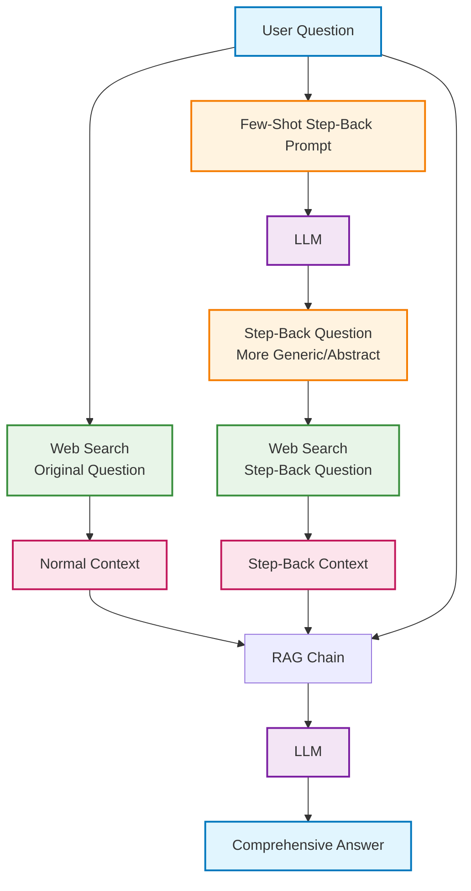

# Step-Back Prompting RAG System

A Retrieval-Augmented Generation (RAG) system that uses abstraction and broader reasoning to improve answer quality for complex or poorly phrased questions.

## Architecture Overview



## What is Step-Back Prompting?

Step-Back Prompting is a reasoning technique that helps language models handle complex or specific questions by first abstracting them into more general, high-level questions. This approach allows models to:

1. **Think More Broadly**: Instead of getting stuck on specific details, the model considers the underlying principles
2. **Access Broader Knowledge**: General questions tap into wider knowledge bases
3. **Improve Reasoning**: Better understanding of core concepts leads to more accurate answers

## The Step-Back Process

### Traditional Approach:
**Question**: "Did Leonardo da Vinci invent the printing press?"
**Problem**: Model might focus on specific details and miss broader historical context

### Step-Back Approach:
1. **Original Question**: "Did Leonardo da Vinci invent the printing press?"
2. **Step-Back Question**: "What were the major inventions and technological developments during the Renaissance period?"
3. **Enhanced Understanding**: Model gains broader historical context before answering the specific question

## Implementation Steps

### Step 1: Environment Setup

```python
import os
from langchain_core.prompts import ChatPromptTemplate, FewShotChatMessagePromptTemplate
from langchain_openai import ChatOpenAI
from langchain_core.output_parsers import StrOutputParser
from langchain_community.utilities import DuckDuckGoSearchAPIWrapper
from langchain import hub

# Set up OpenAI API key
os.environ["OPENAI_API_KEY"] = "your_openai_api_key_here"

if not os.environ["OPENAI_API_KEY"]:
    raise ValueError("Please set the OPENAI_API_KEY environment variable")
```

**What's happening:** Setting up required libraries and API keys for LLM interaction and web search functionality.

### Step 2: Create Few-Shot Examples for Step-Back Generation

```python
# Define examples that show how to transform specific questions into general ones
examples = [
    {
        "input": "Could the members of The Police perform lawful arrests?",
        "output": "what can people named after a profession do?"
    },
    {
        "input": "Jan Sindel's was born in what country?", 
        "output": "what is Jan Sindel's personal history?"
    },
    {
        "input": "Did Leonardo da Vinci invent the printing press?",
        "output": "What were the major inventions and developments during Leonardo da Vinci's time?"
    },
    {
        "input": "What is the capital of the moon?",
        "output": "What are the basic facts about the moon's geography and political status?"
    }
]

# Create example prompt template
example_prompt = ChatPromptTemplate.from_messages([
    ("human", "{input}"),
    ("ai", "{output}")
])

# Build few-shot prompt template  
few_shot_prompt = FewShotChatMessagePromptTemplate(
    example_prompt=example_prompt,
    examples=examples
)
```

**What's happening:** Teaching the model how to abstract specific questions into broader, more general questions through examples.

### Step 3: Build Step-Back Question Generator

```python
# Create the step-back prompting chain
prompt = ChatPromptTemplate.from_messages([
    ("system", """You are an expert at world knowledge. Your task is to step back and paraphrase a question to a more generic step-back question, which is easier to answer. Here are a few examples:"""),
    few_shot_prompt,
    ("user", "{question}")
])

# Create question generation pipeline
question_gen = prompt | ChatOpenAI(temperature=0) | StrOutputParser()

# Test the generator
question = "Did Leonardo da Vinci invent the printing press?"
step_back_question = question_gen.invoke({"question": question})

print("Original Question:", question)
print("Step-Back Question:", step_back_question)
```

**Expected Output:**
```
Original Question: Did Leonardo da Vinci invent the printing press?
Step-Back Question: What were the major inventions and technological developments during the Renaissance period?
```

**What's happening:** Creating a pipeline that takes any specific question and generates a broader, more abstract version that's easier to answer comprehensively.

### Step 4: Set Up Information Retrieval

```python
# Set up web search functionality
search = DuckDuckGoSearchAPIWrapper(max_results=4)

def retriever(query):
    """Retrieve information from web search"""
    return search.run(query)

# Test both searches
normal_context = retriever(question)
step_back_context = retriever(step_back_question)

print("=== NORMAL CONTEXT ===")
print(f"Query: {question}")
print(f"Results: {normal_context[:200]}...")

print("\n=== STEP-BACK CONTEXT ===") 
print(f"Query: {step_back_question}")
print(f"Results: {step_back_context[:200]}...")
```

**Expected Output:**
```
=== NORMAL CONTEXT ===
Query: Did Leonardo da Vinci invent the printing press?
Results: Leonardo da Vinci did not invent the printing press. The printing press was invented by Johannes Gutenberg around 1440, when Leonardo was not yet born...

=== STEP-BACK CONTEXT ===
Query: What were the major inventions and technological developments during the Renaissance period?
Results: The Renaissance period (14th-17th centuries) saw numerous technological breakthroughs including the printing press by Gutenberg (1440), improvements in navigation...
```

**What's happening:** Setting up dual retrieval system that searches for both specific and general information to provide comprehensive context.

### Step 5: Build Complete RAG Chain and Generate Final Answer

This is the most complex step - let me break it down clearly:

```python
# Get the response template from LangChain hub
response_prompt = hub.pull("langchain-ai/stepback-answer")

# Build the complete RAG chain
chain = (
    {
        # This dictionary defines what data gets passed to the response template
        # All three operations run when chain.invoke() is called
        
        "normal_context": lambda x: retriever(x["question"]),
        "step_back_context": lambda x: retriever(
            question_gen.invoke({"question": x["question"]})
        ),
        "question": lambda x: x["question"]
    }
    | response_prompt    # Template that formats all the data
    | ChatOpenAI(temperature=0)  # LLM that generates final answer
    | StrOutputParser()  # Cleans up the output
)

# Generate final answer
result = chain.invoke({"question": question})
print("=== FINAL ANSWER ===")
print(result)
```

#### What Exactly Happens in Step 5?

Let me show you **exactly** what data flows through each part:

**Input to chain:**
```python
{"question": "Did Leonardo da Vinci invent the printing press?"}
```

**After the dictionary operations, the data becomes:**
```python
{
    "normal_context": "Leonardo da Vinci did not invent the printing press. The printing press was invented by Johannes Gutenberg around 1440, when Leonardo was not yet born (he was born in 1452). However, Leonardo did make numerous other inventions and contributions to art, science, and engineering...",
    
    "step_back_context": "The Renaissance period (14th-17th centuries) saw numerous technological breakthroughs including the printing press by Gutenberg (1440), improvements in navigation instruments, advances in optics and astronomy, developments in engineering, artistic innovations, and scientific discoveries. This period marked a significant shift in technological progress...",
    
    "question": "Did Leonardo da Vinci invent the printing press?"
}
```

**The response_prompt template then creates something like:**
```
Context from original question:
Leonardo da Vinci did not invent the printing press. The printing press was invented by Johannes Gutenberg around 1440...

Context from step-back question:
The Renaissance period saw numerous technological breakthroughs including the printing press by Gutenberg (1440)...

Question: Did Leonardo da Vinci invent the printing press?

Please provide a comprehensive answer using both contexts above.
```

**Final LLM Output:**
```
No, Leonardo da Vinci did not invent the printing press. The printing press was invented by Johannes Gutenberg around 1440 in Mainz, Germany, which was about 12 years before Leonardo da Vinci was even born (1452).

**Historical Context:**
During the Renaissance period (14th-17th centuries), there were numerous significant technological developments. The printing press was one of the most revolutionary inventions of this era, fundamentally changing how information was disseminated and contributing to the spread of Renaissance ideas, scientific knowledge, and literacy.

**Leonardo's Actual Contributions:**
While Leonardo da Vinci did not invent the printing press, he was indeed a prolific inventor and made significant contributions to various fields including:
- Engineering designs (flying machines, tanks, bridges)
- Anatomical studies and medical illustrations  
- Artistic techniques and innovations

In summary, while both the printing press and Leonardo da Vinci were significant contributors to Renaissance innovation, they represent different aspects of this remarkable period in human history.
```

#### Step-by-Step Execution Flow

Here's a more explicit version showing exactly what happens:

```python
def explicit_step_back_rag(question):
    """
    Explicit version showing each step of the RAG chain
    """
    print(f"🔍 INPUT: {question}")
    print("-" * 60)
    
    # STEP 1: Generate step-back question
    print("📝 STEP 1: Generating step-back question...")
    step_back_q = question_gen.invoke({"question": question})
    print(f"   Result: {step_back_q}")
    print()
    
    # STEP 2: Dual retrieval
    print("🔎 STEP 2: Performing dual searches...")
    normal_ctx = retriever(question)
    step_back_ctx = retriever(step_back_q)
    print(f"   Normal context: {normal_ctx[:100]}...")
    print(f"   Step-back context: {step_back_ctx[:100]}...")
    print()
    
    # STEP 3: Prepare data for final prompt
    print("📋 STEP 3: Preparing final prompt data...")
    prompt_data = {
        "normal_context": normal_ctx,
        "step_back_context": step_back_ctx, 
        "question": question
    }
    print("   Data prepared with normal context, step-back context, and original question")
    print()
    
    # STEP 4: Generate final answer
    print("🤖 STEP 4: Generating comprehensive answer...")
    final_prompt = response_prompt.format(**prompt_data)
    answer = ChatOpenAI(temperature=0).invoke(final_prompt).content
    print(f"   Final answer generated (length: {len(answer)} chars)")
    
    return answer

# Run the explicit version
result = explicit_step_back_rag(question)
print("\n" + "="*60)
print("FINAL COMPREHENSIVE ANSWER:")
print("="*60)
print(result)
```

## Why Step-Back Prompting Works

### ✅ **Enhanced Context Understanding**
- **Normal search**: Direct answer to specific question
- **Step-back search**: Broader historical/conceptual context
- **Combined**: Comprehensive understanding with proper background

### ✅ **Better Reasoning Quality**
- Prevents getting stuck on specific details
- Provides conceptual framework for understanding
- Reduces hallucinations through broader knowledge access

### ✅ **Improved Answer Structure**
- Answers both the specific question AND provides context
- More educational and informative responses
- Better handling of complex or poorly phrased questions

## Complete Working Example

```python
# Full implementation
import os
from langchain_core.prompts import ChatPromptTemplate, FewShotChatMessagePromptTemplate
from langchain_openai import ChatOpenAI
from langchain_core.output_parsers import StrOutputParser
from langchain_community.utilities import DuckDuckGoSearchAPIWrapper
from langchain import hub

# Setup
os.environ["OPENAI_API_KEY"] = "your_key_here"
search = DuckDuckGoSearchAPIWrapper(max_results=4)

# Examples and templates
examples = [
    {"input": "Could the members of The Police perform lawful arrests?", 
     "output": "what can people named after a profession do?"},
    {"input": "Did Leonardo da Vinci invent the printing press?",
     "output": "What were the major inventions during Leonardo da Vinci's time?"}
]

example_prompt = ChatPromptTemplate.from_messages([("human", "{input}"), ("ai", "{output}")])
few_shot_prompt = FewShotChatMessagePromptTemplate(example_prompt=example_prompt, examples=examples)

prompt = ChatPromptTemplate.from_messages([
    ("system", "You are an expert at world knowledge. Your task is to step back and paraphrase a question to a more generic step-back question, which is easier to answer. Here are a few examples:"),
    few_shot_prompt,
    ("user", "{question}")
])

# Pipelines
question_gen = prompt | ChatOpenAI(temperature=0) | StrOutputParser()
retriever = lambda query: search.run(query)
response_prompt = hub.pull("langchain-ai/stepback-answer")

# Complete chain
chain = (
    {
        "normal_context": lambda x: retriever(x["question"]),
        "step_back_context": lambda x: retriever(question_gen.invoke({"question": x["question"]})),
        "question": lambda x: x["question"]
    }
    | response_prompt
    | ChatOpenAI(temperature=0)
    | StrOutputParser()
)

# Use it
question = "Did Leonardo da Vinci invent the printing press?"
answer = chain.invoke({"question": question})
print(answer)
```

## Use Cases and Benefits

**Perfect for:**
- Historical questions with complex context
- Scientific inquiries requiring background knowledge
- Technical problems needing conceptual understanding
- Questions that are poorly phrased or overly specific

**Benefits:**
- 📈 Improved answer accuracy and depth
- 🧠 Better reasoning and contextualization  
- 📚 More educational and comprehensive responses
- 🎯 Handles complex questions more effectively

**Cost:** ~3x traditional RAG (due to extra LLM call and dual search) but significantly better quality.
