## Example 1 (Notebook crewagent.ipynb)

```mermaid
graph TD
    %% Root
    START([🚀 START EXECUTION])
    
    %% Main execution branches
    START --> STEP1[1️⃣ CREW INITIALIZATION]
    START --> STEP2[2️⃣ TASK ASSIGNMENT]
    START --> STEP3[3️⃣ SEQUENTIAL EXECUTION]
    START --> STEP4[4️⃣ FINAL RESULT]
    
    %% Step 1 details
    STEP1 --> S1_CREATE[📋 Create Crew Instance]
    STEP1 --> S1_LOAD[🤖 Load 2 Agents]
    STEP1 --> S1_DEFINE[📝 Define 2 Tasks]
    STEP1 --> S1_SETUP[🛠️ Setup Tools]
    STEP1 --> S1_MEMORY[(🧠 Enable Memory)]
    
    %% Step 2 details
    STEP2 --> S2_TASK1[📋 Task 1 → Venue Finder Agent]
    STEP2 --> S2_TASK2[📋 Task 2 → QA Agent]
    STEP2 --> S2_ORDER[🔄 Set Sequential Order]
    
    %% Step 3 details - Sequential execution
    STEP3 --> S3_FIRST[🔍 FIRST TASK EXECUTION]
    STEP3 --> S3_SECOND[✅ SECOND TASK EXECUTION]
    
    %% First execution details
    S3_FIRST --> S3F_CREW_CALLS[🎭 CREW calls Task 1]
    S3F_CREW_CALLS --> S3F_TASK_ASSIGNS[📋 Task 1 assigns to Venue Finder Agent]
    S3F_TASK_ASSIGNS --> S3F_AGENT_STARTS[🔍 Venue Finder Agent starts working]
    S3F_AGENT_STARTS --> S3F_TOOL[🌐 Agent uses Search Tool]
    S3F_TOOL --> S3F_FIND[🏢 Agent finds venues]
    S3F_FIND --> S3F_SAVE[(💾 Agent saves to Memory)]
    S3F_SAVE --> S3F_REPORTS{📤 Agent reports back to CREW}
    S3F_REPORTS --> S3F_DONE[✅ CREW marks Task 1 complete]
    
    %% Second execution details
    S3_SECOND --> S3S_CREW_CALLS[🎭 CREW calls Task 2]
    S3S_CREW_CALLS --> S3S_TASK_ASSIGNS[📋 Task 2 assigns to QA Agent]
    S3S_TASK_ASSIGNS --> S3S_AGENT_STARTS[✅ QA Agent starts working]
    S3S_AGENT_STARTS --> S3S_READ[(🧠 Agent reads Memory)]
    S3S_READ --> S3S_TOOL[🌐 Agent uses Search Tool]
    S3S_TOOL --> S3S_REVIEW[🔍 Agent reviews venues]
    S3S_REVIEW --> S3S_ASSESS[📊 Agent creates assessment]
    S3S_ASSESS --> S3S_REPORTS{📤 Agent reports back to CREW}
    S3S_REPORTS --> S3S_DONE[✅ CREW marks Task 2 complete]
    
    %% Step 4 details
    STEP4 --> S4_COMPILE[📋 Compile All Results]
    S4_COMPILE --> S4_DELIVER[/🎉 Deliver to User/]
    S4_DELIVER --> END([✨ END])
    
    %% Key insight box
    INSIGHT[💡 CLEAR EXECUTION FLOW<br/>1. CREW calls Task<br/>2. Task assigns to Agent<br/>3. Agent does the work<br/>4. Agent reports back to CREW<br/>5. CREW moves to next Task]
    
    END --> INSIGHT
    
    %% Styling
    classDef startEnd fill:#e8f5e8,stroke:#4caf50,stroke-width:4px
    classDef step fill:#e3f2fd,stroke:#2196f3,stroke-width:3px
    classDef detail fill:#f5f5f5,stroke:#757575,stroke-width:2px
    classDef execution fill:#fff3e0,stroke:#ff9800,stroke-width:2px
    classDef memory fill:#fff8e1,stroke:#fbc02d,stroke-width:3px
    classDef decision fill:#fce4ec,stroke:#e91e63,stroke-width:2px
    classDef io fill:#e0f2f1,stroke:#009688,stroke-width:2px
    classDef insight fill:#f3e5f5,stroke:#9c27b0,stroke-width:3px
    
    class START,END startEnd
    class STEP1,STEP2,STEP3,STEP4 step
    class S1_CREATE,S1_LOAD,S1_DEFINE,S1_SETUP,S2_TASK1,S2_TASK2,S2_ORDER,S4_COMPILE detail
    class S3_FIRST,S3_SECOND,S3F_CREW_CALLS,S3F_TASK_ASSIGNS,S3F_AGENT_STARTS,S3F_TOOL,S3F_FIND,S3F_DONE,S3S_CREW_CALLS,S3S_TASK_ASSIGNS,S3S_AGENT_STARTS,S3S_TOOL,S3S_REVIEW,S3S_ASSESS,S3S_DONE execution
    class S1_MEMORY,S3F_SAVE,S3S_READ memory
    class S3F_REPORTS,S3S_REPORTS decision
    class S4_DELIVER io
    class INSIGHT insight

```



## Scenario 2: Use of Tools

**Efficient Usage of Different LLMs and Tools in CrewAI: Detailed Strategy with LangChain Context**

---

### Part 1: Understanding the Role of LangChain within CrewAI

CrewAI is a multi-agent coordination and orchestration layer, whereas LangChain is a toolkit for accessing LLMs and tools.

* **CrewAI**: Handles the coordination of agents — who does what, how they interact, when to stop, and how to recover from failures.
* **LangChain**: Supplies the actual building blocks — the models, chains, tools, and retrievers — that CrewAI agents use to perform their tasks.

**Key Connection**:
When you assign an LLM or a tool to a CrewAI agent, you usually instantiate that model/tool using LangChain's abstraction (like `ChatOpenAI`, `tool`, or `BaseTool`).

---

### Part 2: Task-Specific Use of LLMs

CrewAI allows assigning different LLMs to different agents based on what the agent does best.

#### Use Case: Article Generation Workflow

* **Researcher Agent**

  * **Model**: Gemini (via LangChain’s integration)
  * **Why**: High accuracy in extracting insights from large corpora of text (e.g., research papers, reports).
* **Writer Agent**

  * **Model**: GPT-4o (via LangChain’s wrapper)
  * **Why**: Best suited for stylistic writing, storytelling, and transforming raw research into compelling content.

Each agent in CrewAI receives its model using the `llm` parameter, which is a LangChain-wrapped LLM instance.

**Temperature Setting**:

* Low temperature (0–0.3): Consistent, factual output
* High temperature (0.7–1.0): Creative, open-ended responses

---

### Part 3: Using Tools in Agents

Agents can be equipped with tools — these are logical functions that help them perform structured actions beyond just prompting.

#### Two Ways to Create Tools:

1. **BaseTool (LangChain class)**:

   * Full control via object-oriented design.
   * Good for complex APIs or heavy computations.

2. **@tool Decorator (LangChain)**:

   * Fast and functional method.
   * Use for lightweight helpers or quick utilities.

**Example Tools**:

* Currency converter
* News scraper
* Math calculator
* Date/time processor

These are not inherently built into CrewAI — they are built using LangChain’s format and then injected into CrewAI agents.

---

### Part 4: Tool Caching and Efficiency

Some tools may be computationally expensive or receive repeated calls. CrewAI supports tool-level caching, configurable by a `cache_func`.

**Use Case**:

* A tool that does multiplication might only cache even results to reduce overhead.

This ensures agents don’t recompute outputs when it’s unnecessary — improving speed and reducing cost.

---

### Part 5: Exception Handling

Traditional agents may break when one step fails. CrewAI ensures that workflows continue even when something breaks.

**Graceful Degradation**:

* Failed tools don’t break the entire agent.
* Agents retry, fallback, or continue with alternate paths.

**Example**:

* If a research API is down, the agent might switch to cached data or ask another agent for help.

---

### Part 6: Handling Infinite Loops

Agents may rely on each other inappropriately (e.g., asking for context that neither can provide).

**Solution**: Use the `max_iter` parameter.

* After a defined number of iterations, the agent stops and returns its best-possible result.

This prevents runaway loops and wasted resources.

---

### Summary Table

| Concept             | CrewAI Role                    | LangChain Role                              |
| ------------------- | ------------------------------ | ------------------------------------------- |
| Agent Orchestration | Core functionality             | Not handled by LangChain                    |
| LLMs                | Assigned via `llm` param       | Provided through wrappers like `ChatOpenAI` |
| Tools               | Attached to agents for utility | Defined via `@tool` or `BaseTool`           |
| Caching             | Tool-specific caching enabled  | User-defined logic can be plugged in        |
| Exception Handling  | Retry/fallback mechanisms      | Not managed directly                        |
| max\_iter           | Prevent infinite loops         | Not applicable                              |

---

### What You Build Using Both

With LangChain and CrewAI together, you build:

* Multi-agent workflows (CrewAI)
* Each agent powered by customized LLMs (LangChain)
* Augmented with robust tools and fallback logic
* Operating reliably even in noisy or failing environments

In the next phase, you organize these agents in flows — deciding when they talk, delegate, and finish tasks. CrewAI enables this coordination, while LangChain powers the reasoning and computation inside each agent.


# CrewAI + LangChain: Using Custom Tools with Agents (README Example)

## 🧠 Overview
This example shows how to build a simple multi-agent CrewAI system using custom tools. We use:
- **LangChain's `@tool` decorator** to create tools.
- **CrewAI** to assign tools and models to agents.

Agents:
- **Researcher Agent**: Uses a custom tool to fetch research topics.
- **Writer Agent**: Uses GPT-4 to generate a short paragraph.

---

## 🔧 Install Requirements
```bash
pip install crewai langchain openai
```

---

## 📦 Step 1: Define a Custom Tool
```python
from langchain.tools import tool

@tool
def get_research_topic(topic_hint: str) -> str:
    """Returns a refined research topic based on a user hint."""
    return f"Latest trends in {topic_hint} and their business implications"
```

---

## 🤖 Step 2: Create Agents
```python
from crewai import Agent
from langchain.chat_models import ChatOpenAI
from langchain.tools import Tool

# LLM for writing agent
writer_llm = ChatOpenAI(model_name="gpt-4", temperature=0.7)

# Researcher agent (uses the tool)
researcher = Agent(
    role="Researcher",
    goal="Find a precise topic based on a vague idea",
    backstory="Expert in filtering abstract concepts into well-defined topics",
    tools=[Tool.from_function(get_research_topic)],
    allow_delegation=False,
    verbose=True
)

# Writer agent (uses GPT-4 directly)
writer = Agent(
    role="Writer",
    goal="Write a compelling introduction paragraph for the selected topic",
    backstory="An experienced storyteller and writer",
    llm=writer_llm,
    allow_delegation=False,
    verbose=True
)
```

---

## 🧠 Step 3: Create a Task and Run the Crew
```python
from crewai import Task, Crew

# Task for researcher to refine topic
task1 = Task(
    description="Generate a specific topic based on the hint 'AI and marketing'",
    expected_output="A clear, narrowed-down research topic",
    agent=researcher
)

# Task for writer to create content
task2 = Task(
    description="Write a 100-word intro paragraph for the research topic generated",
    expected_output="A paragraph suitable for an article intro",
    agent=writer
)

# Create the Crew
crew = Crew(
    agents=[researcher, writer],
    tasks=[task1, task2],
    verbose=True
)

result = crew.kickoff()
print("\nFinal Output:\n", result)
```

---

## ✅ Output
You should see something like:
```
Final Output:
 In today's rapidly evolving digital world, AI is revolutionizing marketing ...
```

---

## 🧩 Notes
- You can plug in more complex tools by subclassing `BaseTool` if needed.
- This modular setup allows mixing different LLMs, tasks, and roles with delegation rules.
- The agents remain focused and composable.

---

## 🧭 Next Steps
- Add memory to agents.
- Chain outputs to external tools (e.g., search, vector DB).
- Use `max_iter` and error handling features.

Happy experimenting with CrewAI + LangChain 🚀

