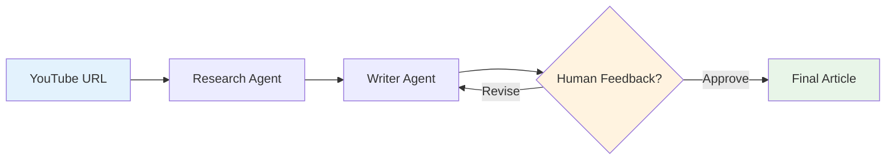
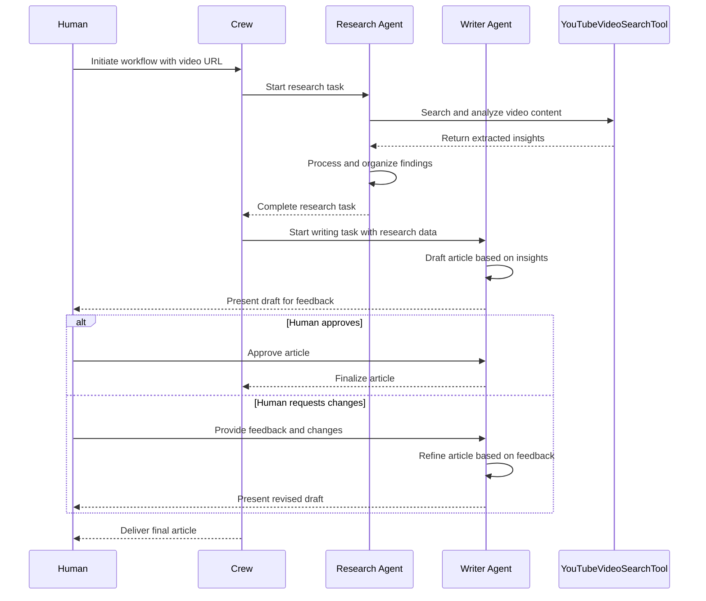

# CrewAI: Balancing AI Autonomy and Human Collaboration

## Overview

This README explains how to build AI agents and multi-agent systems using CrewAI, specifically focusing on creating a YouTube script writer crew that combines AI autonomy with real-time human feedback. The system demonstrates a dynamic approach that uses sequential processes with human intervention, eliminating the need for complex hierarchical structures.

## Table of Contents

- [System Architecture](#system-architecture)
- [Key Components](#key-components)
- [YouTubeVideoSearchTool](#youtubevideosearchtool)
- [Agent Implementation](#agent-implementation)
- [Task Configuration](#task-configuration)
- [Crew Setup](#crew-setup)
- [Workflow Diagram](#workflow-diagram)
- [Implementation Examples](#implementation-examples)
- [Best Practices](#best-practices)

## System Architecture

The CrewAI system implements a **sequential multi-agent workflow** that combines:

- **AI Autonomy**: Agents perform specialized tasks independently
- **Human Collaboration**: Real-time feedback integration at critical decision points
- **Tool Integration**: Specialized tools like YouTubeVideoSearchTool for content analysis
- **Memory Management**: Persistent context across agent interactions



## Key Components

### 1. Multi-Agent System
- **Research Agent**: Specialized in video content analysis
- **Writer Agent**: Focused on article creation and refinement
- **Sequential Process**: Ensures proper information flow between agents

### 2. Human-AI Collaboration
- **Real-time Feedback**: Human input at strategic points
- **Iterative Refinement**: Continuous improvement based on feedback
- **Cost Optimization**: Selective human input to balance quality and efficiency

### 3. Tool Integration
- **YouTubeVideoSearchTool**: RAG-powered video content analysis
- **Memory System**: Context preservation across interactions
- **Flexible Tool Access**: Agents can access tools as needed

## YouTubeVideoSearchTool

The YouTubeVideoSearchTool is a specialized RAG-powered assistant that analyzes YouTube video content. It operates in two modes:

### Initialization Options

```python
# Option 1: General YouTube search (no specific video)
search_tool = YoutubeVideoSearchTool()

# Option 2: Specific video analysis
search_tool = YoutubeVideoSearchTool(
    youtube_video_url="https://youtube.com/watch?v=example"
)
```

### Key Features

- **RAG Integration**: Uses Retrieval-Augmented Generation for content understanding
- **Flexible Search**: Can search across all YouTube or focus on specific videos
- **Content Extraction**: Analyzes and extracts key information from video content
- **Context Awareness**: Maintains understanding of video content throughout the process

## Agent Implementation

### Research Agent Configuration

```python
researcher = Agent(
    role="Video Content Researcher",
    goal="Extract key insights and relevant information from YouTube videos",
    backstory="Expert at analyzing video content and identifying important points",
    memory=True,
    tools=[search_tool],
    verbose=True
)
```

### Writer Agent Configuration

```python
writer = Agent(
    role="Tech Article Writer", 
    goal="Create engaging articles based on research insights",
    backstory="Skilled writer who transforms research into compelling content",
    memory=True,
    tools=[search_tool],  # Access for additional research if needed
    verbose=True
)
```

### Agent Design Principles

- **Memory Enabled**: Both agents retain context for coherent interactions
- **Tool Access**: Strategic tool assignment for flexibility
- **Role Specialization**: Clear responsibilities for each agent
- **Collaborative Design**: Agents work together seamlessly

## Task Configuration

### Research Task

```python
research_task = Task(
    description="""
    Analyze the provided YouTube video and extract:
    - Main topics and themes
    - Key insights and takeaways
    - Technical concepts explained
    - Practical applications mentioned
    - Notable quotes or examples
    """,
    agent=researcher,
    expected_output="Comprehensive research summary with key points"
)
```

### Writing Task with Human Feedback

```python
writing_task = Task(
    description="""
    Create an engaging article based on the research findings:
    - Structure the content logically
    - Make technical concepts accessible
    - Include relevant examples
    - Ensure engaging and informative tone
    """,
    agent=writer,
    expected_output="Well-structured article ready for publication",
    human_input=True  # Enable real-time human feedback
)
```

### Task Design Considerations

- **Detailed Instructions**: Specific task descriptions prevent misunderstandings
- **Expected Outputs**: Clear deliverable definitions
- **Human Input Points**: Strategic placement for maximum value
- **Cost Optimization**: Human feedback only where it adds significant value

## Crew Setup

```python
crew = Crew(
    agents=[researcher, writer],
    tasks=[research_task, writing_task],
    process=Process.sequential,  # Default process type
    verbose=2
)
```

### Crew Configuration Features

- **Sequential Process**: Tasks execute in order (research → writing)
- **Agent Coordination**: Automatic information flow between agents
- **Process Management**: Built-in workflow orchestration
- **Monitoring**: Verbose output for process visibility

## Workflow Diagram



## Complete Implementation Example

Here's the full code implementation that matches our simplified workflow:

### Step 1: Setup and Imports

```python
from crewai import Agent, Task, Crew, Process
from crewai_tools import YoutubeVideoSearchTool

# Initialize the YouTube search tool
search_tool = YoutubeVideoSearchTool()
```

### Step 2: Create Research Agent

```python
# Research Agent - Analyzes YouTube content
researcher = Agent(
    role="Video Content Researcher",
    goal="Extract key insights from YouTube videos for article creation",
    backstory="""You are an expert at analyzing video content and identifying 
    the most important points, themes, and takeaways that would be valuable 
    for creating engaging articles.""",
    tools=[search_tool],
    memory=True,
    verbose=True
)
```

### Step 3: Create Writer Agent

```python
# Writer Agent - Creates articles based on research
writer = Agent(
    role="Tech Article Writer",
    goal="Transform research insights into compelling, well-structured articles",
    backstory="""You are a skilled technical writer who excels at taking 
    research findings and creating engaging, informative articles that 
    resonate with readers.""",
    tools=[search_tool],  # Can access for additional research if needed
    memory=True,
    verbose=True
)
```

### Step 4: Define Tasks

```python
# Research Task
research_task = Task(
    description="""
    Analyze the YouTube video at the provided URL and extract:
    - Main topics and key concepts
    - Important insights and takeaways  
    - Notable examples or case studies
    - Technical details worth highlighting
    
    Provide a comprehensive summary that will serve as the foundation 
    for article creation.
    """,
    agent=researcher,
    expected_output="Detailed research summary with key points organized by topic"
)

# Writing Task with Human Feedback
writing_task = Task(
    description="""
    Using the research findings, create an engaging article that:
    - Has a compelling introduction and conclusion
    - Is well-structured with clear sections
    - Explains technical concepts in accessible language
    - Includes relevant examples from the research
    - Maintains reader engagement throughout
    """,
    agent=writer,
    expected_output="Complete article ready for publication",
    human_input=True  # Enable human feedback for refinement
)
```

### Step 5: Create and Run the Crew

```python
# Setup the crew
youtube_crew = Crew(
    agents=[researcher, writer],
    tasks=[research_task, writing_task],
    process=Process.sequential,  # Research first, then writing
    verbose=2
)

# Execute the workflow
def run_youtube_analysis(video_url):
    result = youtube_crew.kickoff(
        inputs={
            "video_url": video_url,
            "target_audience": "tech professionals and enthusiasts"
        }
    )
    return result

# Example usage
if __name__ == "__main__":
    video_url = "https://www.youtube.com/watch?v=your-video-id"
    final_article = run_youtube_analysis(video_url)
    print("Final Article:", final_article)
```

### Step 6: Human Feedback Integration

When `human_input=True` is enabled, the system will pause and prompt for feedback:

```python
# The system will automatically prompt:
# "Please provide feedback on the article draft:"
# 
# Example responses:
# - "Looks good, publish it!" (proceeds to final output)
# - "Make the introduction more engaging" (agent refines and asks again)
# - "Add more technical details in section 2" (agent revises specific parts)
```

### Complete Workflow Example

```python
#!/usr/bin/env python3

from crewai import Agent, Task, Crew, Process
from crewai_tools import YoutubeVideoSearchTool

def create_youtube_article_crew():
    """Create and configure the YouTube article creation crew"""
    
    # Initialize tools
    search_tool = YoutubeVideoSearchTool()
    
    # Create agents
    researcher = Agent(
        role="Video Content Researcher",
        goal="Extract key insights from YouTube videos",
        backstory="Expert video content analyst",
        tools=[search_tool],
        memory=True
    )
    
    writer = Agent(
        role="Tech Article Writer", 
        goal="Create engaging articles from research",
        backstory="Skilled technical writer",
        tools=[search_tool],
        memory=True
    )
    
    # Define tasks
    research_task = Task(
        description="Analyze video and extract key insights",
        agent=researcher,
        expected_output="Research summary with main points"
    )
    
    writing_task = Task(
        description="Create article from research findings",
        agent=writer,
        expected_output="Complete article",
        human_input=True  # Enable feedback loop
    )
    
    # Create crew
    crew = Crew(
        agents=[researcher, writer],
        tasks=[research_task, writing_task],
        process=Process.sequential
    )
    
    return crew

# Run the workflow
def main():
    crew = create_youtube_article_crew()
    
    result = crew.kickoff(inputs={
        "video_url": "https://www.youtube.com/watch?v=example"
    })
    
    print("Article created successfully!")
    return result

if __name__ == "__main__":
    main()
```

## Best Practices

### 1. Task Design
- **Be Specific**: Detailed task descriptions prevent misunderstandings
- **Define Outputs**: Clear expected output specifications
- **Strategic Human Input**: Place human feedback where it adds most value

### 2. Agent Configuration
- **Enable Memory**: Allows agents to maintain context
- **Tool Assignment**: Give agents access to necessary tools
- **Role Clarity**: Define clear responsibilities for each agent

### 3. Human Feedback Integration
- **Timing**: Integrate feedback at optimal points in the workflow
- **Cost Consideration**: Balance quality improvement with operational costs
- **Iteration Support**: Design for multiple feedback rounds if needed

### 4. Process Optimization
- **Sequential vs Hierarchical**: Choose the right process type for your use case
- **Resource Management**: Monitor and optimize crew performance
- **Error Handling**: Implement robust error handling and recovery

## Advanced Features

### Memory Management
```python
# Enable crew-wide memory
crew = Crew(
    agents=[researcher, writer],
    tasks=[research_task, writing_task],
    memory=True  # Enables persistent memory across tasks
)
```

### Custom Tool Integration
```python
# Add custom tools to agents
custom_researcher = Agent(
    role="Enhanced Researcher",
    tools=[search_tool, custom_analysis_tool, web_scraper],
    memory=True
)
```

### Workflow Monitoring
```python
# Enable detailed monitoring
crew = Crew(
    agents=[researcher, writer],
    tasks=[research_task, writing_task],
    verbose=2,  # Maximum verbosity
    step_callback=custom_callback_function
)
```

## Conclusion

This CrewAI implementation demonstrates how to effectively balance AI autonomy with human collaboration. By using sequential processes with strategic human feedback points, you can create efficient, high-quality content generation workflows that leverage the strengths of both AI agents and human oversight.

The system's modular design allows for easy customization and scaling, making it suitable for various content creation scenarios beyond YouTube analysis, such as research papers, technical documentation, and educational materials.
