# AI Research System using CrewAI - Comprehensive Technical Documentation

A sophisticated multi-agent research system leveraging CrewAI framework with hierarchical management for automated research workflows from data collection to publication-ready reports.

## 🌟 System Overview

This system implements a **collaborative multi-agent architecture** where specialized AI agents work together under a manager to conduct comprehensive research. Each agent is powered by large language models (LLMs) and equipped with specific tools and capabilities to handle different aspects of the research process.

## 🧠 Language Model Integration

### LLM Architecture & Selection

#### Option 1: OpenAI GPT-4o (Currently Active)
```python
llm = ChatOpenAI(
    temperature=0,           # Deterministic output for consistency
    openai_api_key=os.getenv('OPENAI_API_KEY'),
    model_name="gpt-4o"     # 128K context window, multimodal capabilities
)
```

**Technical Specifications:**
- **Model Type**: Transformer-based autoregressive language model
- **Context Window**: 128,000 tokens (~96,000 words)
- **Training Data**: Up to April 2024
- **Capabilities**: Text generation, reasoning, tool use, function calling
- **Token Pricing**: $5/1M input tokens, $15/1M output tokens
- **Rate Limits**: 30,000 TPM (Tier 1), scales with usage tier

#### Option 2: Groq Llama3 (Commented Alternative)
```python
llm = ChatGroq(
    temperature=0,
    groq_api_key=os.getenv('GROQ_API_KEY'),
    model_name='llama3-groq-70b-8192-tool-use-preview'
)
```

**Technical Specifications:**
- **Model Type**: Meta's Llama 3 70B parameter model
- **Context Window**: 8,192 tokens (~6,000 words)
- **Hardware**: Groq's LPU (Language Processing Unit) for ultra-fast inference
- **Speed**: 300+ tokens/second (vs 20-50 for standard GPUs)
- **Tool Support**: Function calling and tool use capabilities
- **Cost**: Significantly lower than OpenAI (~10x cheaper)

### How LLMs Power Each Agent

Each agent receives the **same LLM instance** but with different **system prompts** and **context**:

1. **System Prompt**: Defines the agent's role, personality, and behavior
2. **Context Window**: Maintains conversation history and task context
3. **Tool Integration**: LLM can call functions (search_tool, scrape_tool)
4. **Output Formatting**: LLM structures responses according to expected output formats

## 🏗️ CrewAI Framework Deep Dive

### How CrewAI Works

CrewAI is a **multi-agent orchestration framework** that enables:

#### 1. Agent Instantiation
```python
Agent(
    role="Research Analyst",                    # Defines agent identity
    goal="Create and analyze research points...", # Primary objective
    backstory="Specializing in research...",    # Context for behavior
    verbose=True,                              # Detailed logging
    allow_delegation=True,                     # Can delegate to other agents
    tools=[scrape_tool, search_tool],         # Available functions
    llm=llm                                   # Language model instance
)
```

**Behind the Scenes:**
- CrewAI wraps the LLM with agent-specific prompts
- Tools are converted to function descriptions the LLM can call
- Agent personality and constraints are injected into system messages
- Conversation history is maintained per agent

#### 2. Task Definition & Execution
```python
Task(
    description="...",          # What the agent should do
    expected_output="...",      # Format and content expectations
    agent=research_analyst_agent # Which agent executes this task
)
```

**Execution Process:**
1. **Task Parsing**: CrewAI converts task description into LLM prompt
2. **Context Injection**: Previous task outputs are added to context
3. **Tool Access**: Agent can call tools during execution
4. **Output Validation**: Results are checked against expected_output format
5. **Handoff**: Output becomes input for next task in sequence

#### 3. Hierarchical Process Management
```python
research_crew = Crew(
    agents=[research_analyst_agent, report_writer_agent, report_editor_agent],
    tasks=[data_collection_task, data_analysis_task, report_writing_task, report_assessment_task],
    manager_llm=llm,           # Manager coordinates everything
    process=Process.hierarchical, # Management structure
    verbose=True
)
```

**Management Layer:**
- **Manager LLM**: Acts as project coordinator and quality controller
- **Task Scheduling**: Determines task execution order and dependencies
- **Resource Allocation**: Assigns tasks to appropriate agents
- **Quality Gates**: Reviews outputs before proceeding to next task
- **Error Handling**: Manages failures and retry logic

## 🔄 Detailed Workflow Process

```mermaid
graph TD
    A[🎯 Input Topic] --> B[📊 Data Collection Task]
    B --> C[🔍 Data Analysis Task]
    C --> D[📝 Report Writing Task]
    D --> E[✏️ Report Assessment Task]
    E --> F[📋 Final Report]
    
    subgraph "LLM Processing Layer"
        G[🤖 GPT-4o/Llama3 Model]
        H[🔧 System Prompts]
        I[💾 Context Management]
        J[🛠️ Tool Integration]
    end
    
    subgraph "Agent Execution"
        K[🔬 Research Analyst]
        L[✍️ Report Writer]
        M[📝 Report Editor]
    end
    
    subgraph "CrewAI Orchestration"
        N[🎯 Task Scheduler]
        O[👥 Agent Manager]
        P[🔄 Process Controller]
        Q[📊 Output Validator]
    end
    
    subgraph "Tool Ecosystem"
        R[🔍 Search Tool]
        S[🕷️ Scrape Tool]
        T[📊 Data Processing]
    end
    
    A --> N
    N --> O
    O --> P
    
    B -.-> K
    C -.-> K
    D -.-> L
    E -.-> M
    
    K --> G
    L --> G
    M --> G
    
    G --> H
    G --> I
    G --> J
    
    J --> R
    J --> S
    J --> T
    
    P --> Q
    Q --> F
    
    style A fill:#e1f5fe
    style F fill:#e8f5e8
    style G fill:#ffebee
    style N fill:#f3e5f5
    style K fill:#fff3e0
    style L fill:#e8eaf6
    style M fill:#e0f2f1
```



## 📊 Output Generation Process

### Stage 1: Data Collection Task
**Agent**: Research Analyst  
**Input**: `{topic}: "The impact of AI on modern healthcare systems"`

**LLM Processing:**
1. **Prompt Construction**:
   ```
   You are a Research Analyst specializing in research analysis...
   Task: Collect data from relevant sources about "The impact of AI on modern healthcare systems"
   Focus on identifying key trends, benefits, and challenges.
   Available tools: scrape_tool, search_tool
   Expected output: A comprehensive dataset...
   ```

2. **Tool Execution**:
   - `search_tool("AI healthcare systems 2024 trends")`
   - `scrape_tool("https://healthcare-ai-report.com")`
   - `search_tool("AI medical diagnosis benefits challenges")`

3. **Output Synthesis**:
   ```json
   {
     "data_sources": [...],
     "key_statistics": [...],
     "expert_opinions": [...],
     "recent_studies": [...],
     "trend_indicators": [...]
   }
   ```

### Stage 2: Data Analysis Task
**Agent**: Research Analyst  
**Input**: Previous task output + analysis requirements

**LLM Processing:**
1. **Context Injection**: Previous data collection results
2. **Analysis Prompt**: 
   ```
   Analyze the collected data to identify key trends, benefits, and challenges...
   Data to analyze: [Previous output]
   Apply research methodologies to synthesize findings...
   ```

3. **Analytical Processing**:
   - Pattern recognition across data sources
   - Trend identification and correlation analysis
   - Benefit/challenge categorization
   - Statistical significance assessment

4. **Structured Output**:
   ```json
   {
     "key_trends": {
       "diagnostic_ai": "45% adoption increase",
       "telemedicine_integration": "300% growth post-2020"
     },
     "benefits": [...],
     "challenges": [...],
     "implications": [...]
   }
   ```

### Stage 3: Report Writing Task
**Agent**: Report Writer  
**Input**: Analysis results + writing requirements

**LLM Processing:**
1. **Writing Style Injection**:
   ```
   You are skilled at transforming complex information into clear, concise reports...
   Transform this analysis into a comprehensive research report...
   Analysis data: [Previous output]
   ```

2. **Report Structure Generation**:
   - Executive summary creation
   - Section organization and hierarchy
   - Data visualization planning
   - Citation and reference formatting

3. **Content Generation**:
   ```markdown
   # The Impact of AI on Modern Healthcare Systems
   
   ## Executive Summary
   [Synthesized overview]
   
   ## Key Findings
   [Structured analysis results]
   
   ## Trends and Implications
   [Future-focused insights]
   ```

### Stage 4: Report Assessment Task
**Agent**: Report Editor  
**Input**: Draft report + quality standards

**LLM Processing:**
1. **Quality Review Prompt**:
   ```
   Review and refine this research report for clarity, accuracy, and standards...
   Draft report: [Previous output]
   Ensure coherence, consistency, and professional quality...
   ```

2. **Multi-Pass Editing**:
   - **Pass 1**: Structure and flow assessment
   - **Pass 2**: Factual accuracy verification
   - **Pass 3**: Language clarity and consistency
   - **Pass 4**: Format and style standardization

3. **Final Output Generation**:
   ```markdown
   # The Impact of AI on Modern Healthcare Systems
   *Final polished version with enhanced clarity and professional formatting*
   ```

## 🤖 Agent Deep Dive

### Research Analyst Agent Architecture

**System Prompt Template**:
```
You are a Research Analyst specializing in research analysis. You employ advanced 
methodologies to generate detailed research points and insights. With a deep 
understanding of research frameworks and talent for synthesizing information, you 
deliver thorough and actionable research outcomes.

Your capabilities include:
- Advanced web search and data collection
- Statistical analysis and trend identification  
- Expert opinion synthesis
- Multi-source data validation
- Research methodology application

Available tools: {tools}
Current task: {task_description}
Expected output format: {expected_output}
```

**Tool Integration Process**:
1. **search_tool**: 
   - Executes web searches with optimized queries
   - Returns structured search results with metadata
   - Handles rate limiting and source diversity

2. **scrape_tool**:
   - Extracts content from specific URLs
   - Parses structured data from web pages
   - Handles different content formats (HTML, PDF, etc.)

### Report Writer Agent Architecture

**System Prompt Template**:
```
You are a skilled Report Writer who transforms complex information into clear, 
concise, and informative reports. Your expertise lies in structuring data 
logically, creating compelling narratives, and ensuring accessibility for 
diverse audiences.

Your capabilities include:
- Professional report structuring
- Data visualization integration
- Narrative flow optimization
- Audience-appropriate language adaptation
- Citation and reference management

Input data: {analysis_results}
Output requirements: {report_specifications}
```

**Processing Capabilities**:
- **Structure Generation**: Automatic heading hierarchy and section organization
- **Narrative Flow**: Logical progression from findings to implications
- **Data Integration**: Seamless incorporation of statistics and evidence
- **Formatting**: Professional document styling and presentation

### Report Editor Agent Architecture

**System Prompt Template**:
```
You are a Report Editor with a keen eye for detail and strong background in 
content refinement. You ensure reports are polished, coherent, and meet 
high-quality standards. Your expertise includes content revision for clarity, 
consistency checking, and final quality assurance.

Quality standards:
- Clarity and readability optimization
- Factual accuracy verification
- Consistency in style and terminology
- Professional formatting and presentation
- Compliance with research standards

Draft to review: {draft_report}
Quality criteria: {standards_checklist}
```

**Quality Assurance Process**:
1. **Content Review**: Accuracy, completeness, relevance assessment
2. **Style Consistency**: Terminology, tone, and format standardization
3. **Structural Analysis**: Flow, organization, and logical progression
4. **Final Polish**: Grammar, punctuation, and presentation refinement

## ⚙️ Technical Implementation Details

### CrewAI Execution Flow

```python
# 1. Crew Initialization
research_crew = Crew(...)

# 2. Input Processing
research_inputs = {'topic': 'The impact of AI on modern healthcare systems'}

# 3. Execution Kickoff
result = research_crew.kickoff(inputs=research_inputs)
```

**Behind the Scenes Execution**:

1. **Preprocessing Phase**:
   ```python
   # CrewAI processes inputs and prepares execution context
   execution_context = {
       'topic': 'The impact of AI on modern healthcare systems',
       'task_queue': [data_collection_task, data_analysis_task, ...],
       'agent_roster': [research_analyst_agent, report_writer_agent, ...],
       'manager_llm': llm
   }
   ```

2. **Task Execution Loop**:
   ```python
   for task in task_queue:
       # Select appropriate agent
       assigned_agent = task.agent
       
       # Prepare agent context
       agent_context = {
           'role': assigned_agent.role,
           'backstory': assigned_agent.backstory,
           'tools': assigned_agent.tools,
           'previous_outputs': previous_task_results,
           'current_task': task.description
       }
       
       # Execute with LLM
       result = llm.invoke(
           messages=[
               SystemMessage(content=agent_context),
               HumanMessage(content=task.description)
           ]
       )
       
       # Validate output
       validated_result = validate_against_expected_output(result, task.expected_output)
       
       # Store for next task
       task_results.append(validated_result)
   ```

3. **Output Assembly**:
   ```python
   final_result = {
       'research_data': task_results[0],
       'analysis': task_results[1], 
       'draft_report': task_results[2],
       'final_report': task_results[3],
       'metadata': {
           'execution_time': elapsed_time,
           'token_usage': total_tokens,
           'agent_interactions': interaction_log
       }
   }
   ```

### Memory and Context Management

**Context Preservation**:
- Each task receives outputs from all previous tasks
- Agent memory maintains conversation history within task scope
- Manager LLM tracks overall project state and quality gates

**Token Management**:
- Context window optimization for long research sessions
- Automatic summarization when approaching token limits
- Intelligent context pruning while preserving critical information

### Error Handling and Resilience

```python
# Built-in error handling
try:
    result = agent.execute_task(task)
except RateLimitError:
    wait_time = calculate_backoff()
    time.sleep(wait_time)
    result = agent.execute_task(task)
except ValidationError:
    refined_task = manager_llm.refine_task(task, error_details)
    result = agent.execute_task(refined_task)
```

## 📊 Performance Characteristics

### Token Usage Patterns
- **Data Collection**: 5,000-15,000 tokens per execution
- **Analysis**: 10,000-25,000 tokens per execution  
- **Report Writing**: 15,000-40,000 tokens per execution
- **Editing**: 8,000-20,000 tokens per execution
- **Total**: 38,000-100,000 tokens per complete workflow

### Execution Time Estimates
- **OpenAI GPT-4o**: 3-8 minutes total execution
- **Groq Llama3**: 1-3 minutes total execution (faster inference)
- **Variable factors**: Topic complexity, data availability, report length

### Quality Metrics
- **Accuracy**: Multi-agent validation and cross-checking
- **Completeness**: Comprehensive coverage through specialized agents
- **Consistency**: Shared LLM and standardized prompts
- **Professional Quality**: Dedicated editing and refinement stage

## 🛠️ Advanced Configuration Options

### Custom Agent Personalities
```python
# Enhanced agent with domain expertise
research_analyst_agent = Agent(
    role="Healthcare AI Research Specialist",
    goal="Conduct specialized research on AI applications in healthcare...",
    backstory="PhD in Biomedical Informatics with 10+ years experience...",
    tools=[pubmed_search_tool, clinical_trial_scraper, medical_journal_access],
    llm=domain_specific_llm
)
```

### Dynamic Tool Integration
```python
# Context-aware tool selection
def select_tools_for_topic(topic):
    if "healthcare" in topic.lower():
        return [pubmed_tool, fda_database_tool, medical_news_scraper]
    elif "finance" in topic.lower():
        return [sec_filings_tool, market_data_api, financial_news_scraper]
    else:
        return [general_search_tool, web_scraper, news_aggregator]
```

### Quality Control Enhancements
```python
# Multi-stage validation
validation_crew = Crew(
    agents=[fact_checker_agent, citation_validator_agent, plagiarism_detector_agent],
    process=Process.parallel,
    manager_llm=quality_control_llm
)
```

## 🚀 Deployment and Scaling

### Production Considerations
- **API Rate Limit Management**: Implement exponential backoff and request queuing
- **Cost Optimization**: Token usage monitoring and model selection strategies
- **Caching Strategy**: Store and reuse research for similar topics
- **Monitoring**: Track agent performance, error rates, and output quality

### Integration Capabilities
- **REST API**: Expose research functionality via web service
- **Database Integration**: Store research outputs and build knowledge base
- **Real-time Updates**: Subscribe to news feeds and update research automatically
- **Multi-format Output**: Generate reports in PDF, HTML, Word, and presentation formats

---

*This system represents a sophisticated implementation of collaborative AI agents working together to automate complex research workflows while maintaining human-level quality and insight generation.* 🚀
