# AI Research System using CrewAI

A comprehensive multi-agent research system built with CrewAI that automates the entire research workflow from data collection to final report generation.

## 🌟 Overview

This system employs three specialized AI agents working in a hierarchical structure to conduct thorough research and generate high-quality reports on any given topic. The system is designed to handle complex research tasks while maintaining quality and consistency throughout the process.

## 🏗️ Architecture

### Multi-Agent System
- **Research Analyst Agent**: Data collection and initial analysis
- **Report Writer Agent**: Comprehensive report compilation
- **Report Editor Agent**: Quality assurance and final polishing

### LLM Configuration
The system supports multiple language model providers:

```python
# Option 1: Groq (Fast, Cost-effective)
llm = ChatGroq(
    temperature=0,
    groq_api_key=os.getenv('GROQ_API_KEY'),
    model_name='llama3-groq-70b-8192-tool-use-preview'
)

# Option 2: OpenAI (High Quality)
llm = ChatOpenAI(
    temperature=0,
    openai_api_key=os.getenv('OPENAI_API_KEY'),
    model_name="gpt-4o"
)
```

## 🔄 Workflow Process

```mermaid
graph TD
    A[🎯 Input Topic] --> B[📊 Data Collection Task]
    B --> C[🔍 Data Analysis Task]
    C --> D[📝 Report Writing Task]
    D --> E[✏️ Report Assessment Task]
    E --> F[📋 Final Report]
    
    subgraph "Agent Responsibilities"
        G[🔬 Research Analyst Agent]
        H[✍️ Report Writer Agent]
        I[📝 Report Editor Agent]
    end
    
    B -.-> G
    C -.-> G
    D -.-> H
    E -.-> I
    
    subgraph "Hierarchical Management"
        J[🤖 Manager LLM]
        J -.-> B
        J -.-> C
        J -.-> D
        J -.-> E
    end
    
    style A fill:#e1f5fe
    style F fill:#e8f5e8
    style G fill:#fff3e0
    style H fill:#f3e5f5
    style I fill:#e0f2f1
    style J fill:#ffebee
```



## 🤖 Agent Specifications

### 🔬 Research Analyst Agent
- **Role**: Research Analyst
- **Goal**: Create and analyze research points for comprehensive insights
- **Tools**: 
  - `scrape_tool` - Web scraping capabilities
  - `search_tool` - Advanced search functionality
- **Capabilities**: 
  - Data gathering from multiple sources
  - Trend identification
  - Statistical analysis
  - Expert opinion synthesis

### ✍️ Report Writer Agent
- **Role**: Report Writer
- **Goal**: Compile analyzed data into comprehensive, well-structured reports
- **Specialization**: Transforming complex information into clear, readable formats
- **Capabilities**:
  - Structured report generation
  - Data visualization integration
  - Professional formatting

### 📝 Report Editor Agent
- **Role**: Report Editor
- **Goal**: Ensure clarity, accuracy, and adherence to quality standards
- **Specialization**: Quality control and content refinement
- **Capabilities**:
  - Content review and revision
  - Consistency checking
  - Final quality assurance

## 📋 Task Pipeline

### 1. 📊 Data Collection Task
```python
description: "Collect data from relevant sources about the given {topic}. 
             Focus on identifying key trends, benefits, and challenges."
expected_output: "A comprehensive dataset including recent studies, 
                 statistics, and expert opinions."
```

### 2. 🔍 Data Analysis Task
```python
description: "Analyze the collected data to identify key trends, 
             benefits, and challenges for the {topic}."
expected_output: "A detailed analysis report highlighting the most 
                 significant findings."
```

### 3. 📝 Report Writing Task
```python
description: "Write a comprehensive research report that clearly 
             presents the findings from the data analysis report"
expected_output: "A well-structured research report that provides 
                 insights about the topic."
```

### 4. ✏️ Report Assessment Task
```python
description: "Review and rewrite the research report to ensure clarity, 
             accuracy, and adherence to standards."
expected_output: "A polished, coherent research report that meets 
                 high-quality standards."
```

## ⚙️ System Configuration

### Hierarchical Process
- **Process Type**: `Process.hierarchical`
- **Manager LLM**: Same as agent LLM for consistency
- **Verbose Mode**: Enabled for detailed logging
- **Agent Collaboration**: Enabled through delegation

### Key Features
- **Multi-agent collaboration**
- **Hierarchical task management**
- **Comprehensive error handling**
- **Scalable architecture**
- **Quality assurance pipeline**

## 🚀 Usage

### Basic Usage
```python
# Define research topic
research_inputs = {
    'topic': 'The impact of AI on modern healthcare systems'
}

# Execute research workflow
result = research_crew.kickoff(inputs=research_inputs)
```

### Custom Topics Examples
```python
# Technology Research
research_inputs = {'topic': 'Blockchain adoption in supply chain management'}

# Healthcare Research  
research_inputs = {'topic': 'Telemedicine trends post-COVID-19'}

# Business Research
research_inputs = {'topic': 'Remote work impact on productivity metrics'}

# Environmental Research
research_inputs = {'topic': 'Renewable energy adoption in developing countries'}
```

## 📋 Prerequisites

### Required Dependencies
```bash
pip install crewai
pip install langchain-openai  # or langchain-groq
pip install python-dotenv
```

### Environment Variables
```bash
# For OpenAI
OPENAI_API_KEY=your_openai_api_key_here

# For Groq (alternative)
GROQ_API_KEY=your_groq_api_key_here
```

## 🔧 Configuration Options

### LLM Selection
- **OpenAI GPT-4o**: Best quality, higher cost
- **OpenAI GPT-4o-mini**: Good quality, cost-effective
- **Groq Llama3**: Fast inference, open-source

### Process Types
- **Hierarchical**: Manager coordinates tasks (recommended)
- **Sequential**: Tasks run in order
- **Parallel**: Tasks run simultaneously where possible

## 📊 Output Format

The system generates:
1. **Raw Research Data**: Collected sources and statistics
2. **Analysis Report**: Key findings and trends
3. **Comprehensive Report**: Full research document
4. **Final Polished Report**: Quality-assured output

## 🛠️ Troubleshooting

### Common Issues
- **Rate Limits**: Switch to GPT-4o-mini or add delays
- **Token Limits**: Chunk large inputs into smaller pieces
- **API Errors**: Check environment variables and API keys
- **Tool Errors**: Ensure scrape_tool and search_tool are properly configured

### Performance Optimization
- Use appropriate model for task complexity
- Implement caching for repeated research topics
- Monitor token usage for cost control
- Adjust temperature settings for consistency

## 📈 Future Enhancements

- [ ] Database integration for research caching
- [ ] Custom tool development for specialized sources
- [ ] Multi-language support
- [ ] Advanced visualization generation
- [ ] API endpoint for external integration
- [ ] Real-time collaboration features

## 🤝 Contributing

Feel free to contribute by:
- Adding new research tools
- Improving agent prompts
- Enhancing report formats
- Optimizing performance
- Adding new features

---

*Built with CrewAI for autonomous multi-agent research workflows* 🚀