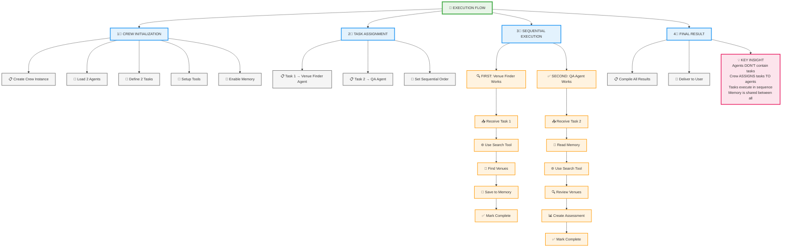

```mermaid
graph TD
    %% Root
    START[🚀 EXECUTION FLOW]

    %% Main execution branches
    START --> STEP1[1⃣ CREW INITIALIZATION]
    START --> STEP2[2⃣ TASK ASSIGNMENT]
    START --> STEP3[3⃣ SEQUENTIAL EXECUTION]
    START --> STEP4[4⃣ FINAL RESULT]

    %% Step 1 details
    STEP1 --> S1_CREATE[📋 Create Crew Instance]
    STEP1 --> S1_LOAD[🤖 Load 2 Agents]
    STEP1 --> S1_DEFINE[📝 Define 2 Tasks]
    STEP1 --> S1_SETUP[🚰️ Setup Tools]
    STEP1 --> S1_MEMORY[🧠 Enable Memory]

    %% Step 2 details
    STEP2 --> S2_TASK1[📋 Task 1 → Venue Finder Agent]
    STEP2 --> S2_TASK2[📋 Task 2 → QA Agent]
    STEP2 --> S2_ORDER[🔄 Set Sequential Order]

    %% Step 3 details - Sequential execution
    STEP3 --> S3_FIRST[🔍 FIRST: Venue Finder Works]
    STEP3 --> S3_SECOND[✅ SECOND: QA Agent Works]

    %% First execution details
    S3_FIRST --> S3F_RECEIVE[📥 Receive Task 1]
    S3F_RECEIVE --> S3F_TOOL[🌐 Use Search Tool]
    S3F_TOOL --> S3F_FIND[🏢 Find Venues]
    S3F_FIND --> S3F_SAVE[💾 Save to Memory]
    S3F_SAVE --> S3F_DONE[✅ Mark Complete]

    %% Second execution details
    S3_SECOND --> S3S_RECEIVE[📥 Receive Task 2]
    S3S_RECEIVE --> S3S_READ[🧠 Read Memory]
    S3S_READ --> S3S_TOOL[🌐 Use Search Tool]
    S3S_TOOL --> S3S_REVIEW[🔍 Review Venues]
    S3S_REVIEW --> S3S_ASSESS[📊 Create Assessment]
    S3S_ASSESS --> S3S_DONE[✅ Mark Complete]

    %% Step 4 details
    STEP4 --> S4_COMPILE[📋 Compile All Results]
    STEP4 --> S4_DELIVER[🎉 Deliver to User]

    %% Key insight box
    INSIGHT[💡 KEY INSIGHT<br/>Agents DON'T contain tasks<br/>Crew ASSIGNS tasks TO agents<br/>Tasks execute in sequence<br/>Memory is shared between all]

    STEP4 --> INSIGHT

    %% Styling
    classDef start fill:#e8f5e8,stroke:#4caf50,stroke-width:4px
    classDef step fill:#e3f2fd,stroke:#2196f3,stroke-width:3px
    classDef detail fill:#f5f5f5,stroke:#757575,stroke-width:2px
    classDef execution fill:#fff3e0,stroke:#ff9800,stroke-width:2px
    classDef insight fill:#fce4ec,stroke:#e91e63,stroke-width:3px

    class START start
    class STEP1,STEP2,STEP3,STEP4 step
    class S1_CREATE,S1_LOAD,S1_DEFINE,S1_SETUP,S1_MEMORY,S2_TASK1,S2_TASK2,S2_ORDER,S4_COMPILE,S4_DELIVER detail
    class S3_FIRST,S3_SECOND,S3F_RECEIVE,S3F_TOOL,S3F_FIND,S3F_SAVE,S3F_DONE,S3S_RECEIVE,S3S_READ,S3S_TOOL,S3S_REVIEW,S3S_ASSESS,S3S_DONE execution
    class INSIGHT insight
```
