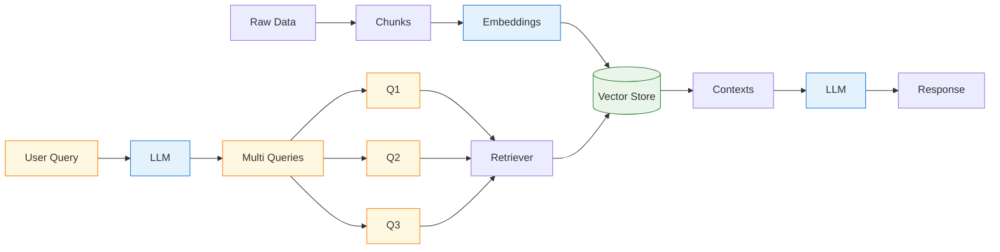

# Multi-Query RAG System

A Retrieval-Augmented Generation (RAG) system that uses multiple query variations to improve document retrieval and answer quality.

## Architecture Overview



## What is Multi-Query RAG?

Traditional RAG systems use a single user query to search for relevant documents. However, this approach has limitations:

- **Single perspective**: One query might miss relevant information
- **Vocabulary mismatch**: User terminology might differ from document content
- **Incomplete coverage**: Important context might be scattered across multiple documents

**Multi-Query RAG solves these problems by:**
1. Generating multiple variations of the original question
2. Searching with all variations simultaneously 
3. Combining results to get comprehensive context
4. Generating better, more complete answers

## Step-by-Step Implementation Guide

### Step 1: Environment Setup

First, we import necessary libraries and set up API keys:

```python
# Import required modules
from langchain.text_splitter import RecursiveCharacterTextSplitter
from langchain_community.document_loaders import TextLoader
from langchain_community.vectorstores import Chroma
from langchain_openai import OpenAIEmbeddings, ChatOpenAI
from langchain_core.prompts import ChatPromptTemplate
from langchain_core.output_parsers import StrOutputParser
from langchain_core.runnables import RunnablePassthrough
from langchain.schema import Document
from operator import itemgetter

# Set up API keys
os.environ["LANGCHAIN_TRACING_V2"] = "true"
os.environ["LANGCHAIN_ENDPOINT"] = "https://api.smith.langchain.com"
os.environ["LANGCHAIN_API_KEY"] = "your_langchain_api_key"
os.environ["OPENAI_API_KEY"] = "your_openai_api_key"
```

**What's happening here?**
- We import all the tools we need for text processing, embeddings, and language models
- Environment variables configure tracing and API access
- API keys authenticate our requests to OpenAI and LangChain services

### Step 2: Document Preparation and Indexing

```python
# Load documents
loaders = [
    TextLoader("document1.txt"),
    TextLoader("document2.txt"),
    TextLoader("document3.txt")
]

docs = []
for loader in loaders:
    docs.extend(loader.load())

# Split documents into chunks
text_splitter = RecursiveCharacterTextSplitter(
    chunk_size=400, 
    chunk_overlap=60
)
splits = text_splitter.split_documents(docs)

# Create vector store and retriever
vectorstore = Chroma.from_documents(
    documents=splits, 
    embedding=OpenAIEmbeddings()
)
retriever = vectorstore.as_retriever()
```

**What's happening here?**
- **Document Loading**: Read text files from disk
- **Text Splitting**: Break large documents into smaller 400-character chunks with 60-character overlap
  - *Why chunks?* LLMs have context limits; smaller chunks are easier to process
  - *Why overlap?* Ensures important information isn't lost at chunk boundaries
- **Vector Store Creation**: Convert text chunks into numerical embeddings that capture semantic meaning
- **Retriever Setup**: Create a search interface for finding relevant chunks

### Step 3: Multi-Query Generation

```python
# Define prompt for generating query variations
template = """You are an AI language model assistant. Your task is to generate three 
different versions of the given user question to retrieve relevant documents from 
a vector database. By generating multiple perspectives on the user question, your 
goal is to help the user overcome some of the limitations of the distance-based 
similarity search. Provide these alternative questions separated by newlines.
Original question: {question}"""

prompt_perspectives = ChatPromptTemplate.from_template(template)

# Create query generation chain
generate_queries = (
    prompt_perspectives 
    | ChatOpenAI(temperature=0) 
    | StrOutputParser() 
    | (lambda x: x.split("\\n"))
)
```

**What's happening here?**
- **Prompt Template**: Instructions for the LLM to generate 3 different versions of the user's question
- **Chain Creation**: Links together prompt → LLM → text parsing → splitting into list
- **Temperature=0**: Makes the LLM responses deterministic (less random)
- **Why multiple queries?** Different phrasings can retrieve different relevant documents

**Example:** If user asks "What is LangSmith?", the LLM might generate:
1. "What is LangSmith?"
2. "Can you explain LangSmith's purpose and functionality?"
3. "What are the main features and benefits of LangSmith?"

### Step 4: Document Retrieval with Deduplication

```python
def get_unique_union(documents: list[list]):
    """Get unique documents from multiple retrieval results"""
    # Flatten the list of lists
    flattened_docs = [doc for sublist in documents for doc in sublist]
    
    # Get unique documents
    unique_docs = []
    seen_content = set()
    
    for doc in flattened_docs:
        # Use page content as identifier
        if doc.page_content not in seen_content:
            seen_content.add(doc.page_content)
            unique_docs.append(doc)
    
    return unique_docs

# Create retrieval chain
question = "What is LangSmith, and why do we need it?"

retrieval_chain = generate_queries | retriever.map() | get_unique_union
docs = retrieval_chain.invoke({"question": question})
```

**What's happening here?**
- **Multi-Retrieval**: Each generated query searches the vector store independently
- **Flattening**: Combine all search results into one list
- **Deduplication**: Remove duplicate documents to avoid redundancy
- **Why deduplication?** Different queries might find the same relevant document

### Step 5: Answer Generation

```python
# Define RAG prompt template
template = """Answer the following question based on this context:

{context}

Question: {question}
"""

prompt = ChatPromptTemplate.from_template(template)
llm = ChatOpenAI(temperature=0)

# Create final RAG chain
final_rag_chain = (
    {
        "context": retrieval_chain, 
        "question": itemgetter("question")
    }
    | prompt
    | llm
    | StrOutputParser()
)

# Generate final answer
result = final_rag_chain.invoke({"question": question})
print(result)
```

**What's happening here?**
- **Context Assembly**: Combine all retrieved documents into context
- **Prompt Formation**: Create a prompt with context and original question
- **Answer Generation**: LLM processes context and question to generate comprehensive answer
- **Final Output**: Clean text response to the user

## Key Benefits of Multi-Query RAG

1. **Better Coverage**: Multiple query perspectives find more relevant information
2. **Improved Accuracy**: More context leads to better answers
3. **Robustness**: Less dependent on exact keyword matching
4. **Comprehensive Results**: Captures different aspects of complex questions

## Use Cases

- **Customer Support**: Handle varied question phrasings
- **Research Applications**: Comprehensive literature review
- **Documentation Search**: Find information across large knowledge bases
- **Educational Tools**: Provide thorough explanations from multiple angles

## Performance Considerations

- **Cost**: Multiple queries = more API calls
- **Latency**: Sequential processing takes longer
- **Quality vs Speed**: Trade-off between comprehensive results and response time

## Next Steps

- Implement parallel query processing for speed
- Add query ranking and filtering
- Experiment with different embedding models
- Add evaluation metrics for answer quality