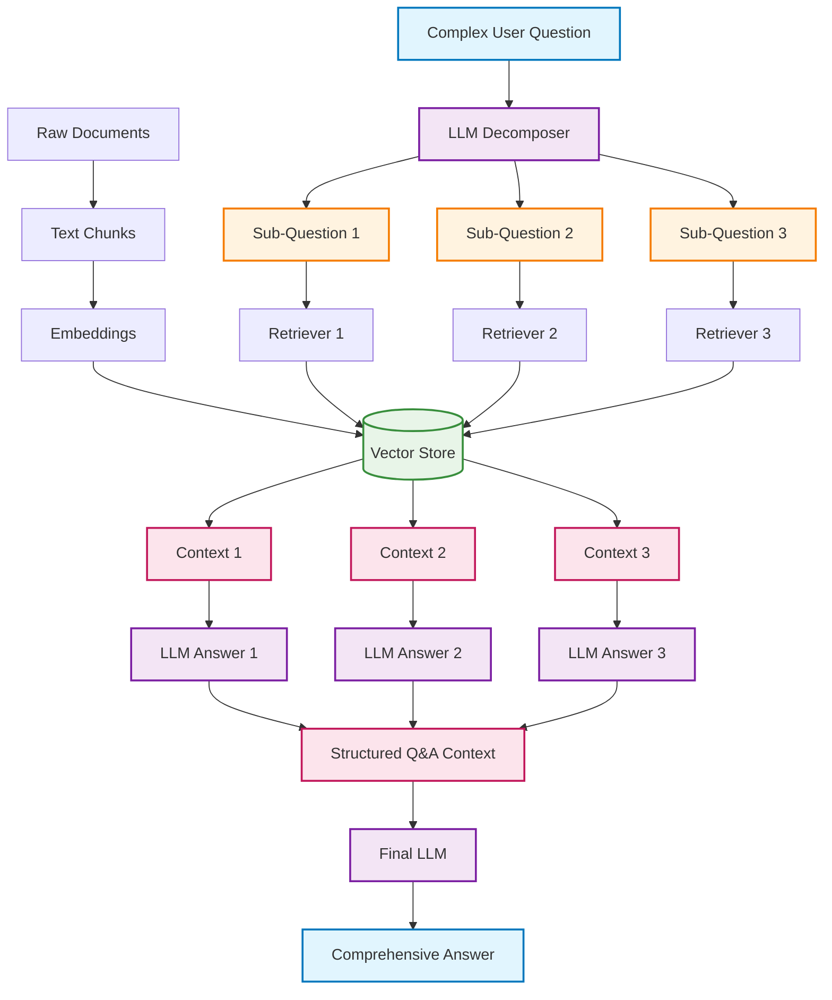

# Query Decomposition RAG System

A Retrieval-Augmented Generation (RAG) system that breaks down complex questions into focused sub-questions for better precision and comprehensive answers.

## Architecture Overview



## What is Query Decomposition?

Query Decomposition is an advanced RAG technique that breaks down complex, multi-faceted questions into smaller, focused sub-questions. Instead of trying to answer a complex question all at once, this approach:

1. **Decomposes** the main question into 3-4 specific sub-questions
2. **Retrieves** relevant documents for each sub-question independently  
3. **Generates** individual answers for each sub-question
4. **Synthesizes** all sub-answers into a comprehensive final response

## Why Use Query Decomposition?

### Traditional RAG Limitations:
- **Single perspective**: Complex questions may miss important aspects
- **Information scatter**: Relevant info might be spread across different document sections
- **Shallow coverage**: One query might not capture all dimensions of a complex topic

### Query Decomposition Benefits:
- ✅ **Enhanced Precision**: Each sub-question targets specific aspects
- ✅ **Comprehensive Coverage**: Multiple focused searches capture more relevant information
- ✅ **Structured Responses**: Organized, systematic answers to complex queries
- ✅ **Better Accuracy**: Focused retrieval leads to more relevant context

## Step-by-Step Implementation Guide

### Step 1: Environment Setup

```python
import os
from langchain_community.document_loaders import WebBaseLoader
from langchain.text_splitter import RecursiveCharacterTextSplitter
from langchain_community.vectorstores import Chroma
from langchain_openai import OpenAIEmbeddings, ChatOpenAI
from langchain_core.prompts import ChatPromptTemplate
from langchain_core.output_parsers import StrOutputParser
from langchain import hub

# Set up API keys and tracing
os.environ["LANGCHAIN_TRACING_V2"] = "true"
os.environ["LANGCHAIN_ENDPOINT"] = "https://api.smith.langchain.com"
os.environ["LANGCHAIN_API_KEY"] = "your_langchain_api_key"
os.environ["LANGCHAIN_PROJECT"] = "Decomposition"
os.environ["OPENAI_API_KEY"] = "your_openai_api_key"

if not os.environ["OPENAI_API_KEY"]:
    raise ValueError("OpenAI API key is required")
```

**What's happening here?**
- Import all necessary libraries for web loading, text processing, and LLM operations
- Configure environment variables for API access and project tracking
- Set up LangSmith tracing to monitor the decomposition process

### Step 2: Document Loading and Processing

```python
# Load documents from web
loader = WebBaseLoader(
    web_paths=("https://docs.langchain.com/docs/langsmith/",)
)
blog_docs = loader.load()

# Split documents into chunks
text_splitter = RecursiveCharacterTextSplitter.from_tiktoken_encoder(
    chunk_size=300, 
    chunk_overlap=50
)
splits = text_splitter.split_documents(blog_docs)

# Create vector store and retriever
vectorstore = Chroma.from_documents(documents=splits, embedding=OpenAIEmbeddings())
retriever = vectorstore.as_retriever()
```

**Expected Output:**
```python
print(f"Loaded {len(blog_docs)} documents")
print(f"Created {len(splits)} text chunks")
print(f"Vector store ready with {len(splits)} embeddings")
```

```
Loaded 1 documents
Created 45 text chunks  
Vector store ready with 45 embeddings
```

**What's happening here?**
- **Web Loading**: Fetch documents directly from URLs (perfect for documentation, blogs, etc.)
- **Tiktoken Splitting**: Use OpenAI's tokenizer for more accurate chunk sizing (300 tokens ≈ 200-250 words)
- **Vector Store**: Create searchable embeddings from all document chunks

### Step 3: Question Decomposition

```python
# Define decomposition prompt
template = """You are a helpful assistant that generates multiple sub-questions related to an input question. 
The goal is to break down the input into a set of sub-problems / sub-questions that can be answers in isolation. 
Generate multiple search queries related to: {question} 
Output (3 queries):"""

prompt_decomposition = ChatPromptTemplate.from_template(template)
llm = ChatOpenAI(temperature=0)

# Create decomposition chain
generate_queries_decomposition = (
    prompt_decomposition 
    | llm 
    | StrOutputParser() 
    | (lambda x: x.split("\n"))
)

# Test with a complex question
question = "What is LangSmith, and why do we need it?"
sub_questions = generate_queries_decomposition.invoke({"question": question})
```

**Expected Output:**
```python
print("Original Question:", question)
print("\nGenerated Sub-Questions:")
for i, sub_q in enumerate(sub_questions, 1):
    if sub_q.strip():  # Skip empty lines
        print(f"{i}. {sub_q.strip()}")
```

```
Original Question: What is LangSmith, and why do we need it?

Generated Sub-Questions:
1. What is LangSmith and what are its core features?
2. What problems does LangSmith solve in language model development?
3. Why is LangSmith necessary for building production LLM applications?
```

**What's happening here?**
- **Strategic Decomposition**: LLM breaks complex question into focused sub-questions
- **Temperature=0**: Ensures consistent, deterministic decomposition
- **Multiple Perspectives**: Each sub-question targets a different aspect of the main topic

### Step 4: Individual Sub-Question Processing

```python
# Get RAG prompt from LangChain hub
prompt_rag = hub.pull("rlm/rag-prompt")

# Process each sub-question independently
rag_results = []
sub_questions = generate_queries_decomposition.invoke({"question": question})

for sub_question in sub_questions:
    if sub_question.strip():  # Skip empty lines
        # Retrieve relevant documents for this specific sub-question
        retrieved_docs = retriever.invoke(sub_question)
        
        # Generate answer using retrieved context
        answer = (prompt_rag | llm | StrOutputParser()).invoke({
            "context": retrieved_docs, 
            "question": sub_question
        })
        rag_results.append(answer)
```

**Expected Output:**
```python
print("Sub-Question Processing Results:")
for i, (sub_q, answer) in enumerate(zip(sub_questions, rag_results), 1):
    if sub_q.strip():
        print(f"\n--- Sub-Question {i} ---")
        print(f"Q: {sub_q.strip()}")
        print(f"A: {answer[:150]}...")
```

```
Sub-Question Processing Results:

--- Sub-Question 1 ---
Q: What is LangSmith and what are its core features?
A: LangSmith is a platform for building production-grade LLM applications. Its core features include tracing, debugging, testing, and monitoring...

--- Sub-Question 2 ---
Q: What problems does LangSmith solve in language model development?
A: LangSmith addresses key challenges in LLM development including lack of visibility into model behavior, difficulty in debugging complex chains...

--- Sub-Question 3 ---
Q: Why is LangSmith necessary for building production LLM applications?
A: LangSmith is essential for production applications because it provides the observability and reliability tools needed for enterprise deployment...
```

**What's happening here?**
- **Independent Processing**: Each sub-question gets its own retrieval and generation cycle
- **Focused Context**: Retriever finds documents most relevant to each specific sub-question
- **Targeted Answers**: Each answer addresses a specific aspect of the main question

### Step 5: Answer Formatting and Structuring

```python
def format_qa_pairs(questions, answers):
    """Format questions and answers into structured context"""
    formatted_string = ""
    for i, (question, answer) in enumerate(zip(questions, answers)):
        if question.strip():  # Skip empty questions
            formatted_string += f"Question {i+1}: {question.strip()}\n"
            formatted_string += f"Answer {i+1}: {answer}\n\n"
    return formatted_string.strip()

# Create structured context from all Q&A pairs
context = format_qa_pairs(sub_questions, rag_results)
```

**Expected Output:**
```python
print("Structured Q&A Context:")
print(context)
```

```
Structured Q&A Context:
Question 1: What is LangSmith and what are its core features?
Answer 1: LangSmith is a platform for building production-grade LLM applications. Its core features include comprehensive tracing capabilities that allow developers to see exactly how their language model chains execute, debugging tools for identifying issues in complex workflows, testing frameworks for systematic evaluation, and monitoring dashboards for production applications.

Question 2: What problems does LangSmith solve in language model development?
Answer 2: LangSmith addresses several critical challenges including the black-box nature of language models, difficulty in debugging multi-step AI workflows, lack of systematic testing for AI applications, and insufficient monitoring of model performance in production environments.

Question 3: Why is LangSmith necessary for building production LLM applications?
Answer 3: LangSmith is essential because production AI applications require reliability, observability, and maintainability that traditional development tools cannot provide. It enables teams to build AI systems with confidence by providing visibility into model behavior and tools for continuous improvement.
```

**What's happening here?**
- **Structured Organization**: All sub-questions and answers are formatted clearly
- **Comprehensive Context**: Creates rich context material for final synthesis
- **Clear Separation**: Each Q&A pair is distinctly formatted for easy processing

### Step 6: Final Answer Synthesis

```python
# Define synthesis prompt
template = """Here is a set of Q+A pairs:

{context}

Use these to synthesize an answer to the question: {question}
"""

prompt = ChatPromptTemplate.from_template(template)

# Create final synthesis chain
final_rag_chain = (
    prompt 
    | llm 
    | StrOutputParser()
)

# Generate comprehensive final answer
final_answer = final_rag_chain.invoke({
    "context": context, 
    "question": question
})

print(final_answer)
```

**Expected Output:**
```
LangSmith is a comprehensive platform specifically designed for building, testing, and monitoring production-grade language model applications. It serves as an essential development and operations tool for teams working with Large Language Models (LLMs).

**What LangSmith Is:**
LangSmith is a specialized platform that provides developers with the tools needed to build reliable AI applications. Its core features include comprehensive tracing capabilities, debugging tools, systematic testing frameworks, and production monitoring dashboards.

**Key Problems It Solves:**
The platform addresses several critical challenges in LLM development:
- The black-box nature of language models that makes it difficult to understand how they reach decisions
- Complexity in debugging multi-step AI workflows and chains
- Lack of systematic testing methodologies for AI applications  
- Insufficient monitoring and observability for models deployed in production

**Why We Need LangSmith:**
LangSmith is necessary because production AI applications require a level of reliability, observability, and maintainability that traditional development tools cannot provide. As organizations deploy LLM applications at scale, they need:
- Visibility into model behavior and decision-making processes
- Tools for systematic testing and evaluation of AI systems
- Monitoring capabilities to track performance and identify issues in production
- Debugging tools that can handle the complexity of multi-step AI workflows

In essence, LangSmith bridges the gap between experimental AI development and production-ready applications by providing the professional development tools that make AI systems reliable, maintainable, and trustworthy for business-critical use cases.
```

**What's happening here?**
- **Comprehensive Synthesis**: LLM combines all sub-answers into a cohesive response
- **Structured Output**: Final answer addresses all aspects of the original complex question
- **Enhanced Quality**: The decomposition approach results in more thorough and accurate answers

## Comparison: Traditional vs Decomposition RAG

| Aspect | Traditional RAG | Decomposition RAG |
|--------|----------------|-------------------|
| **Query Processing** | Single query | 3-4 focused sub-queries |
| **Retrieval Scope** | One search operation | Multiple targeted searches |
| **Answer Quality** | May miss aspects | Comprehensive coverage |
| **Response Structure** | Unstructured | Organized by sub-topics |
| **Complexity Handling** | Struggles with complex questions | Excels at complex, multi-faceted queries |
| **Processing Time** | Faster | Slower (multiple operations) |
| **Best Use Cases** | Simple, direct questions | Complex, analytical questions |

## Use Cases

### Perfect for Decomposition RAG:
- **Research Questions**: "What are the environmental and economic impacts of renewable energy adoption?"
- **Comparative Analysis**: "How do different cloud providers compare in terms of pricing, features, and performance?"
- **Multi-faceted Topics**: "What is machine learning, how does it work, and what are its applications?"
- **Technical Documentation**: "What is Kubernetes, how do you deploy it, and what are best practices?"

### Traditional RAG Better For:
- **Simple Factual Questions**: "What is the capital of France?"
- **Direct Lookups**: "What is the current version of Python?"
- **Quick References**: "How do you install NumPy?"

## Performance Considerations

### Advantages:
- **Better Accuracy**: More focused retrieval leads to higher quality answers
- **Comprehensive Coverage**: Captures multiple aspects of complex topics
- **Structured Responses**: Well-organized, easy-to-follow answers
- **Scalable Complexity**: Handles increasingly complex questions better

### Trade-offs:
- **Higher Latency**: Multiple LLM calls increase response time
- **Increased Costs**: More API calls = higher usage costs
- **Complex Implementation**: More moving parts than traditional RAG

## Advanced Optimizations

1. **Parallel Processing**: Run sub-question processing in parallel
2. **Adaptive Decomposition**: Vary number of sub-questions based on complexity
3. **Smart Caching**: Cache decomposition results for similar questions
4. **Quality Filtering**: Filter sub-questions for relevance before processing

## Getting Started

1. **Clone and Install**: Set up the environment with required dependencies
2. **Configure APIs**: Add your OpenAI and LangChain API keys
3. **Load Documents**: Point to your knowledge base (web docs, PDFs, etc.)
4. **Test with Complex Questions**: Start with multi-faceted questions
5. **Monitor with LangSmith**: Use tracing to optimize your decomposition strategy

This decomposition approach transforms how RAG systems handle complex queries, providing more thorough, accurate, and well-structured responses for sophisticated use cases.