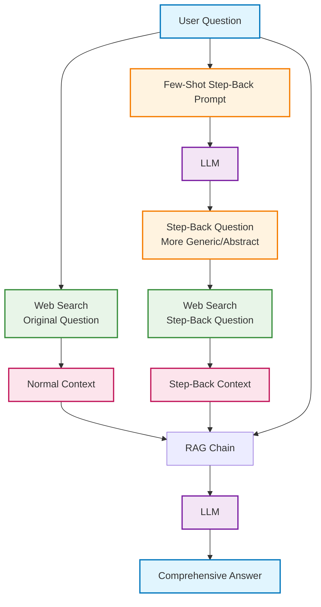

# Step-Back Prompting RAG System

A Retrieval-Augmented Generation (RAG) system that uses abstraction and broader reasoning to improve answer quality for complex or poorly phrased questions.

## Architecture Overview



## What is Step-Back Prompting?

Step-Back Prompting is a reasoning technique that helps language models handle complex or specific questions by first abstracting them into more general, high-level questions. This approach allows models to:

1. **Think More Broadly**: Instead of getting stuck on specific details, the model considers the underlying principles
2. **Access Broader Knowledge**: General questions tap into wider knowledge bases
3. **Improve Reasoning**: Better understanding of core concepts leads to more accurate answers

## The Step-Back Process

### Traditional Approach:
**Question**: "Did Leonardo da Vinci invent the printing press?"
**Problem**: Model might focus on specific details and miss broader historical context

### Step-Back Approach:
1. **Original Question**: "Did Leonardo da Vinci invent the printing press?"
2. **Step-Back Question**: "What were the major inventions and technological developments during the Renaissance period?"
3. **Enhanced Understanding**: Model gains broader historical context before answering the specific question

## Real-World Example

**🧮 Math Problem Analogy:**
- **Specific Question**: "In a right triangle with sides 3 and 4, what's the hypotenuse?"
- **Step-Back Question**: "What mathematical principles apply to right triangles?"
- **Result**: Model recognizes Pythagorean theorem (a² + b² = c²) and applies it correctly

## Step-by-Step Implementation Guide

### Step 1: Environment Setup

```python
import os
from langchain_core.prompts import ChatPromptTemplate, FewShotChatMessagePromptTemplate
from langchain_openai import ChatOpenAI
from langchain_core.output_parsers import StrOutputParser
from langchain_community.utilities import DuckDuckGoSearchAPIWrapper
from langchain import hub

# Set up OpenAI API key
os.environ["OPENAI_API_KEY"] = "your_openai_api_key_here"

if not os.environ["OPENAI_API_KEY"]:
    raise ValueError("Please set the OPENAI_API_KEY environment variable")
```

**What's happening here?**
- Import necessary libraries for prompting, LLM interaction, and web search
- Configure OpenAI API access for step-back question generation and final answer synthesis
- Validate API key to ensure proper authentication

### Step 2: Few-Shot Learning Setup

```python
# Define examples for step-back prompting
examples = [
    {
        "input": "Could the members of The Police perform lawful arrests?",
        "output": "what can people named after a profession do?"
    },
    {
        "input": "Jan Sindel's was born in what country?", 
        "output": "what is Jan Sindel's personal history?"
    },
    {
        "input": "Did Leonardo da Vinci invent the printing press?",
        "output": "What were the major inventions and developments during Leonardo da Vinci's time?"
    },
    {
        "input": "What is the capital of the moon?",
        "output": "What are the basic facts about the moon's geography and political status?"
    }
]

# Create example prompt template
example_prompt = ChatPromptTemplate.from_messages([
    ("human", "{input}"),
    ("ai", "{output}")
])

# Build few-shot prompt template  
few_shot_prompt = FewShotChatMessagePromptTemplate(
    example_prompt=example_prompt,
    examples=examples
)
```

**Expected Output:**
```python
print("Few-shot examples loaded:")
for i, example in enumerate(examples, 1):
    print(f"\nExample {i}:")
    print(f"  Input: {example['input']}")
    print(f"  Output: {example['output']}")
```

```
Few-shot examples loaded:

Example 1:
  Input: Could the members of The Police perform lawful arrests?
  Output: what can people named after a profession do?

Example 2:
  Input: Jan Sindel's was born in what country?
  Output: what is Jan Sindel's personal history?

Example 3:
  Input: Did Leonardo da Vinci invent the printing press?
  Output: What were the major inventions and developments during Leonardo da Vinci's time?

Example 4:
  Input: What is the capital of the moon?
  Output: What are the basic facts about the moon's geography and political status?
```

**What's happening here?**
- **Pattern Learning**: Examples show how to transform specific questions into general ones
- **Abstraction Training**: Model learns to identify underlying concepts and principles  
- **Consistent Format**: Examples maintain consistent input/output structure for reliable learning

### Step 3: Build Step-Back Question Generator

```python
# Create the step-back prompting chain
prompt = ChatPromptTemplate.from_messages([
    ("system", """You are an expert at world knowledge. Your task is to step back and paraphrase a question to a more generic step-back question, which is easier to answer. Here are a few examples:"""),
    few_shot_prompt,
    ("user", "{question}")
])

# Create question generation pipeline
question_gen = prompt | ChatOpenAI(temperature=0) | StrOutputParser()

# Test with a specific question
question = "Did Leonardo da Vinci invent the printing press?"
step_back_question = question_gen.invoke({"question": question})
```

**Expected Output:**
```python
print("Original Question:", question)
print("Step-Back Question:", step_back_question)
```

```
Original Question: Did Leonardo da Vinci invent the printing press?
Step-Back Question: What were the major inventions and technological developments during the Renaissance period?
```

**What's happening here?**
- **Template Integration**: Combines system instructions with few-shot examples
- **Temperature=0**: Ensures consistent, deterministic step-back question generation
- **Abstraction Process**: Model learns to identify the broader topic or principle behind specific questions

### Step 4: Dual Information Retrieval

```python
# Set up web search functionality
search = DuckDuckGoSearchAPIWrapper(max_results=4)

def retriever(query):
    """Retrieve information from web search"""
    return search.run(query)

# Retrieve information for both questions
normal_context = retriever(question)
step_back_context = retriever(step_back_question)
```

**Expected Output:**
```python
print("=== NORMAL CONTEXT (Original Question) ===")
print(f"Query: {question}")
print(f"Results: {normal_context[:300]}...")

print("\n=== STEP-BACK CONTEXT (Abstract Question) ===") 
print(f"Query: {step_back_question}")
print(f"Results: {step_back_context[:300]}...")
```

```
=== NORMAL CONTEXT (Original Question) ===
Query: Did Leonardo da Vinci invent the printing press?
Results: Leonardo da Vinci did not invent the printing press. The printing press was invented by Johannes Gutenberg around 1440, when Leonardo was not yet born (he was born in 1452). However, Leonardo did make numerous other inventions and...

=== STEP-BACK CONTEXT (Abstract Question) ===
Query: What were the major inventions and technological developments during the Renaissance period?
Results: The Renaissance period (14th-17th centuries) saw numerous technological breakthroughs including the printing press by Gutenberg (1440), improvements in navigation instruments, advances in optics and astronomy, developments in engineering...
```

**What's happening here?**
- **Dual Perspective**: Search both specific and general questions to capture different types of information
- **Complementary Context**: Original question provides direct answers, step-back question provides broader context
- **Enhanced Coverage**: Broader search captures historical context, innovations, and related developments

### Step 5: RAG Chain Assembly and Answer Generation

```python
# Get RAG response template from LangChain hub
response_prompt = hub.pull("langchain-ai/stepback-answer")

# Build the complete RAG chain
chain = (
    {
        # Retrieve context for both questions
        "normal_context": lambda x: retriever(x["question"]),
        "step_back_context": lambda x: retriever(
            question_gen.invoke({"question": x["question"]})
        ),
        "question": lambda x: x["question"]
    }
    | response_prompt
    | ChatOpenAI(temperature=0)
    | StrOutputParser()
)

# Generate final answer
result = chain.invoke({"question": question})
```

**Expected Output:**
```python
print("=== FINAL COMPREHENSIVE ANSWER ===")
print(result)
```

```
=== FINAL COMPREHENSIVE ANSWER ===
No, Leonardo da Vinci did not invent the printing press. The printing press was invented by Johannes Gutenberg around 1440 in Mainz, Germany, which was about 12 years before Leonardo da Vinci was even born (1452).

**Historical Context:**
During the Renaissance period (14th-17th centuries), there were numerous significant technological developments. The printing press was one of the most revolutionary inventions of this era, fundamentally changing how information was disseminated and contributing to the spread of Renaissance ideas, scientific knowledge, and literacy.

**Leonardo's Actual Contributions:**
While Leonardo da Vinci did not invent the printing press, he was indeed a prolific inventor and made significant contributions to various fields including:
- Engineering designs (flying machines, tanks, bridges)
- Anatomical studies and medical illustrations  
- Artistic techniques and innovations
- Hydraulic engineering and water management systems
- Military engineering and fortification designs

**The Printing Press Impact:**
Gutenberg's printing press was crucial during Leonardo's lifetime, as it enabled the rapid reproduction and distribution of books, scientific treatises, and artistic works that influenced Renaissance thinkers like Leonardo himself. The technology helped spread the very ideas and knowledge that fueled the Renaissance period's intellectual achievements.

In summary, while both the printing press and Leonardo da Vinci were significant contributors to Renaissance innovation, they represent different aspects of this remarkable period in human history.
```

**What's happening here?**
- **Context Integration**: Combines both normal and step-back contexts for comprehensive understanding
- **Enhanced Reasoning**: Broader context helps model provide more nuanced, accurate answers
- **Structured Response**: Step-back approach leads to well-organized, informative answers with proper historical context

## Benefits of Step-Back Prompting

### ✅ **Improved Accuracy**
- Reduces hallucinations by encouraging broader knowledge access
- Helps model recognize when it lacks specific information
- Provides historical/contextual grounding for better reasoning

### ✅ **Better Handling of Complex Questions**
- Abstracts complex queries into manageable concepts
- Identifies underlying principles and relationships
- Reduces confusion from overly specific or poorly phrased questions

### ✅ **Enhanced Context Understanding**
- Captures broader thematic information
- Provides background knowledge that informs specific answers
- Helps distinguish between related but different concepts

### ✅ **More Comprehensive Responses**
- Combines specific answers with broader context
- Addresses not just "what" but also "why" and "how"
- Provides educational value beyond the immediate question

## Use Cases

### **Perfect for Step-Back Prompting:**
- **Historical Questions**: "Did Napoleon use cannons at Waterloo?" → "What military technologies were used in Napoleonic warfare?"
- **Scientific Inquiries**: "Does water boil at 100°C on Mount Everest?" → "How does altitude affect the boiling point of liquids?"
- **Complex Factual Questions**: "Can penguins fly?" → "What are the characteristics and adaptations of flightless birds?"
- **Technical Problems**: "Why won't my Python code work?" → "What are common programming errors and debugging approaches?"

### **Less Suitable For:**
- **Simple Factual Lookups**: "What's 2+2?" (doesn't need abstraction)
- **Current Events**: "Who won yesterday's game?" (time-sensitive, specific)
- **Personal Questions**: "What's my favorite color?" (subjective, no general principle)

## Comparison with Other RAG Techniques

| Technique | API Calls | Best For | Strength | Limitation |
|-----------|-----------|----------|----------|------------|
| **Traditional RAG** | 1 | Simple questions | Speed, cost | Limited reasoning |
| **Multi-Query RAG** | 2 | Varied terminology | Better retrieval | Still single perspective |
| **Query Decomposition** | 5+ | Complex, multi-part questions | Comprehensive coverage | High cost, complexity |
| **Step-Back Prompting** | 3 | Poorly phrased, complex reasoning | Enhanced reasoning, context | Moderate cost increase |

## API Cost Analysis

### **Cost Structure:**
1. **Step-Back Generation**: 1 API call (usually small prompt)
2. **Dual Web Search**: 2 search operations (typically low/no cost)  
3. **Final Answer**: 1 API call (with enhanced context)

**Total**: ~3x cost of traditional RAG, but significantly better reasoning capability

## Performance Optimizations

1. **Caching Step-Back Questions**: Store abstractions for similar question patterns
2. **Async Processing**: Run dual searches in parallel
3. **Smart Routing**: Use step-back only for questions that need abstraction
4. **Context Compression**: Optimize retrieved content to reduce token usage

## Implementation Tips

1. **Quality Examples**: Curate diverse, high-quality few-shot examples
2. **Domain Adaptation**: Adjust examples for specific domains (medical, legal, technical)
3. **Evaluation Metrics**: Track improvement in answer quality and reasoning depth
4. **Fallback Strategy**: Use traditional RAG if step-back generation fails

## Getting Started

1. **Set Up Environment**: Install required dependencies and configure API keys
2. **Prepare Examples**: Create domain-specific few-shot examples for your use case
3. **Test Abstraction**: Verify step-back questions are appropriately general
4. **Evaluate Results**: Compare answer quality with traditional RAG approaches
5. **Optimize for Domain**: Fine-tune examples and prompts for your specific domain

Step-Back Prompting bridges the gap between simple retrieval and complex reasoning, making RAG systems more intelligent and capable of handling nuanced, challenging questions.