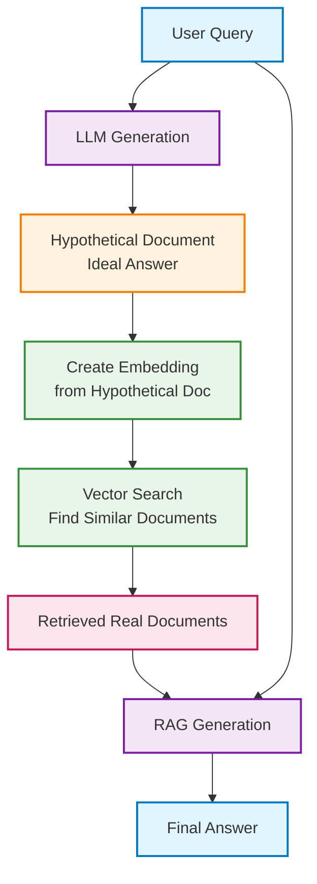

# HyDE (Hypothetical Document Embeddings) RAG System

A Retrieval-Augmented Generation (RAG) system that generates hypothetical documents to improve retrieval accuracy by creating ideal document representations for any given query.

## Architecture Overview



## What is HyDE?

HyDE (Hypothetical Document Embeddings) is a retrieval technique that addresses the fundamental challenge in RAG systems: the semantic gap between user queries and document content. Instead of directly searching with the user's query, HyDE:

1. **Generates hypothetical documents** that would ideally answer the user's question
2. **Creates embeddings** from these hypothetical documents  
3. **Retrieves real documents** that are semantically similar to the hypothetical ones
4. **Uses retrieved documents** to generate the final answer

Think of it as asking an AI: "What would the perfect document look like to answer this question?" and then finding real documents that match that ideal.

## The HyDE Process

### Traditional RAG Problem:
**User Query**: "How do I optimize database performance?"
**Issue**: Query is short and generic, may not match specific technical documentation

### HyDE Approach:
1. **Original Query**: "How do I optimize database performance?"
2. **Generated Hypothetical Document**: "Database performance optimization involves several key strategies including indexing, query optimization, connection pooling, caching mechanisms, and hardware scaling. Proper indexing on frequently queried columns can dramatically improve read performance..."
3. **Embedding & Search**: Uses the rich hypothetical document to find similar real documents
4. **Better Retrieval**: Finds comprehensive guides, technical documentation, and specific optimization techniques

## Implementation Steps

### Step 1: Environment Setup

```python
import os
from langchain_openai import OpenAI, OpenAIEmbeddings, ChatOpenAI
from langchain.chains import HypotheticalDocumentEmbedder
from langchain.prompts import PromptTemplate, ChatPromptTemplate
from langchain_text_splitters import RecursiveCharacterTextSplitter
from langchain_community.document_loaders import TextLoader
from langchain_community.vectorstores import Chroma
from langchain_core.output_parsers import StrOutputParser
from langchain_core.runnables import RunnablePassthrough

# Set up OpenAI API key
os.environ["OPENAI_API_KEY"] = ""  # Add your OpenAI API key here

if not os.environ["OPENAI_API_KEY"]:
    raise ValueError("Please set the OPENAI_API_KEY environment variable")
```

**What's happening:** Setting up required libraries and API keys for LLM interaction, document processing, and vector storage.

### Step 2: Load and Prepare Documents

```python
# Load example documents
loaders = [
    TextLoader("blog.langchain.dev_announcing-langsmith.txt"),
    TextLoader("blog.langchain.dev_automating-web-research.txt"),
]

# Load all documents
docs = []
for loader in loaders:
    docs.extend(loader.load())

# Split documents into chunks
text_splitter = RecursiveCharacterTextSplitter.from_tiktoken_encoder(
    chunk_size=400, 
    chunk_overlap=60
)
splits = text_splitter.split_documents(docs)

print(f"Loaded {len(docs)} documents")
print(f"Split into {len(splits)} chunks")
```

**Expected Output:**
```
Loaded 2 documents
Split into 15 chunks
```

**What's happening:** Loading source documents and splitting them into manageable chunks for embedding and storage in the vector database.

### Step 3: Create Vector Store

```python
# Create vector store with document embeddings
vectorstore = Chroma.from_documents(
    documents=splits, 
    embedding=OpenAIEmbeddings()
)

print("Vector store created with document embeddings")

# Test basic similarity search
query = "What is LangSmith, and why do we need it?"
docs = vectorstore.similarity_search(query)
print(f"Found {len(docs)} similar documents")
print(f"First document preview: {docs[0].page_content[:100]}...")
```

**Expected Output:**
```
Vector store created with document embeddings
Found 4 similar documents
First document preview: LangSmith is a platform built by LangChain to help developers debug, test, evaluate, and...
```

**What's happening:** Creating a vector database that stores embeddings of real documents for later retrieval comparison.

### Step 4: Set Up HyDE Embeddings (Single Document)

```python
# Initialize HyDE embedder for single hypothetical document generation
embeddings = HypotheticalDocumentEmbedder.from_llm(
    OpenAI(), 
    OpenAIEmbeddings(), 
    "web_search"
)

# Test with a query
query = "What is LangSmith, and why do we need it?"
result = embeddings.embed_query(query)

print(f"Query: {query}")
print(f"Generated embedding dimensions: {len(result)}")
print("HyDE embedding created successfully")
```

**Expected Output:**
```
Query: What is LangSmith, and why do we need it?
Generated embedding dimensions: 1536
HyDE embedding created successfully
```

**What's happening:** Setting up HyDE to generate a single hypothetical document for each query, then create embeddings from that document.

### Step 5: Advanced HyDE with Multiple Documents

```python
# Initialize multi-LLM for generating multiple hypothetical documents
multi_llm = OpenAI(n=3, best_of=4)

# Create HyDE embedder with multiple document generation
embeddings_multi = HypotheticalDocumentEmbedder.from_llm(
    multi_llm, 
    OpenAIEmbeddings(), 
    "web_search"
)

# Generate multiple hypothetical document embeddings
result_multi = embeddings_multi.embed_query("What is LangSmith, and why do we need it?")

print("Multi-document HyDE setup complete")
print(f"Enhanced embedding dimensions: {len(result_multi)}")
```

**What's happening:** Using multiple LLM completions to generate diverse hypothetical documents, providing more robust embeddings that capture different aspects of the query.

### Step 6: Generate Hypothetical Documents Explicitly

```python
# Define system prompt for hypothetical document generation
system_prompt = """
As a knowledgeable and helpful research assistant, your task is to provide informative answers based on the given context.
Use your extensive knowledge base to offer clear, concise, and accurate responses to the user's inquiries.
Question: {question}
Answer:
"""

# Create prompt template
prompt = ChatPromptTemplate.from_messages([
    ("system", system_prompt),
    ("human", "{question}")
])

# Initialize LLM
llm = ChatOpenAI(model="gpt-3.5-turbo-0125", temperature=0)

# Create hypothetical document generation chain
context = prompt | llm | StrOutputParser()

# Generate hypothetical document
question = "What is LangSmith, and why do we need it?"
hypothetical_doc = context.invoke({"question": question})

print("=== HYPOTHETICAL DOCUMENT ===")
print(hypothetical_doc)
print(f"\nDocument length: {len(hypothetical_doc)} characters")
```

**Expected Output:**
```
=== HYPOTHETICAL DOCUMENT ===
LangSmith is a comprehensive platform designed to help developers build, test, and deploy language model applications more effectively. It provides essential tools for debugging, monitoring, and evaluating LLM-powered applications throughout their development lifecycle.

We need LangSmith because:

1. **Debugging Complex Chains**: LangChain applications often involve multiple steps and components. LangSmith provides visibility into each step, making it easier to identify where issues occur.

2. **Testing and Evaluation**: It offers robust testing frameworks to evaluate model performance, compare different approaches, and ensure consistent quality.

3. **Production Monitoring**: LangSmith helps track application performance in production, monitor costs, and identify potential issues before they impact users.

4. **Collaboration**: Teams can share experiments, results, and insights, making it easier to collaborate on LLM application development.

Document length: 847 characters
```

**What's happening:** Explicitly generating a hypothetical document that represents what an ideal answer would look like, providing rich context for semantic search.

### Step 7: Complete HyDE Pipeline

This is the most important step - putting it all together:

```python
def hyde_retrieval_chain(question):
    """
    Complete HyDE pipeline with step-by-step explanation
    """
    
    print(f"🔍 ORIGINAL QUESTION: {question}")
    print("-" * 60)
    
    # STEP 1: Generate hypothetical document
    print("📝 STEP 1: Generating hypothetical document...")
    hypothetical_doc = context.invoke({"question": question})
    print(f"   Generated doc: {hypothetical_doc[:150]}...")
    print()
    
    # STEP 2: Create embedding from hypothetical document
    print("🔢 STEP 2: Creating embedding from hypothetical document...")
    # Note: This uses the hypothetical document content for embedding
    hyde_embedding = OpenAIEmbeddings().embed_query(hypothetical_doc)
    print(f"   Embedding dimensions: {len(hyde_embedding)}")
    print()
    
    # STEP 3: Search vector store using hypothetical document embedding
    print("🔎 STEP 3: Searching for similar real documents...")
    # Search using the embedding of the hypothetical document
    similar_docs = vectorstore.similarity_search_by_vector(hyde_embedding, k=4)
    print(f"   Found {len(similar_docs)} similar documents")
    print(f"   First result: {similar_docs[0].page_content[:100]}...")
    print()
    
    # STEP 4: Generate final answer using retrieved documents
    print("🤖 STEP 4: Generating final answer...")
    
    # Create context from retrieved documents
    context_text = "\n\n".join([doc.page_content for doc in similar_docs])
    
    # Final RAG prompt
    final_prompt = f"""
    Based on the following context, please answer the question comprehensively:
    
    Context:
    {context_text}
    
    Question: {question}
    
    Answer:"""
    
    final_answer = llm.invoke(final_prompt).content
    
    return {
        "question": question,
        "hypothetical_document": hypothetical_doc,
        "retrieved_documents": similar_docs,
        "final_answer": final_answer
    }

# Run the complete pipeline
result = hyde_retrieval_chain("What is LangSmith, and why do we need it?")

print("="*60)
print("FINAL COMPREHENSIVE ANSWER:")
print("="*60)
print(result["final_answer"])
```

**Expected Output:**
```
🔍 ORIGINAL QUESTION: What is LangSmith, and why do we need it?
------------------------------------------------------------

📝 STEP 1: Generating hypothetical document...
   Generated doc: LangSmith is a comprehensive platform designed to help developers build, test, and deploy language model applications more effectively...

🔢 STEP 2: Creating embedding from hypothetical document...
   Embedding dimensions: 1536

🔎 STEP 3: Searching for similar real documents...
   Found 4 similar documents
   First result: LangSmith is a platform built by LangChain to help developers debug, test, evaluate, and monitor LLM...

🤖 STEP 4: Generating final answer...

============================================================
FINAL COMPREHENSIVE ANSWER:
============================================================
Based on the provided context, LangSmith is a unified platform built by LangChain specifically designed to help developers debug, test, evaluate, and monitor large language model (LLM) applications throughout their entire lifecycle.

**What LangSmith is:**
- A comprehensive development platform for LLM applications
- An integrated toolset that provides visibility into complex language model chains
- A solution for managing the unique challenges of building with LLMs

**Why we need LangSmith:**

1. **Debugging Complex Applications**: LLM applications often involve multiple steps, external APIs, and complex logic flows. LangSmith provides detailed tracing and logging to help identify where issues occur.

2. **Testing and Evaluation**: It offers systematic ways to test different prompts, models, and approaches, allowing developers to compare performance objectively.

3. **Production Monitoring**: LangSmith helps track application performance, costs, and user interactions in production environments.

4. **Collaboration and Sharing**: Teams can share experiments, datasets, and insights, facilitating better collaboration on LLM projects.

5. **Continuous Improvement**: By providing detailed analytics and feedback loops, LangSmith enables iterative improvement of LLM applications.

LangSmith addresses the gap between experimental LLM development and production-ready applications, making it easier to build reliable, scalable language model solutions.
```

#### What Exactly Happens in Step 7?

Let me break down the **exact data flow**:

**Input:**
```python
question = "What is LangSmith, and why do we need it?"
```

**Step 1 - Hypothetical Document Generation:**
```python
# LLM generates an ideal document that would answer the question
hypothetical_doc = context.invoke({"question": question})
# Result: "LangSmith is a comprehensive platform designed to help developers..."
```

**Step 2 - Embedding Creation:**
```python
# Create embedding from the hypothetical document (NOT the original query)
hyde_embedding = OpenAIEmbeddings().embed_query(hypothetical_doc)
# Result: [0.123, -0.456, 0.789, ...] (1536-dimensional vector)
```

**Step 3 - Vector Search:**
```python
# Search using hypothetical document's embedding
similar_docs = vectorstore.similarity_search_by_vector(hyde_embedding, k=4)
# Finds real documents that are semantically similar to the hypothetical document
```

**Step 4 - Final Answer Generation:**
```python
# Use retrieved real documents + original question to generate final answer
final_answer = llm.invoke(final_prompt).content
```

### Step 8: Alternative HyDE Chain Implementation

```python
# Alternative implementation using RunnablePassthrough
def create_hyde_chain():
    """Create a complete HyDE chain using LangChain components"""
    
    # Define the chain that generates hypothetical document and passes original question
    chain = RunnablePassthrough.assign(
        hypothetical_document=context
    )
    
    return chain

# Create and test the chain
hyde_chain = create_hyde_chain()

# Run the chain
chain_result = hyde_chain.invoke({
    "question": "What is LangSmith, and why do we need it?"
})

print("=== HYDE CHAIN OUTPUT ===")
print("Question:", chain_result["question"])
print("\nHypothetical Document:")
print(chain_result["hypothetical_document"][:200] + "...")
```

**Expected Output:**
```
=== HYDE CHAIN OUTPUT ===
Question: What is LangSmith, and why do we need it?

Hypothetical Document:
LangSmith is a comprehensive platform designed to help developers build, test, and deploy language model applications more effectively. It provides essential tools for debugging, monitoring...
```

**What's happening:** Creating a reusable chain component that can generate hypothetical documents and pass through the original question for downstream processing.

## Key Differences: HyDE vs Traditional RAG

| Aspect | Traditional RAG | HyDE RAG |
|--------|----------------|----------|
| **Query Processing** | Use original query directly | Generate hypothetical document first |
| **Embedding Source** | Query text | Hypothetical document content |
| **Search Quality** | Limited by query phrasing | Rich semantic content matching |
| **API Calls** | 2 (retrieval + generation) | 3 (hypothesis + retrieval + generation) |
| **Best For** | Well-formed, specific queries | Vague, complex, or poorly phrased queries |

## When to Use HyDE

### ✅ **Ideal Use Cases:**
- **Vague or poorly phrased questions**: "How do I make my app faster?"
- **Domain-specific queries**: Technical questions where terminology matters
- **Complex information needs**: Questions requiring synthesis from multiple concepts
- **Poor query-document semantic overlap**: When users ask questions differently than documents are written

### ❌ **Less Suitable For:**
- **Simple factual lookups**: "What is the capital of France?"
- **Well-structured queries**: Questions that already match document language
- **Cost-sensitive applications**: HyDE requires extra LLM call
- **Real-time applications**: Additional latency from hypothesis generation

## Benefits and Limitations

### ✅ **Benefits:**
- **Better semantic matching**: Hypothetical documents bridge the gap between queries and document language
- **Improved retrieval quality**: Richer embeddings lead to more relevant document retrieval
- **Handles ambiguous queries**: Works well with poorly phrased or vague questions
- **Domain adaptation**: Generates domain-appropriate language for better matching

### ⚠️ **Limitations:**
- **Increased cost**: ~50% more expensive due to additional LLM call
- **Added latency**: Extra step in the pipeline increases response time
- **Potential hallucination**: Hypothetical documents might contain inaccurate information
- **Complexity**: More components to manage and debug

## Cost Analysis

**Per Query Cost Structure:**
1. **Hypothetical Document Generation**: 1 LLM call (~200-800 tokens)
2. **Embedding Creation**: 1 embedding call 
3. **Vector Search**: Minimal cost
4. **Final Answer Generation**: 1 LLM call (with retrieved context)

**Total**: ~1.5x the cost of traditional RAG

## Complete Working Example

```python
# Full implementation combining all components
import os
from langchain_openai import OpenAI, OpenAIEmbeddings, ChatOpenAI
from langchain.chains import HypotheticalDocumentEmbedder
from langchain_text_splitters import RecursiveCharacterTextSplitter
from langchain_community.document_loaders import TextLoader
from langchain_community.vectorstores import Chroma
from langchain_core.prompts import ChatPromptTemplate
from langchain_core.output_parsers import StrOutputParser

class HyDERAG:
    def __init__(self, documents_path_list):
        # Setup
        os.environ["OPENAI_API_KEY"] = "your_key_here"
        
        # Load and process documents
        docs = []
        for path in documents_path_list:
            loader = TextLoader(path)
            docs.extend(loader.load())
        
        # Split documents
        text_splitter = RecursiveCharacterTextSplitter.from_tiktoken_encoder(
            chunk_size=400, chunk_overlap=60
        )
        self.splits = text_splitter.split_documents(docs)
        
        # Create vector store
        self.vectorstore = Chroma.from_documents(
            documents=self.splits, 
            embedding=OpenAIEmbeddings()
        )
        
        # Setup LLM and prompts
        self.llm = ChatOpenAI(model="gpt-3.5-turbo-0125", temperature=0)
        
        # Hypothetical document generation prompt
        system_prompt = """
        As a knowledgeable research assistant, provide comprehensive answers to questions.
        Question: {question}
        Answer:
        """
        
        self.hypothesis_prompt = ChatPromptTemplate.from_messages([
            ("system", system_prompt),
            ("human", "{question}")
        ])
        
        # Create hypothesis generation chain
        self.hypothesis_chain = self.hypothesis_prompt | self.llm | StrOutputParser()
    
    def query(self, question):
        # Step 1: Generate hypothetical document
        hypothetical_doc = self.hypothesis_chain.invoke({"question": question})
        
        # Step 2: Create embedding from hypothetical document
        hyde_embedding = OpenAIEmbeddings().embed_query(hypothetical_doc)
        
        # Step 3: Retrieve similar documents
        similar_docs = self.vectorstore.similarity_search_by_vector(hyde_embedding, k=4)
        
        # Step 4: Generate final answer
        context_text = "\n\n".join([doc.page_content for doc in similar_docs])
        
        final_prompt = f"""
        Based on the following context, answer the question:
        
        Context: {context_text}
        Question: {question}
        Answer:"""
        
        final_answer = self.llm.invoke(final_prompt).content
        
        return {
            "question": question,
            "hypothetical_document": hypothetical_doc,
            "retrieved_docs": len(similar_docs),
            "answer": final_answer
        }

# Usage
rag_system = HyDERAG([
    "document1.txt",
    "document2.txt"
])

result = rag_system.query("What is LangSmith, and why do we need it?")
print(result["answer"])
```

## Performance Tips

1. **Optimize Hypothetical Document Length**: Balance detail with embedding efficiency
2. **Use Appropriate Models**: Consider faster models for hypothesis generation
3. **Cache Common Hypotheses**: Store frequently generated hypothetical documents  
4. **Batch Processing**: Generate multiple hypotheses simultaneously when possible
5. **Monitor Costs**: Track LLM usage to manage expenses

## Conclusion

HyDE represents a significant advancement in RAG retrieval quality, particularly for complex or ambiguous queries. While it introduces additional computational overhead, the improved semantic matching and retrieval accuracy often justify the extra cost for applications requiring high-quality information retrieval.

The key insight is that by generating what an ideal document would look like, HyDE bridges the semantic gap between user queries and document content, leading to more relevant retrievals and better final answers.
