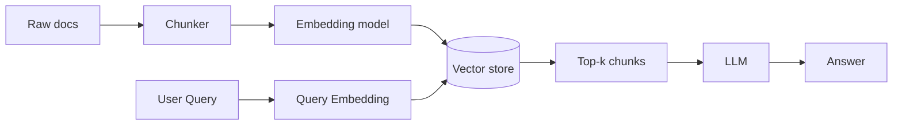

# Multi-Representation Indexing for Enhanced Search Results

Learn about the **multi-representation indexing** technique, how it works, and its **step-by-step implementation** in LangChain. This README also includes a concise **comparison with naïve RAG**. No BM25 or hybrid content is included.

---

## Why Multi‑Representation Indexing?

Traditional IR systems rely on a **single representation** (usually plain text or keyword features). That can miss nuance and underperform on varied queries. Multi‑representation indexing fixes this by storing **multiple views** of the same document (e.g., LLM summaries + originals) and using the best view at query time.

**Benefits**

* **Improved retrieval accuracy** – Different views capture different signals.
* **Contextual understanding** – Semantic summaries/embeddings capture meaning beyond exact words.
* **Diverse query handling** – Handles natural language questions and keyword-y queries more robustly.
* **Flexibility** – Works across formats (PDFs, web pages, etc.).
* **Suited to complex info** – Scientific/technical text becomes easier to search via concise summaries.

---

## What is Multi‑Representation Indexing?

Create and store **multiple representations** for each document:

* **Textual analysis** – (optional) keywords, entities, topics.
* **Semantic embeddings** – vectors built from compact LLM **summaries**.
* **Visual features** – (optional) image/diagram representations for multimodal corpora.

At retrieval time, the system searches the **most suitable representation** (e.g., semantic summaries) and then returns the **original full document** for answering.

---

## Architecture (Mermaid)

### Naïve RAG (single representation: raw chunks)



### Multi‑Representation (summaries + originals via MultiVectorRetriever)

```mermaid
flowchart LR
  A[Full docs] --> S[LLM Summarizer
(1..N summaries per doc)]
  S --> E[Embedding model]
  E --> V[(Vector store: summary vectors
+ metadata {doc_id})]
  A --> DS[(Docstore: originals keyed by doc_id)]
  Q[User Query] --> QE[Query Embedding]
  QE --> V
  V -- doc_id --> DS
  DS --> F[Full docs / chosen chunks]
  F --> L[LLM]
  L --> R[Answer]
```

---

## Step‑by‑Step Implementation (Text + LLM Summaries)

This implementation focuses on **text** with **LLM‑generated summaries** used for semantic indexing.

### 1) Import modules

```python
from langchain_openai import ChatOpenAI, OpenAIEmbeddings
from langchain.prompts import ChatPromptTemplate
from langchain.schema import Document
from langchain.schema.output_parser import StrOutputParser
from langchain_chroma import Chroma
from langchain.storage import InMemoryByteStore
from langchain.retrievers.multi_vector import MultiVectorRetriever
from langchain.text_splitter import RecursiveCharacterTextSplitter
import os, uuid
```

### 2) Set the OpenAI API key

```python
os.environ["OPENAI_API_KEY"] = "YOUR_OPENAI_KEY"
if not os.environ.get("OPENAI_API_KEY"):
    raise ValueError("Please set the OPENAI_API_KEY environment variable")
```

### 3) Load documents and (optionally) split

```python
# Example document list (replace with a proper loader for PDFs/HTML/etc.)
docs = [
    Document(page_content="Long document about LangSmith and tracing..."),
    Document(page_content="Another document covering evaluations and datasets..."),
]

# Optional: split long docs into manageable parts (use headings/semantic splits in prod)
splitter = RecursiveCharacterTextSplitter(chunk_size=1000, chunk_overlap=150)
docs = splitter.split_documents(docs)
```

### 4) Generate document summaries with an LLM

```python
summary_chain = (
    {"doc": lambda x: x.page_content}
    | ChatPromptTemplate.from_template(
        "Summarize the following document concisely in 4–6 sentences.

{doc}"
      )
    | ChatOpenAI(model="gpt-3.5-turbo", temperature=0)
    | StrOutputParser()
)

summaries = summary_chain.batch(docs, {"max_concurrency": 3})  # one summary per (split) doc
```

### 5) Index with multi‑representations (summaries + originals)

```python
# Vector store for summary embeddings
vectorstore = Chroma(collection_name="summaries", embedding_function=OpenAIEmbeddings())

# Docstore for full originals (could be Redis/DB/S3; here in-memory)
store = InMemoryByteStore()
id_key = "doc_id"

retriever = MultiVectorRetriever(
    vectorstore=vectorstore,
    byte_store=store,
    id_key=id_key,
)

# Assign stable IDs to link summaries ↔ originals
doc_ids = [str(uuid.uuid4()) for _ in docs]

# Wrap summaries with the linking metadata
summary_docs = [
    Document(page_content=s, metadata={id_key: doc_ids[i]})
    for i, s in enumerate(summaries)
]

# Index summaries (this computes embeddings and stores vectors + metadata)
retriever.vectorstore.add_documents(summary_docs)

# Store full originals keyed by the same IDs
retriever.docstore.mset(list(zip(doc_ids, docs)))
```

### 6) Retrieve documents for a query

```python
query = \"What is LangSmith?\"

# A) Direct vector search on **summaries** (returns summaries)
sub_docs = vectorstore.similarity_search(query, k=3)
print(\"SUMMARY HIT:
\", sub_docs[0].page_content[:200])

# B) MultiVectorRetriever search (search summaries → return **full docs**)
retrieved_docs = retriever.invoke(query)
print(\"FULL DOC:
\", retrieved_docs[0].page_content[:500])
print(\"FULL DOC LENGTH:\", len(retrieved_docs[0].page_content))
```

*This snippet shows both modes of retrieval: first fetching summaries directly from the vector store, and then retrieving the corresponding full document via the retriever.*

**Important**: `vectorstore.similarity_search()` searches the **summary vectors** and returns **summaries**. `retriever.invoke()` searches the same summaries but returns the **original documents**, using the shared `doc_id` key.

---

## How is This Different from Naïve RAG?

**Naïve RAG**

* Index = **raw chunks only** (single representation).
* Retrieval returns **chunks** directly.
* May be noisy; meaning can be diluted; less explainable.

**Multi‑Representation (this guide)**

* Index = **LLM summaries** (compact, semantic) **+ originals** (linked by `doc_id`).
* Retrieval searches summaries for relevance, then returns **full documents**.
* Fewer noisy matches, better recall for semantically phrased queries, clearer rationale (show the matching summary).

| Aspect            | Naïve RAG        | Multi‑Representation                      |
| ----------------- | ---------------- | ----------------------------------------- |
| Representation    | Raw chunks       | Summary views + originals                 |
| What’s indexed?   | Chunk embeddings | Summary embeddings + `doc_id` metadata    |
| What’s returned?  | Chunks           | Full docs (or chosen chunks) via `doc_id` |
| Noise sensitivity | Higher           | Lower (summaries filter)                  |
| Explainability    | Harder           | Easier (show summary that matched)        |

---

## TL;DR

* Index **summaries** for clean semantic matching.
* Link each summary to its **original document** via `doc_id`.
* Use `MultiVectorRetriever` to search summaries **and** return the full document for generation.

> This yields more robust, context‑aware retrieval than naïve RAG while keeping the pipeline simple (no keyword/BM25 hybrid here).
