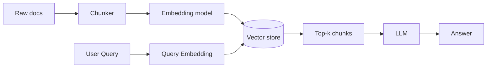
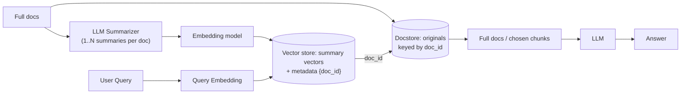

# Fixed Mermaid Diagrams

## Naïve RAG (single representation: raw chunks)

## Multi-Representation (summaries + originals via MultiVectorRetriever)

## Key Fixes Made:

1. **Multi-line labels**: Used ` ` instead of line breaks within node labels
2. **Edge labels**: Changed `-- doc_id -->` to `-->|doc_id|` for proper edge labeling syntax
3. **Consistent spacing**: Ensured proper indentation and spacing
4. **Quote protection**: Added quotes around multi-line node labels to prevent parsing issues

The main issues were:
- Line breaks within node labels need to use HTML ` ` tags
- Edge labels should use the `-->|label|` syntax instead of `-- label -->`
- Multi-line content in nodes should be wrapped in quotes
