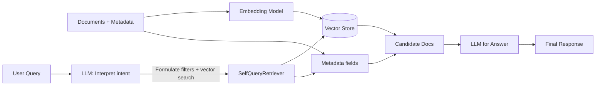

# Self-Querying Retrieval (SQR): Automating Query Formulation

Learn about the **self-querying retrieval (SQR)** technique, how it works, and its **step-by-step implementation** using LangChain.

Traditional retrieval systems often require complex query languages or predefined search facets. SQR, on the other hand, enables natural language queries and automates query formulation. This makes interacting with document collections more intuitive, powerful, and user-friendly.

---

## 🚀 Why Self‑Querying Retrieval?

* **Natural language queries** – Ask questions conversationally, without learning a query syntax.
* **Advanced retrieval** – Supports both content-based search and metadata filtering.
* **Flexibility** – Allows follow-up questions or refinements for narrowing results.

---

## 🧠 What is SQR?

Self-querying retrieval uses an **LLM to translate user intent** into structured queries over a vector store. It leverages both:

* **Document representations** (embeddings for semantic similarity)
* **Metadata fields** (structured filters like year, genre, author)

---

## 📊 High-Level Workflow



---

## 🛠️ Step-by-Step Implementation

### 1) Import Necessary Libraries

```python
from langchain_openai import OpenAIEmbeddings, ChatOpenAI
from langchain.chains.query_constructor.base import AttributeInfo
from langchain.retrievers.self_query.base import SelfQueryRetriever
from langchain_chroma import Chroma
from langchain.schema import Document
import os
```

### 2) Set Up the OpenAI API Key

```python
os.environ["OPENAI_API_KEY"] = "YOUR_OPENAI_KEY"
if not os.environ.get("OPENAI_API_KEY"):
    raise ValueError("Please set the OPENAI_API_KEY environment variable")
```

### 3) Example Data with Metadata

```python
docs = [
    Document(
        page_content="A historical fiction novel about love and war.",
        metadata={"title": "Book A", "author": "Author 1", "year": 2005, "genre": "historical fiction", "rating": 4.7, "language": "English", "country": "UK"}
    ),
    Document(
        page_content="A dystopian thriller set in a near-future society.",
        metadata={"title": "Book B", "author": "Author 2", "year": 2012, "genre": "thriller", "rating": 4.6, "language": "English", "country": "USA"}
    ),
]
```

### 4) Define the Embedding Function

```python
embeddings = OpenAIEmbeddings()
```

### 5) Initialize Vector Store

```python
vectorstore = Chroma.from_documents(docs, embedding=embeddings)
```

### 6) Create LLM and SelfQueryRetriever

```python
metadata_field_info = [
    AttributeInfo(name="title", description="Title of the book", type="string"),
    AttributeInfo(name="author", description="Author of the book", type="string"),
    AttributeInfo(name="year", description="Publication year", type="integer"),
    AttributeInfo(name="genre", description="Genre of the book", type="string"),
    AttributeInfo(name="rating", description="Average rating", type="float"),
    AttributeInfo(name="language", description="Language of the book", type="string"),
    AttributeInfo(name="country", description="Country of origin", type="string"),
]

document_content_description = "Summaries of books with rich metadata including title, author, genre, year, and more."

llm = ChatOpenAI(model="gpt-3.5-turbo", temperature=0)

retriever = SelfQueryRetriever.from_llm(
    llm,
    vectorstore,
    document_content_description,
    metadata_field_info,
    verbose=True
)
```

### 7) Example Queries

```python
# Basic query
retriever.get_relevant_documents("highly rated historical fiction books")

# Filtering with metadata
retriever.get_relevant_documents("thriller books published after 2010")

# Metadata-based query
retriever.get_relevant_documents("books from the USA")

# Combined filters
retriever.get_relevant_documents("books published after 2003 but before 2015 with rating above 4.5")

# Limiting results
retriever.get_relevant_documents("two books that have a rating above 4.8")
```

*This snippet shows how SQR enables natural language queries that map to both **semantic similarity** and **metadata filters** automatically.*

---

## 🎯 Educative Byte

Self-Querying Retrieval (SQR) turns natural language into structured queries with the help of LLMs. By combining semantic search with metadata filtering, SQR systems make retrieval **both powerful and user-friendly**.

This approach is ideal for applications like **legal search, academic research, recommendation systems, and enterprise knowledge bases**.
