# Self-Querying Retrieval (SQR): Implementation Guide

[](https://python.org)
[](https://langchain.com)

Transform natural language questions into intelligent database searches that combine semantic similarity with metadata filtering.

## 📋 Table of Contents

- [Overview](#overview)
- [Cost Considerations](#cost-considerations)
- [Architecture](#architecture)
- [Implementation](#implementation)
- [Query Examples](#query-examples)
- [Best Practices](#best-practices)

---

## 🎯 Overview

**Self-Querying Retrieval** uses an LLM to translate natural language queries into structured searches over a vector store, combining both semantic similarity and metadata filtering.

### How It Works

```python
# User asks naturally:
"Find highly rated sci-fi books from the last 3 years"

# SQR automatically creates:
{
    "semantic_query": "sci-fi science fiction",  # For vector search
    "metadata_filters": {
        "rating": {">=": 4.0},     # "highly rated"
        "year": {">=": 2021}       # "last 3 years"
    }
}
```

### Key Benefits

- **Natural Language**: Ask complex questions conversationally
- **Smart Interpretation**: Understands "recent", "highly rated", "short books"
- **Hybrid Search**: Combines content similarity with precise filtering
- **No Query Syntax**: No need to learn database query languages

---

## 💰 Cost Considerations

### Traditional RAG vs Self-Querying RAG

| Component | Traditional RAG | Self-Querying RAG | Cost Impact |
|-----------|----------------|-------------------|-------------|
| **Embeddings** | Required | Required | Use open-source models (FREE) |
| **LLM for Query Parsing** | Not needed | Required | OpenAI needed for quality (~$0.01-0.05/query) |
| **Vector Operations** | Standard | Standard | Same cost |
| **Total per Query** | **~$0.0001** | **~$0.01-0.05** | **50-500x more expensive** |

### Scalability Considerations

| Approach | Scalability Considerations |
|----------|---------------------------|
| **Traditional RAG** | • Simpler architecture<br/>• Cost mostly in vector store ops and storage<br/>• Costs rise mainly with data size and chunking granularity |
| **Self-Query Retriever** | • Adds extra LLM steps per query<br/>• Needs prompt/design tuning and metadata handling<br/>• Iterative retrieval increases compute/latency<br/>• Greater architectural complexity |

### When to Use Each Approach

**Use Self-Querying RAG when:**
- Complex natural language queries ("highly rated recent books")
- Expert users (researchers, analysts, lawyers)
- Low-medium volume (<10K queries/day)
- Rich metadata available
- UX more important than cost

**Use Traditional RAG when:**
- Simple keyword queries ("python tutorials")
- High volume (>100K queries/day)
- Cost-sensitive applications
- Minimal metadata
- Speed priority

---

## 🏗️ Architecture

### High-Level Architecture

```mermaid
graph TB
    subgraph "Phase 1: Indexing"
        A[📄 Documents] --> B[📝 Content]
        A --> C[🏷️ Metadata]
        B --> D[🧠 Embeddings<br/><small>Open Source</small>]
        D --> E[📊 Vector Store]
        C --> F[🗃️ Metadata Store]
    end
    
    subgraph "Phase 2: Setup"
        G[📋 Schema Definition] --> H[🤖 SelfQueryRetriever]
        E --> H
        F --> H
    end
    
    subgraph "Phase 3: Querying"
        I[🗣️ Natural Language] --> H
        H --> J[🧠 LLM Query Parser<br/><small>OpenAI $0.01-0.05</small>]
        J --> K[🔍 Hybrid Search]
        K --> L[📋 Results]
    end
    
    style J fill:#ffebee
    style L fill:#e8f5e8
```



### Query Processing Flow

```mermaid
sequenceDiagram
    participant User
    participant SQR as SelfQueryRetriever
    participant LLM as OpenAI LLM
    participant Vector as Vector Store
    participant Meta as Metadata Store
    
    User->>SQR: "Find good recent sci-fi books"
    SQR->>LLM: Parse intent + schema context
    Note over LLM: Cost: ~$0.025 per query
    LLM->>SQR: {"query": "sci-fi", "filters": {...}}
    
    par Semantic Search
        SQR->>Vector: similarity_search("sci-fi")
    and Metadata Filtering  
        SQR->>Meta: filter(rating≥4.0, year≥2020)
    end
    
    SQR->>SQR: Combine results
    SQR->>User: Relevant documents
```



---

## 🛠️ Implementation

### Installation

```bash
pip install langchain langchain-openai langchain-chroma sentence-transformers
```

### Step 1: Setup with Cost Optimization

```python
import os
from langchain_openai import ChatOpenAI
from langchain.embeddings import HuggingFaceEmbeddings
from langchain.chains.query_constructor.base import AttributeInfo
from langchain.retrievers.self_query.base import SelfQueryRetriever
from langchain_chroma import Chroma
from langchain.schema import Document

# Cost-optimized embeddings (FREE)
embeddings = HuggingFaceEmbeddings(
    model_name="sentence-transformers/all-MiniLM-L6-v2"
)

# Quality LLM required for query parsing
llm = ChatOpenAI(model="gpt-3.5-turbo", temperature=0)
os.environ["OPENAI_API_KEY"] = "your-openai-api-key"
```

### Step 2: Prepare Documents

```python
# Documents with rich metadata
documents = [
    Document(
        page_content="A gripping psychological thriller about a detective hunting a serial killer in modern Tokyo.",
        metadata={
            "title": "Tokyo Shadows",
            "author": "Kenji Nakamura",
            "year": 2023,
            "genre": "thriller", 
            "rating": 4.7,
            "pages": 380
        }
    ),
    Document(
        page_content="An epic space opera featuring interstellar wars and alien civilizations.",
        metadata={
            "title": "Galactic Conquest",
            "author": "Sarah Chen",
            "year": 2022,
            "genre": "sci-fi",
            "rating": 4.9, 
            "pages": 520
        }
    ),
    Document(
        page_content="A heartwarming romantic comedy about second chances in a coastal town.",
        metadata={
            "title": "Second Chance Summer", 
            "author": "Emma Rodriguez",
            "year": 2021,
            "genre": "romance",
            "rating": 4.3,
            "pages": 290
        }
    )
]

# Create vector store
vectorstore = Chroma.from_documents(documents, embeddings)
```

### Step 3: Define Metadata Schema

```python
# Define what the LLM can filter by
metadata_field_info = [
    AttributeInfo(
        name="year",
        description="Publication year. Recent means 2020+, classic means before 1980",
        type="integer"
    ),
    AttributeInfo(
        name="genre",
        description="Book genre: thriller, sci-fi, romance, mystery, historical-fiction", 
        type="string"
    ),
    AttributeInfo(
        name="rating",
        description="Reader rating 1-5. Highly rated means 4.5+, good means 4.0+",
        type="float"
    ),
    AttributeInfo(
        name="pages",
        description="Page count. Short means <300, medium means 300-450, long means >450",
        type="integer"
    )
]
```

### Step 4: Create Self-Query Retriever

```python
# Create the intelligent retriever
retriever = SelfQueryRetriever.from_llm(
    llm=llm,
    vectorstore=vectorstore,
    document_content_description="A collection of books across various genres with detailed metadata",
    metadata_field_info=metadata_field_info,
    verbose=True  # Shows LLM query parsing
)
```

---

## 🔍 Query Examples

### Natural Language Queries

```python
# Complex queries that showcase SQR power
queries = [
    "Find highly rated sci-fi books",
    "Show me recent thriller books with good ratings", 
    "I want short romance books from the last 3 years",
    "Books with excellent ratings published after 2020",
    "Find long books in any genre with high ratings"
]

for query in queries:
    print(f"\n🗣️ Query: {query}")
    results = retriever.get_relevant_documents(query)
    
    for doc in results:
        print(f"📖 {doc.metadata['title']} ({doc.metadata['year']})")
        print(f"   Rating: {doc.metadata['rating']} ⭐ | Pages: {doc.metadata['pages']}")
```

### What Happens Behind the Scenes

```python
# Query: "Find highly rated recent sci-fi books"

# LLM automatically creates:
{
    "query": "sci-fi science fiction space",  # Semantic search terms
    "filter": {
        "and": [
            {"eq": {"genre": "sci-fi"}},      # "sci-fi books"
            {"gte": {"rating": 4.5}},         # "highly rated" 
            {"gte": {"year": 2020}}           # "recent"
        ]
    }
}

# Then system searches:
# 1. Vector similarity for "sci-fi science fiction space"
# 2. Applies filters: genre=sci-fi AND rating≥4.5 AND year≥2020
# 3. Returns documents matching both criteria
```

---

## 📋 Best Practices

### 1. Metadata Design

```python
# ✅ Good: Descriptive with clear thresholds
AttributeInfo(
    name="rating",
    description="Reader rating 1-5. Excellent=4.8+, good=4.0+, poor=<3.0",
    type="float"
)

# ❌ Bad: Vague description
AttributeInfo(name="rating", description="Rating", type="float")
```

### 2. Content Quality

```python
# ✅ Good: Rich, searchable content
Document(
    page_content="A psychological thriller exploring the mind of a serial killer, set in rainy Seattle with complex detective work and family drama",
    metadata={...}
)

# ❌ Bad: Minimal content
Document(page_content="Thriller book", metadata={...})
```

### 3. Cost Management

```python
# Monitor LLM usage
retriever = SelfQueryRetriever.from_llm(
    llm=llm,
    vectorstore=vectorstore,
    document_content_description="...",
    metadata_field_info=metadata_field_info,
    verbose=True  # See when expensive LLM calls happen
)
```

### 4. Error Handling

```python
def safe_query(query, max_retries=2):
    for attempt in range(max_retries):
        try:
            return retriever.get_relevant_documents(query)
        except Exception as e:
            print(f"Attempt {attempt+1} failed: {e}")
    return []
```

---

## 🎯 Key Takeaways

1. **Cost Reality**: 50-500x more expensive than traditional RAG due to LLM calls
2. **Quality Trade-off**: Open-source embeddings (free) + OpenAI LLM (necessary for quality)
3. **Use Case Fit**: Best for complex queries with rich metadata, expert users
4. **Architecture**: Adds intelligent query parsing layer to traditional RAG
5. **Scalability**: Consider cost implications for high-volume applications

---

## 🔗 Resources

- [LangChain Self-Query Documentation](https://python.langchain.com/docs/modules/data_connection/retrievers/self_query/)
- [Sentence Transformers](https://huggingface.co/sentence-transformers)
- [OpenAI Pricing](https://openai.com/pricing)

---

**Self-Querying Retrieval transforms natural language into intelligent database queries, but at significant cost. Use wisely for high-value, complex query scenarios.**
