# Parent Document Retrieval (PDR): Complete Guide

[](https://python.org)
[](https://langchain.com)

Solve RAG's context limitation by retrieving complete parent documents from relevant chunks.

## 📋 Table of Contents

- [The Context Problem](#the-context-problem)
- [What is PDR?](#what-is-pdr)
- [Architecture](#architecture)
- [How PDR Works](#how-pdr-works)
- [PDR vs Naive RAG](#pdr-vs-naive-rag)
- [Implementation](#implementation)
- [Limitations](#limitations)
- [When to Use PDR](#when-to-use-pdr)

---

## 🤔 The Context Problem

### Traditional RAG's Limitation

**The Issue**: RAG splits documents into small chunks but only returns those tiny pieces, missing crucial context.

```
📚 Large Document: "Complete Python Guide" (50 pages)
    ↓ Split into chunks
📝 Chunk 1: "Variables store data..." (200 words)
📝 Chunk 2: "Functions take parameters..." (200 words)  
📝 Chunk 3: "Classes define objects..." (200 words)
    ↓ User asks complex question
❓ "How do classes use functions with variables?"
    ↓ Traditional RAG finds most relevant
📝 Returns: Chunk 3 only (200 words)
❌ Missing: How variables and functions work with classes
```

### Real-World Example

**Document**: Medical Textbook - "Understanding Cancer" (100 pages)
**User Query**: "What causes lung cancer and how is it treated?"

**Traditional RAG Problem**:
```
🔍 Finds: "Lung cancer affects respiratory system..." (150 words)
📝 Returns: Just this snippet
❌ Missing: Risk factors, prevention, treatment options, prognosis
```

**What We Actually Need**:
```
📚 Complete Context: Entire chapters on causes + treatment + prevention
✅ Comprehensive Understanding: Full picture of lung cancer
```

---

## 🎯 What is PDR?

**Parent Document Retrieval** = Use small chunks to find relevant documents, then return the complete parent documents for rich context.

### The Simple Concept

```
Small Question → Find Small Relevant Chunk → Return Large Complete Document
```

### Key Insight

- **Small chunks** = Good for precise searching (like index entries)
- **Large documents** = Rich context for understanding (like complete books)
- **PDR** = Use small to find, return large to understand

---

## 🏗️ Architecture

### PDR System Components

```mermaid
graph TB
    subgraph "Data Preparation"
        A[📄 Parent Documents] --> B[✂️ Text Splitter]
        B --> C[📝 Small Chunks]
    end
    
    subgraph "Dual Storage System"
        C --> D[🧠 Create Embeddings]
        D --> E[📊 Vector Store<br/><small>Stores: Chunk embeddings</small>]
        A --> F[🗃️ Document Store<br/><small>Stores: Complete documents</small>]
        C --> G[🔗 Chunk-to-Parent Mapping]
    end
    
    subgraph "Retrieval Process"
        H[❓ User Query] --> I[🔍 Search Vector Store]
        I --> J[📝 Find Relevant Chunks]
        J --> G
        G --> F
        F --> K[📚 Return Parent Documents]
    end
    
    style E fill:#e3f2fd
    style F fill:#fff3e0
    style K fill:#e8f5e8
```



### What Gets Stored Where

#### Vector Store (Searchable):
```
📊 Embeddings of small chunks for similarity search

chunk_001: [0.23, -0.45, 0.67, ...] → "Neural networks learn through backpropagation..."
chunk_002: [0.89, -0.12, 0.34, ...] → "Deep learning requires large datasets..."
chunk_003: [0.56, -0.78, 0.91, ...] → "Overfitting occurs when models memorize..."
```

#### Document Store (Complete Context):
```
🗃️ Full parent documents for rich context

doc_id_ML → "Complete Machine Learning Textbook" (50,000 words)
doc_id_PY → "Python Programming Guide" (30,000 words)
doc_id_AI → "Artificial Intelligence Handbook" (40,000 words)
```

#### Mapping (The Link):
```
🔗 Connecting chunks to their parents

chunk_001 → belongs_to → doc_id_ML
chunk_002 → belongs_to → doc_id_ML  
chunk_003 → belongs_to → doc_id_ML
```

---

## 🔄 How PDR Works

### Step-by-Step Process

#### Step 1: Document Indexing
```
📄 Input: "Machine Learning Textbook" (20,000 words)
    ↓
✂️ Split into small chunks:
    📝 Chunk A: "Introduction to ML algorithms..." (400 words)
    📝 Chunk B: "Supervised learning methods..." (400 words)
    📝 Chunk C: "Neural network architectures..." (400 words)
    
📊 Store chunk embeddings in Vector Store
🗃️ Store complete textbook in Document Store
🔗 Map: Chunk A,B,C → "ML Textbook"
```

#### Step 2: Query Processing
```
❓ User asks: "How do neural networks prevent overfitting?"
    ↓
🧠 Convert query to embedding
    ↓
🔍 Search Vector Store for similar chunk embeddings
    ↓
📝 Find: Chunk C (highest similarity score)
    ↓
🔗 Look up: Chunk C belongs to "ML Textbook"
    ↓
📚 Retrieve: Complete "ML Textbook" from Document Store
    ↓
✅ Return: Full 20,000-word context
```

### Two PDR Strategies

#### Strategy 1: Full Document Retrieval
```
📄 Original Document → 📝 Small Chunks → 📚 Return ENTIRE Document

Example:
- Book: "Python Programming" (100 pages)
- Found chunk: "Functions can return values..."
- Retrieved: Entire book (100 pages)
```

#### Strategy 2: Larger Chunk Retrieval
```
📄 Original Document → 📖 Large Sections → 📝 Small Chunks → 📖 Return Parent Section

Example:
- Book: "Python Programming" (100 pages)
- Sections: "Functions" (15 pages), "Classes" (20 pages)
- Found chunk: "Functions can return values..."
- Retrieved: "Functions" section (15 pages)
```

---

## ⚖️ PDR vs Naive RAG

### Traditional RAG (Naive Approach)


```
Query: "Explain machine learning model overfitting"
    ↓
Retrieves: "Overfitting occurs when..." (200 words)
    ↓
AI Response: Limited explanation based on 200 words
```

### Parent Document Retrieval


```
Query: "Explain machine learning model overfitting"
    ↓
Finds: "Overfitting occurs when..." (relevant chunk)
    ↓
Retrieves: Complete ML chapter (5,000 words)
    ↓
AI Response: Comprehensive explanation with examples, solutions, theory
```

### Detailed Comparison

| Aspect | Naive RAG | Parent Document Retrieval |
|--------|-----------|---------------------------|
| **Context Size** | 200-500 words | 2,000-50,000 words |
| **Query Handling** | Simple factual questions | Complex, analytical questions |
| **Understanding** | Surface-level | Deep, comprehensive |
| **Response Quality** | Basic answers | Rich, detailed explanations |
| **Processing Cost** | Low | Higher |
| **Storage Complexity** | Simple | Dual storage system |

### Example Comparison

**Query**: "How do Python classes implement inheritance and what are the best practices?"

#### Naive RAG Result:
```
Retrieved Chunk: "Classes in Python use inheritance with the syntax class Child(Parent):"
AI Response: "Python classes implement inheritance by using the syntax class Child(Parent). This allows the child class to access parent methods."
```

#### PDR Result:
```
Retrieved Context: Complete "Object-Oriented Programming" chapter (8,000 words)
AI Response: "Python classes implement inheritance through several mechanisms:

1. Single Inheritance: class Child(Parent)
2. Multiple Inheritance: class Child(Parent1, Parent2)
3. Method Resolution Order (MRO): How Python resolves method calls
4. Super() function: Accessing parent class methods
5. Best Practices:
   - Use composition over inheritance when possible
   - Keep inheritance hierarchies shallow
   - Document class relationships clearly
   [... detailed explanation with examples ...]"
```

---

## 🛠️ Implementation

### Basic Setup

```python
from langchain.retrievers import ParentDocumentRetriever
from langchain.text_splitter import RecursiveCharacterTextSplitter
from langchain_chroma import Chroma
from langchain.storage import InMemoryStore
from langchain_openai import OpenAIEmbeddings

# Initialize components
embeddings = OpenAIEmbeddings()
vectorstore = Chroma(embedding_function=embeddings)
docstore = InMemoryStore()

# Create text splitter for small chunks
child_splitter = RecursiveCharacterTextSplitter(chunk_size=400)
```

### Strategy 1: Full Document Retrieval

```python
# Create PDR that returns complete documents
full_doc_retriever = ParentDocumentRetriever(
    vectorstore=vectorstore,
    docstore=docstore,
    child_splitter=child_splitter,
    # No parent_splitter = returns full documents
)

# Add documents
full_doc_retriever.add_documents(your_documents)

# Query for rich context
results = full_doc_retriever.invoke("Your complex question")
```

### Strategy 2: Larger Chunk Retrieval

```python
# Create splitters for hierarchical chunking
parent_splitter = RecursiveCharacterTextSplitter(chunk_size=2000)  # Larger sections
child_splitter = RecursiveCharacterTextSplitter(chunk_size=400)    # Small chunks

# Create PDR that returns larger sections
section_retriever = ParentDocumentRetriever(
    vectorstore=vectorstore,
    docstore=docstore,
    child_splitter=child_splitter,
    parent_splitter=parent_splitter,  # Returns larger sections
)

# Add documents
section_retriever.add_documents(your_documents)

# Query for balanced context
results = section_retriever.invoke("Your question")
```

### Integration with QA

```python
from langchain.chains import RetrievalQA
from langchain_openai import OpenAI

# Create QA chain with PDR
qa_chain = RetrievalQA.from_chain_type(
    llm=OpenAI(),
    chain_type="stuff",
    retriever=full_doc_retriever
)

# Ask complex questions
response = qa_chain.invoke({"query": "Analyze the relationship between X and Y"})
```

---

## ⚠️ Limitations

### What PDR Cannot Solve

#### 1. Missing Information Problem
```
❌ Problem: Information doesn't exist in documents
Query: "Compare TensorFlow with PyTorch"
Documents: Only contain TensorFlow information
Result: PDR can't create PyTorch information that doesn't exist
```

#### 2. Cross-Document Knowledge
```
❌ Problem: Answer requires multiple documents
Query: "How does concept A in Document 1 relate to concept B in Document 2?"
Current PDR: Returns individual documents separately
Missing: Cross-document relationship analysis
```

#### 3. Abstract Concept Gaps
```
❌ Problem: Concepts not explicitly mentioned
Query: "What are the philosophical implications of AI?"
Chunk found: "AI uses machine learning algorithms..."
Parent doc: Technical AI implementation guide
Missing: Philosophical discussion entirely
```

#### 4. Irrelevant Large Context
```
❌ Problem: Parent document too broad
Query: "How to fix Python import error?"
Chunk found: "Import statements load modules..."
Parent retrieved: Entire Python documentation (1000 pages)
Result: 99% irrelevant information
```

### Technical Limitations

#### 1. Storage Overhead
```
Traditional RAG: Store only chunk embeddings
PDR: Store chunk embeddings + full documents + mapping
Storage cost: 2-3x higher
```

#### 2. Processing Cost
```
Traditional RAG: Process 200-500 words
PDR: Process 2,000-50,000 words
LLM cost: 5-100x higher per query
```

#### 3. Retrieval Accuracy
```
Problem: Small chunk may not represent large document well
Example: Technical chunk found in mostly theoretical document
Result: Retrieved context doesn't match query intent
```

### When PDR Fails

#### Scenario 1: Wrong Document Retrieved
```
Query: "How to optimize Python code performance?"
Chunk found: "Python is a programming language..." (generic intro)
Parent retrieved: "Python Basics for Beginners" (irrelevant for optimization)
Better approach: More specific chunking or metadata filtering
```

#### Scenario 2: Information Fragmentation
```
Query: "Complete guide to machine learning"
Problem: Information spread across 10 different documents
PDR result: Returns one document, misses comprehensive view
Better approach: Multi-document retrieval or synthesis
```

---

## 🎯 When to Use PDR

### ✅ **PDR is Ideal For:**

#### Complex Analytical Queries
```
✅ "Analyze the themes in Shakespeare's Hamlet"
✅ "Explain the relationship between quantum mechanics and relativity"
✅ "Compare different machine learning algorithms comprehensively"
✅ "What are the causes, symptoms, and treatments for diabetes?"
```

#### Rich, Interconnected Documents
```
✅ Academic papers with complex arguments
✅ Technical manuals with cross-references
✅ Books with themes spanning multiple chapters
✅ Legal documents with interconnected clauses
```

#### Expert-Level Understanding
```
✅ Research applications requiring deep context
✅ Educational content needing comprehensive explanations
✅ Professional analysis requiring full background
```

### ❌ **Avoid PDR For:**

#### Simple Factual Queries
```
❌ "What is the capital of France?"
❌ "When was Python created?"
❌ "Define machine learning"
❌ "List Python data types"
```

#### High-Volume Applications
```
❌ Customer service chatbots (thousands of queries/day)
❌ Real-time search systems
❌ Mobile apps with limited processing power
```

#### Short Documents
```
❌ FAQ sections (already complete)
❌ Product descriptions (no additional context needed)
❌ Simple knowledge base articles
```

### Decision Framework

```python
def should_use_pdr(query_complexity, document_size, context_importance):
    if query_complexity == "simple":
        return False
    
    if document_size < 2000:  # Already small enough
        return False
        
    if context_importance == "critical":
        return True
        
    return query_complexity == "complex" and document_size > 5000
```

---

## 💡 Key Takeaways

1. **PDR solves context limitation**: Gets both precise search AND comprehensive context
2. **Dual storage required**: Small chunks for search, large documents for context
3. **Better for complexity**: Ideal for analytical queries, poor for simple facts
4. **Trade-offs exist**: Higher cost and complexity for richer context
5. **Limitations apply**: Can't create missing information or cross-document knowledge

**Bottom Line**: PDR transforms narrow chunk retrieval into comprehensive knowledge access, but only when the complete information exists within individual documents.

---

## 🔗 Resources

- [LangChain Parent Document Retriever](https://python.langchain.com/docs/modules/data_connection/retrievers/parent_document_retriever)
- [Text Splitting Strategies](https://python.langchain.com/docs/modules/data_connection/document_transformers/)
- [Vector Store Comparison](https://python.langchain.com/docs/modules/data_connection/vectorstores/)

---

**Parent Document Retrieval: When you need the full story, not just the headlines.**