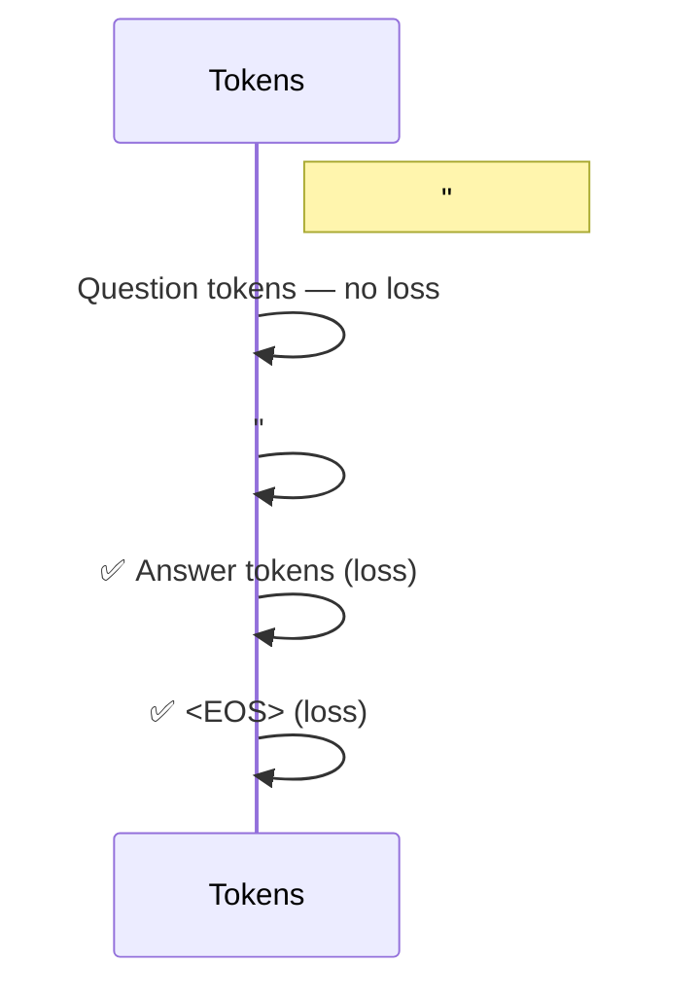

# 📚 Instruction Tuning — A Practical README

## Table of Contents

1. [What Is Instruction Tuning?](#what-is-instruction-tuning)
2. [Where It Fits in the LLM Training Pipeline](#where-it-fits-in-the-llm-training-pipeline)
3. [Dataset Anatomy 📑](#dataset-anatomy)
4. [Prompt & Special‑Token Formats](#prompt--special-token-formats)
5. [Instruction Masking 🎯](#instruction-masking)
6. [Key Design Considerations](#key-design-considerations)
7. [End‑to‑End Example](#end-to-end-example)
8. [Typical Use Cases](#typical-use-cases)
9. [Further Reading & Resources](#further-reading--resources)

---

## What Is Instruction Tuning?

**Instruction tuning** (aka **Supervised Fine‑Tuning — SFT**) means retraining a *pre‑trained* language model on a curated set of ***instruction–response*** pairs written by experts. The fresh supervision teaches the model *how* to follow natural‑language commands rather than just predicting the next token.

> 🔑 **Goal** → Improve alignment, task‑specific accuracy, and safety *before* applying preference‑based methods such as RLHF or Direct Preference Optimisation (DPO).

---

## Where It Fits in the LLM Training Pipeline

| Stage                            | Objective                            | Data                             | Typical Loss                                        |
| -------------------------------- | ------------------------------------ | -------------------------------- | --------------------------------------------------- |
| 1️⃣ **Pre‑training**             | General language knowledge           | 100 B+ tokens (web, books, code) | Next‑token, unmasked                                |
| 2️⃣ **Instruction tuning (SFT)** | Teach the model to *follow commands* | ≤1 M high‑quality triples        | Cross‑entropy on answer tokens (masked or unmasked) |
| 3️⃣ **RLHF / DPO**               | Align outputs with human preferences | Human comparison data            | Policy‑gradient / K‑L‑regularised loss              |

---

## Dataset Anatomy 📑

Each record usually contains **three** parts:

```yaml
instruction:    "Translate to French."
input:          "Good morning!"     # optional
output:         "Bonjour !"
```

* `instruction` → Describes the task.
* `input` → Context the model must process. May be empty.
* `output` → Ground‑truth answer.

Some public corpora (e.g. **Self‑Instruct**, **Flan**) omit `input` for simpler commands.

---

## Prompt & Special‑Token Formats

LLMs rely on *special tokens* so the decoder can distinguish instructions from answers.
Popular templates include:

### 1. Triple‑Hash Blocks (Flan‑T5)

````text
### Instruction:
Create a Python function that squares numbers.

### Response:
```python
def f(x):
    return x**2
````

````

### 2. Chat‑Style Roles (Llama / Vicuna)
```text
### Human:
What is the capital of Japan?

### Assistant:
Tokyo.
````

### 3. Explicit `<|prompt|>` Tokens (GPT‑J‑Tuned)

```text
<|instruction|> Summarise: "The food was awesome!" <|response|> The review is positive.
```

💡 *Why bother?* Using reserved IDs prevents the tokenizer from splitting the tags, ensuring deterministic boundary detection during training and inference.

> **Whitespace matters!** Even an invisible `\n` may shift every token position. Always verify with `tokenizer.encode_plus()`.

---

## Instruction Masking 🎯

During SFT we **don’t** always want to back‑propagate through *every* generated token. *Instruction masking* restricts the loss to the answer span:



### Why Mask?

* Prevents the model from overfitting to the literal wording of instructions.
* Reduces compute — fewer tokens in `CrossEntropyLoss`.
* Empirically boosts performance on smaller, high‑quality datasets.

### Implementation Snippet (🤗 Transformers ≥ 4.39)

```python
from transformers import AutoTokenizer, DataCollatorForCompletionOnlyLM

collator = DataCollatorForCompletionOnlyLM(
    tokenizer=tok,
    response_template="### Response:",   # text right before the answer
)
```

*Special tokens (e.g. `<bos>`, `<eos>`) are automatically ignored.*

> ⚖️ *Unmasked vs Masked?* Recent papers show that **unmasked** loss can help when your dataset is tiny (<5 k examples) because every gradient counts. Try both.

---

## Key Design Considerations

1. **Data quality ≫ Data size**: 5 k pristine tasks often beat 500 k noisy ones.
2. **Domain match**: For specialised LLMs (medical, legal, education) craft domain‑specific instructions.
3. **Token budget**: Longer prompts → higher training cost. Use concise yet explicit instructions.
4. **Catastrophic forgetting**: Over‑fine‑tuning can erase skills learnt during pre‑training. Use smaller learning rates (1 – 2 × 10⁻⁵) and early stopping.
5. **Evaluation**: Probe *follow‑ability* (e.g. HELM, MT‑Bench) rather than perplexity alone.

---

## End‑to‑End Example

### Task

> **Instruction**: "Answer the question."
>
> **Input**: "Which is the largest ocean?"
>
> **Output**: "The Pacific Ocean."

### Packed Training Sequence

```text
### Instruction:
Answer the question.
### Input:
Which is the largest ocean?
### Response:
The Pacific Ocean.
<|eos|>
```

The model is asked to predict each next token. With masking, gradients are applied **only** on:

```
The ▲Pacific ▲Ocean. ▲<|eos|>
```

(symbol ▲ = tokens that contribute to loss)

---

## Typical Use Cases

| Domain          | Example Instruction‑Tuned Model   | Real‑World Impact                            |
| --------------- | --------------------------------- | -------------------------------------------- |
| Chat Assistants | ChatGPT (GPT‑3.5‑Turbo SFT stage) | Safer & more helpful responses               |
| Code Generation | StarCoderBase ↦ StarChat          | Better instruction compliance for developers |
| Education       | Math‑Tutor Llama 7B               | Step‑by‑step explanations for students       |
| Medicine        | MedAlpaca / Gatortron‑SFT         | Reliable answers to clinical queries         |
| Robotics & IoT  | In‑house SFT on task specs        | Accurate natural‑language robot control      |

---

## Further Reading & Resources

* **Stanford Alpaca** paper — first low‑cost 7 B instruction tuning.
* **FLAN‑T5** — 62 diverse datasets merged for zero‑shot gen.
* **"InstructGPT"** — OpenAI’s original RLHF work (SFT stage details).
* **HuggingFace 🤗 Course — SFT Chapter**.
* **DataCollatorForCompletionOnlyLM** docs.
* **mt‑bench** by LMSys — instruction‑following benchmark.

---

> 🏁 *Instruction tuning forms the bridge between raw language knowledge and task‑specific mastery. Master it, and your LLM will listen — not just talk.*
