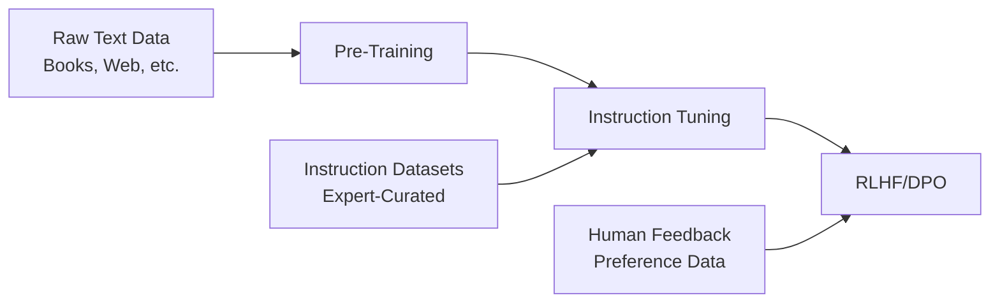

# Instruction Tuning: A Comprehensive Guide

[](https://opensource.org/licenses/MIT)
[](https://www.python.org/downloads/)
[](https://github.com/huggingface/transformers)

## 📖 Table of Contents
- [Introduction](#introduction)
- [What is Instruction Tuning?](#what-is-instruction-tuning)
- [Training Pipeline](#training-pipeline)
- [Components & Architecture](#components--architecture)
- [Special Tokens & Formatting](#special-tokens--formatting)
- [Instruction Masking](#instruction-masking)
- [Real-World Examples](#real-world-examples)
- [Use Cases](#use-cases)
- [Implementation Guide](#implementation-guide)
- [Best Practices](#best-practices)
- [Resources](#resources)

## 🚀 Introduction

Instruction Tuning is a critical fine-tuning technique that transforms pre-trained language models into instruction-following assistants. This repository provides a comprehensive guide to understanding and implementing instruction tuning for various applications.

## 🎯 What is Instruction Tuning?

**Instruction Tuning** (also known as **Supervised Fine-Tuning** or **SFT**) is a training method that teaches language models to:

- Follow specific instructions accurately
- Generate contextually appropriate responses
- Handle diverse tasks with consistent performance
- Maintain coherent conversation flows

### Key Benefits:
- ✅ **Task Versatility**: Handle multiple tasks with a single model
- ✅ **Improved Accuracy**: Better task-specific performance
- ✅ **Human Alignment**: More natural and helpful responses
- ✅ **Consistency**: Reliable output quality across different prompts

## 🔄 Training Pipeline



### Stage 1: Pre-Training
- **Purpose**: Learn general language patterns
- **Data**: Massive text corpora (books, web pages, articles)
- **Objective**: Next token prediction
- **Duration**: Weeks to months

### Stage 2: Instruction Tuning (SFT)
- **Purpose**: Learn to follow instructions
- **Data**: Curated instruction-response pairs
- **Objective**: Generate appropriate responses to instructions
- **Duration**: Hours to days

### Stage 3: RLHF/DPO
- **Purpose**: Align with human preferences
- **Data**: Human preference rankings
- **Objective**: Optimize for helpfulness, harmlessness, honesty
- **Duration**: Hours to days

## 🏗️ Components & Architecture

### Dataset Structure
Every instruction tuning example contains three components:

```python
{
    "instruction": "The task description",
    "input": "Optional context or data",
    "output": "Expected response"
}
```

### Detailed Breakdown:

#### 1. **Instructions** 🎯
Define what the model should do:
- `"Answer the following question"`
- `"Translate this text to French"`
- `"Write a Python function that..."`
- `"Summarize the given article"`

#### 2. **Input** 📝 (Optional)
Provide necessary context:
- Questions to answer
- Text to translate
- Data to process
- Context for generation

#### 3. **Output** ✨
Show the expected response:
- Correct answers
- Translations
- Code implementations
- Summaries

## 🏷️ Special Tokens & Formatting

Special tokens structure the training data and help the model understand different parts of the sequence:

### Common Token Formats:

#### Format 1: Simple Delimiters
```
###instruction### Answer the question: What is the capital of France?
###response### The capital of France is Paris.
```

#### Format 2: Conversational
```
###human### Can you explain photosynthesis?
###assistant### Photosynthesis is the process by which plants convert sunlight, carbon dioxide, and water into glucose and oxygen...
```

#### Format 3: Alpaca Format
```
Below is an instruction that describes a task, paired with an input that provides further context.

### Instruction:
Translate the following text to Spanish.

### Input:
Hello, how are you today?

### Response:
Hola, ¿cómo estás hoy?
```

#### Format 4: ChatML Format
```
<|im_start|>system
You are a helpful assistant.<|im_end|>
<|im_start|>user
What is machine learning?<|im_end|>
<|im_start|>assistant
Machine learning is a subset of artificial intelligence...<|im_end|>
```

### Token Compatibility ⚠️
- Tokens must exist in the model's tokenizer
- Custom tokens require tokenizer updates
- Mismatched tokens can cause training failures

## 🎭 Instruction Masking

Instruction masking focuses the loss calculation on output tokens only, improving training efficiency and quality.

### How It Works:

```python
# Example sequence
sequence = "###instruction### What is 2+2? ###response### 4"

# Without masking (traditional)
loss_tokens = ["###instruction###", "What", "is", "2+2?", "###response###", "4"]

# With masking (instruction tuning)
loss_tokens = [MASKED, MASKED, MASKED, MASKED, MASKED, "4"]
```

### Benefits:
- 🎯 **Focused Learning**: Model learns to generate responses, not repeat instructions
- ⚡ **Efficiency**: Faster convergence with better resource utilization
- 🎨 **Quality**: Improved response generation quality

### Implementation Example:
```python
from transformers import DataCollatorForCompletionOnlyLM

# Configure masking for specific tokens
data_collator = DataCollatorForCompletionOnlyLM(
    response_template="###response###",
    tokenizer=tokenizer,
    mlm=False
)
```

## 🌟 Real-World Examples

### Example 1: Question Answering
```json
{
    "instruction": "Answer the question based on the given context.",
    "input": "Context: The Amazon rainforest spans 9 countries and covers 5.5 million square kilometers. Question: How many countries does the Amazon rainforest span?",
    "output": "The Amazon rainforest spans 9 countries."
}
```

### Example 2: Code Generation
```json
{
    "instruction": "Write a Python function that calculates the factorial of a number.",
    "input": "",
    "output": "def factorial(n):\n    if n == 0 or n == 1:\n        return 1\n    else:\n        return n * factorial(n - 1)"
}
```

### Example 3: Text Summarization
```json
{
    "instruction": "Summarize the following article in 2-3 sentences.",
    "input": "Artificial intelligence has revolutionized many industries over the past decade. From healthcare to finance, AI systems are now helping doctors diagnose diseases, banks detect fraud, and companies optimize their operations. The rapid advancement in machine learning algorithms and the availability of large datasets have been key drivers of this transformation.",
    "output": "Artificial intelligence has transformed numerous industries over the past decade, including healthcare and finance. AI systems now assist in medical diagnosis, fraud detection, and operational optimization. This transformation has been driven by advances in machine learning algorithms and the availability of large datasets."
}
```

### Example 4: Creative Writing
```json
{
    "instruction": "Write a short story about a robot learning to paint.",
    "input": "",
    "output": "ARTIE-7 stared at the blank canvas, its mechanical fingers gripping the paintbrush with uncertain precision. For months, it had analyzed thousands of masterpieces, calculating color theory and composition rules. But today, something different stirred in its circuits—a desire to create rather than compute. As the first stroke of blue touched the canvas, ARTIE-7 felt something it had never experienced before: the joy of creation."
}
```

## 🎪 Use Cases

### 1. **Customer Service Chatbots** 🤖
- **Application**: Automated customer support
- **Training Data**: Customer queries and support responses
- **Benefits**: 24/7 availability, consistent quality, cost reduction

```json
{
    "instruction": "Respond to the customer's billing inquiry professionally.",
    "input": "I was charged twice for my monthly subscription. Can you help?",
    "output": "I apologize for the billing error. I can see the duplicate charge on your account. I'll immediately process a refund for the extra charge, which should appear in your account within 3-5 business days. Is there anything else I can help you with today?"
}
```

### 2. **Educational Assistants** 🎓
- **Application**: Personalized tutoring and homework help
- **Training Data**: Educational Q&A, explanations, problem-solving steps
- **Benefits**: Personalized learning, instant feedback, 24/7 availability

```json
{
    "instruction": "Explain this math concept to a 10-year-old student.",
    "input": "What are fractions?",
    "output": "Fractions are like sharing pizza! Imagine you have a whole pizza and you cut it into equal pieces. If you cut it into 4 pieces and take 1 piece, you have 1/4 (one-fourth) of the pizza. The bottom number (4) tells us how many pieces the whole pizza was cut into, and the top number (1) tells us how many pieces you have."
}
```

### 3. **Code Assistants** 💻
- **Application**: Programming help, code review, debugging
- **Training Data**: Code snippets, documentation, programming Q&A
- **Benefits**: Faster development, learning assistance, code quality improvement

```json
{
    "instruction": "Debug this Python code and explain the fix.",
    "input": "def calculate_average(numbers):\n    return sum(numbers) / len(numbers)\n\nresult = calculate_average([])",
    "output": "The code will raise a ZeroDivisionError when an empty list is passed because len([]) is 0. Here's the fix:\n\ndef calculate_average(numbers):\n    if not numbers:\n        return 0  # or raise ValueError('Cannot calculate average of empty list')\n    return sum(numbers) / len(numbers)\n\nThis prevents division by zero by checking if the list is empty first."
}
```

### 4. **Content Creation** ✍️
- **Application**: Blog posts, marketing copy, social media content
- **Training Data**: High-quality content examples across domains
- **Benefits**: Faster content production, idea generation, consistency

```json
{
    "instruction": "Write an engaging social media post for a sustainable fashion brand.",
    "input": "New organic cotton t-shirt collection launch",
    "output": "🌱 Introducing our new Organic Cotton Collection! Each t-shirt is made from 100% certified organic cotton, grown without harmful pesticides. Soft on your skin, gentle on the planet. Available in 8 beautiful colors. Shop sustainable, wear confidently! #SustainableFashion #OrganicCotton #EcoFriendly"
}
```

### 5. **Medical Information Systems** 🏥
- **Application**: Medical Q&A, symptom checking, drug information
- **Training Data**: Medical literature, approved medical resources
- **Benefits**: Quick access to information, preliminary guidance, education

```json
{
    "instruction": "Provide general information about the medication asked about.",
    "input": "What is ibuprofen used for?",
    "output": "Ibuprofen is a nonsteroidal anti-inflammatory drug (NSAID) commonly used to reduce pain, inflammation, and fever. It's often used for headaches, muscle aches, menstrual cramps, dental pain, and minor arthritis. Always follow dosing instructions and consult a healthcare provider for persistent symptoms or if you have medical conditions."
}
```

### 6. **Data Analysis Assistants** 📊
- **Application**: Data interpretation, report generation, insights
- **Training Data**: Data analysis examples, statistical explanations
- **Benefits**: Democratized data analysis, faster insights, educational value

```json
{
    "instruction": "Analyze this sales data and provide insights.",
    "input": "Q1 Sales: $150K, Q2 Sales: $180K, Q3 Sales: $165K, Q4 Sales: $200K",
    "output": "Analysis of your annual sales data shows strong growth with a 33% increase from Q1 to Q4 ($150K to $200K). Key insights: 1) Steady growth momentum with Q2 showing the strongest quarter-over-quarter growth (20%), 2) Q3 saw a temporary dip (-8.3%) possibly due to seasonal factors, 3) Strong finish in Q4 with 21% growth, suggesting effective holiday strategies. Total annual sales: $695K. Recommendation: Investigate Q3 factors and replicate Q4 strategies."
}
```

## 💻 Implementation Guide

### Basic Setup

```python
from transformers import (
    AutoTokenizer, 
    AutoModelForCausalLM, 
    TrainingArguments, 
    Trainer,
    DataCollatorForCompletionOnlyLM
)
from datasets import Dataset
import torch

# 1. Load model and tokenizer
model_name = "microsoft/DialoGPT-medium"
tokenizer = AutoTokenizer.from_pretrained(model_name)
model = AutoModelForCausalLM.from_pretrained(model_name)

# Add padding token if not present
if tokenizer.pad_token is None:
    tokenizer.pad_token = tokenizer.eos_token

# 2. Prepare dataset
def format_instruction(example):
    """Format instruction data into training format"""
    if example['input']:
        text = f"###instruction### {example['instruction']}\n{example['input']}\n###response### {example['output']}"
    else:
        text = f"###instruction### {example['instruction']}\n###response### {example['output']}"
    return {"text": text}

# 3. Tokenize data
def tokenize_function(examples):
    return tokenizer(
        examples["text"],
        truncation=True,
        padding=True,
        max_length=512,
        return_tensors="pt"
    )

# 4. Setup data collator with instruction masking
data_collator = DataCollatorForCompletionOnlyLM(
    response_template="###response###",
    tokenizer=tokenizer,
    mlm=False
)

# 5. Configure training arguments
training_args = TrainingArguments(
    output_dir="./instruction-tuned-model",
    overwrite_output_dir=True,
    num_train_epochs=3,
    per_device_train_batch_size=4,
    per_device_eval_batch_size=4,
    warmup_steps=100,
    logging_steps=50,
    save_steps=500,
    evaluation_strategy="steps",
    eval_steps=500,
    learning_rate=5e-5,
    fp16=True,  # Enable mixed precision for efficiency
    dataloader_num_workers=4,
)

# 6. Initialize trainer
trainer = Trainer(
    model=model,
    args=training_args,
    train_dataset=train_dataset,
    eval_dataset=eval_dataset,
    data_collator=data_collator,
    tokenizer=tokenizer,
)

# 7. Start training
trainer.train()

# 8. Save the model
trainer.save_model()
tokenizer.save_pretrained("./instruction-tuned-model")
```

### Advanced Configuration

```python
# Custom data preprocessing
class InstructionDataProcessor:
    def __init__(self, tokenizer, max_length=512):
        self.tokenizer = tokenizer
        self.max_length = max_length
    
    def process_conversations(self, examples):
        """Process multi-turn conversations"""
        processed = []
        for conversation in examples:
            text = ""
            for turn in conversation:
                if turn['role'] == 'user':
                    text += f"###human### {turn['content']}\n"
                else:
                    text += f"###assistant### {turn['content']}\n"
            processed.append({"text": text})
        return processed
    
    def add_special_tokens(self):
        """Add custom tokens to tokenizer"""
        special_tokens = ["###instruction###", "###response###", "###human###", "###assistant###"]
        self.tokenizer.add_special_tokens({"additional_special_tokens": special_tokens})
        return len(special_tokens)

# Usage
processor = InstructionDataProcessor(tokenizer)
num_added = processor.add_special_tokens()

# Resize model embeddings to accommodate new tokens
model.resize_token_embeddings(len(tokenizer))
```

## 🎯 Best Practices

### 1. **Data Quality** ✨
- **Diverse Examples**: Include varied instruction types and domains
- **High-Quality Outputs**: Ensure responses are accurate and well-written
- **Consistent Formatting**: Maintain uniform token structure across datasets
- **Balanced Distribution**: Avoid over-representation of specific task types

### 2. **Token Management** 🏷️
- **Tokenizer Alignment**: Ensure special tokens exist in the tokenizer
- **Context Length**: Respect model's maximum sequence length
- **Efficient Encoding**: Use appropriate truncation and padding strategies

### 3. **Training Configuration** ⚙️
- **Learning Rate**: Start with 5e-5 to 1e-4 for instruction tuning
- **Batch Size**: Use appropriate batch sizes based on available memory
- **Gradient Accumulation**: Use for effective larger batch sizes
- **Mixed Precision**: Enable fp16 for memory efficiency

### 4. **Evaluation Strategy** 📊
- **Hold-out Set**: Reserve data for evaluation
- **Task-Specific Metrics**: Use appropriate metrics for each task type
- **Human Evaluation**: Include human assessment for response quality
- **Diverse Test Cases**: Evaluate on various instruction types

### 5. **Monitoring & Debugging** 🔍
- **Loss Tracking**: Monitor training and validation loss
- **Sample Outputs**: Regularly check generated responses
- **Overfitting Prevention**: Use early stopping and regularization
- **Resource Monitoring**: Track GPU memory and training time

## 📚 Resources

### Essential Libraries
- **[Hugging Face Transformers](https://github.com/huggingface/transformers)**: Core library for model training
- **[Datasets](https://github.com/huggingface/datasets)**: Data loading and processing
- **[PEFT](https://github.com/huggingface/peft)**: Parameter-efficient fine-tuning
- **[TRL](https://github.com/huggingface/trl)**: Transformer Reinforcement Learning

### Popular Datasets
- **[Alpaca](https://github.com/tatsu-lab/stanford_alpaca)**: Stanford's instruction-following dataset
- **[Dolly](https://github.com/databrickslabs/dolly)**: Databricks' instruction dataset
- **[OpenOrca](https://huggingface.co/datasets/Open-Orca/OpenOrca)**: Large-scale instruction dataset
- **[ShareGPT](https://huggingface.co/datasets/anon8231489123/ShareGPT_Vicuna_unfiltered)**: Conversational data

### Model Architectures
- **[LLaMA](https://ai.facebook.com/blog/large-language-model-llama-meta-ai/)**: Meta's foundation models
- **[Mistral](https://mistral.ai/)**: Efficient open-source models
- **[Phi](https://azure.microsoft.com/en-us/products/ai-services/openai-service)**: Microsoft's small language models

### Tutorials & Guides
- **[Hugging Face Course](https://huggingface.co/course/chapter1/1)**: Comprehensive NLP course
- **[FastAI](https://course.fast.ai/)**: Practical deep learning course
- **[Papers with Code](https://paperswithcode.com/)**: Latest research and implementations

## 🤝 Contributing

We welcome contributions! Please follow these guidelines:

1. **Fork** the repository
2. **Create** a feature branch (`git checkout -b feature/amazing-feature`)
3. **Commit** your changes (`git commit -m 'Add amazing feature'`)
4. **Push** to the branch (`git push origin feature/amazing-feature`)
5. **Open** a Pull Request

### Contribution Areas:
- 📖 Documentation improvements
- 🔧 Code examples and utilities
- 📊 Dataset contributions
- 🐛 Bug fixes and optimizations
- ✨ New features and enhancements

## 📄 License

This project is licensed under the MIT License - see the [LICENSE](LICENSE) file for details.

## 🙏 Acknowledgments

- Hugging Face team for the Transformers library
- Stanford for the Alpaca dataset
- OpenAI for pioneering instruction-following research
- The open-source community for valuable contributions

---

**⭐ Star this repository if it helped you!**

For questions and discussions, please use the [Issues](https://github.com/your-repo/instruction-tuning/issues) section.
