# 🎓 Instruction Tuning: A Complete Beginner's Guide

[](https://opensource.org/licenses/MIT)
[](https://www.python.org/downloads/)
[](https://github.com/huggingface/transformers)

> **TL;DR**: Instruction tuning teaches AI models to follow human instructions, transforming them from "text completers" into helpful assistants. Think of it as teaching a parrot not just to mimic words, but to understand and respond to specific requests.

---

## 📖 Table of Contents
- [🤔 What Problem Are We Solving?](#-what-problem-are-we-solving)
- [🧠 Understanding Language Models: The Journey](#-understanding-language-models-the-journey)
- [🎯 What is Instruction Tuning?](#-what-is-instruction-tuning)
- [🔍 The Magic of Instruction Masking (Simplified!)](#-the-magic-of-instruction-masking-simplified)
- [🏗️ Building Blocks: Dataset Structure](#️-building-blocks-dataset-structure)
- [🏷️ Special Tokens: The Model's Language](#️-special-tokens-the-models-language)
- [🚀 The Complete Training Pipeline](#-the-complete-training-pipeline)
- [🌟 Real-World Examples (Learn by Doing)](#-real-world-examples-learn-by-doing)
- [💻 Implementation: From Zero to Hero](#-implementation-from-zero-to-hero)
- [🎯 Best Practices & Common Pitfalls](#-best-practices--common-pitfalls)
- [📚 Resources & Next Steps](#-resources--next-steps)

---

## 🤔 What Problem Are We Solving?

### The Problem: Smart but Disobedient AI

Imagine you have a brilliant friend who knows everything but doesn't listen to instructions:

**You**: "Please write me a Python function to calculate tax"
**Regular AI**: "Here's a story about a calculator that lived in a magic kingdom..."

**You**: "Translate 'Hello' to French"  
**Regular AI**: "Hello is a common greeting used in English-speaking countries..."

### The Solution: Instruction Tuning

After instruction tuning:

**You**: "Please write me a Python function to calculate tax"
**Tuned AI**: 
```python
def calculate_tax(income, tax_rate):
    return income * tax_rate
```

**You**: "Translate 'Hello' to French"  
**Tuned AI**: "Bonjour"

---

## 🧠 Understanding Language Models: The Journey

Think of training an AI like teaching a child to communicate:

### Stage 1: Pre-Training (Learning Language) 🍼
**What happens**: The model reads millions of books, websites, and articles
**What it learns**: Grammar, facts, patterns in text
**Analogy**: Like a child learning to speak by listening to conversations

```
Input: "The sky is..."
Output: "blue" (completes the sentence)
```

### Stage 2: Instruction Tuning (Learning to Follow Directions) 🎓
**What happens**: We show the model examples of instructions and correct responses
**What it learns**: How to follow specific requests
**Analogy**: Like teaching the child to respond appropriately when asked questions

```
Input: "What color is the sky?"
Output: "The sky is blue."
```

### Stage 3: RLHF (Learning Human Preferences) 👨‍🏫
**What happens**: Humans rate responses, and the model learns preferences
**What it learns**: What humans consider helpful, harmless, and honest
**Analogy**: Like getting feedback on whether your answers are actually helpful

---

## 🎯 What is Instruction Tuning?

### The Simple Definition
**Instruction Tuning** = Teaching a language model to follow human instructions instead of just completing text.

### Before vs After Instruction Tuning

| Scenario | Before (Pre-trained only) | After (Instruction Tuned) |
|----------|---------------------------|---------------------------|
| **Input**: "Explain gravity" | "Gravity is a fundamental force... Newton's law states... Einstein's theory..." (continues indefinitely) | "Gravity is the force that pulls objects toward each other. It's why things fall down and why planets orbit the sun." |
| **Input**: "Write a haiku about coffee" | "Write a haiku about coffee shops in downtown Seattle..." (continues rambling) | "Morning brew steams up<br/>Caffeine awakens my soul<br/>Day begins with warmth" |
| **Input**: "What's 25% of 80?" | "What's 25% of 80% of people think that mathematics..." (goes off-topic) | "25% of 80 is 20." |

### Key Benefits
- ✅ **Follows instructions accurately** instead of just continuing text
- ✅ **Gives focused answers** instead of rambling
- ✅ **Handles diverse tasks** with one model
- ✅ **More helpful and predictable** responses

---

## 🔍 The Magic of Instruction Masking (Crystal Clear Explanation!)

### Let's Start with How AI Actually Learns

**Every AI model learns by predicting the next word.** That's it. It sees a sequence of words and tries to guess what comes next.

### Example: How Training Works Without Masking

Let's train our AI with this example:
```
"###instruction### What is 2+2? ###response### 4"
```

**Step 1: The AI sees this sequence word by word**
```
[###instruction###] [What] [is] [2+2?] [###response###] [4]
     Word 1        Word 2  Word 3  Word 4     Word 5     Word 6
```

**Step 2: The AI practices predicting each next word**
```
Given: [###instruction###] → AI predicts: [What] ✓
Given: [###instruction###] [What] → AI predicts: [is] ✓  
Given: [###instruction###] [What] [is] → AI predicts: [2+2?] ✓
Given: [###instruction###] [What] [is] [2+2?] → AI predicts: [###response###] ✓
Given: [###instruction###] [What] [is] [2+2?] [###response###] → AI predicts: [4] ✓
```

**The Problem**: The AI learns to continue instruction text, not just answer questions!

**What happens when you ask the trained AI "What is 2+2?"**
```
You: "What is 2+2?"
AI: "What is 2+2? What is the square root of 16? What is 5+5?" 
```
**The AI learned to ask MORE questions instead of answering!**

### Example: How Training Works WITH Masking

Same training text:
```
"###instruction### What is 2+2? ###response### 4"
```

**Step 1: We MASK (hide) the instruction part from learning**
```
[###instruction###] [What] [is] [2+2?] [###response###] [4]
     MASKED        MASKED MASKED MASKED    MASKED     LEARN!
```

**Step 2: The AI ONLY practices predicting the response**
```
Given: [###instruction###] [What] [is] [2+2?] [###response###] → AI predicts: [4] ✓
```

**That's it!** The AI only learns to generate good answers, not repeat instructions.

**What happens when you ask the trained AI "What is 2+2?"**
```
You: "What is 2+2?"  
AI: "4"
```
**Perfect! The AI learned to answer questions!**

### Let's See This With a Real Example

#### Training Data:
```
"###instruction### Translate 'hello' to Spanish ###response### Hola"
```

#### WITHOUT Masking - AI learns to predict EVERYTHING:

**Training step 1:**
```
Input: [###instruction###]
AI learns to predict: [Translate] 
```

**Training step 2:**  
```
Input: [###instruction###] [Translate]
AI learns to predict: ['hello']
```

**Training step 3:**
```
Input: [###instruction###] [Translate] ['hello']  
AI learns to predict: [to]
```

**Training step 4:**
```
Input: [###instruction###] [Translate] ['hello'] [to]
AI learns to predict: [Spanish]
```

**Training step 5:**
```
Input: [###instruction###] [Translate] ['hello'] [to] [Spanish]
AI learns to predict: [###response###]
```

**Training step 6:**
```
Input: [###instruction###] [Translate] ['hello'] [to] [Spanish] [###response###]
AI learns to predict: [Hola]
```

**Result when you test it:**
```
You: "Translate 'hello' to Spanish"
AI: "Translate 'goodbye' to Spanish. Translate 'thank you' to French..."
```
**The AI learned to generate more translation requests!**

#### WITH Masking - AI learns to predict ONLY the answer:

**Training step 1-5: SKIPPED** (masked, no learning)

**Training step 6:**
```
Input: [###instruction###] [Translate] ['hello'] [to] [Spanish] [###response###]
AI learns to predict: [Hola]
```

**Result when you test it:**
```
You: "Translate 'hello' to Spanish"  
AI: "Hola"
```
**Perfect! The AI learned to translate!**

### The Code That Makes This Happen

```python
from transformers import DataCollatorForCompletionOnlyLM

# This is the magic code that does masking
data_collator = DataCollatorForCompletionOnlyLM(
    response_template="###response###",  # Everything BEFORE this gets masked
    tokenizer=tokenizer,
    mlm=False
)

# What this does:
# 1. Finds "###response###" in your training text
# 2. Masks everything before it (so AI doesn't learn from instructions)  
# 3. Only teaches the AI to predict what comes after "###response###"
```

### A Simple Analogy

Think of it like teaching someone to be a translator:

**Without masking (wrong way):**
- Student hears: "Please translate 'cat' to Spanish... gato"
- Student learns: "Please translate 'dog' to Spanish... Please translate 'bird' to Spanish..."
- **Result**: Student learned to ask for translations, not do translations!

**With masking (right way):**
- Student hears: "Please translate 'cat' to Spanish..." (this part is muted)
- Student learns: "...gato" (only this part is heard)
- **Result**: Student learned that when asked to translate 'cat', say 'gato'!

### Why Does This Matter?

**Without masking:**
- ❌ AI learns to repeat instructions
- ❌ Wastes training time on useless patterns  
- ❌ Gives unhelpful responses
- ❌ Training is slower and less efficient

**With masking:**
- ✅ AI learns to give helpful responses
- ✅ Focuses training on what matters
- ✅ Gives exactly what you want
- ✅ Training is faster and more efficient

### One More Crystal Clear Example

Let's say you want to train an AI to be a cooking assistant:

**Training data:**
```
"###instruction### How do I make pasta? ###response### Boil water, add pasta, cook for 8-10 minutes, drain."
```

**Without masking - AI learns to predict each word:**
```
"How" → "do" → "I" → "make" → "pasta?" → "###response###" → "Boil" → "water" → ...
```

**When you ask "How do I make rice?":**
```
AI: "How do I make pasta? How do I make bread? How do I make..."
```

**With masking - AI only learns the cooking steps:**
```
(instruction part ignored) → "Boil" → "water" → "add" → "pasta" → ...
```

**When you ask "How do I make rice?":**
```
AI: "Rinse rice, add water in 2:1 ratio, bring to boil, simmer for 18 minutes."
```

**That's instruction masking!** The AI learns to be helpful instead of just continuing text patterns.

---

## 🏗️ Building Blocks: Dataset Structure

Every instruction tuning example has three components. Think of it like a teaching card:

### The Perfect Teaching Card

```python
{
    "instruction": "What the human wants you to do",
    "input": "Extra information (optional)",  
    "output": "The perfect response"
}
```

### Component Breakdown

#### 1. **Instruction** 🎯 (The Task)
This tells the model what to do. Like giving directions to a friend.

**Examples:**
- `"Answer the following question"`
- `"Translate this text to Spanish"`
- `"Write a Python function that calculates area"`
- `"Summarize this article in one sentence"`

#### 2. **Input** 📝 (The Context - Optional)
This provides the necessary information to complete the task.

**Examples:**
- The question to answer
- The text to translate  
- The requirements for the function
- The article to summarize

#### 3. **Output** ✨ (The Perfect Answer)
This shows exactly how the model should respond.

**Examples:**
- The correct answer
- The accurate translation
- The working code
- The concise summary

### Complete Examples

#### Example 1: Simple Q&A
```python
{
    "instruction": "Answer this geography question.",
    "input": "What is the largest ocean on Earth?",
    "output": "The Pacific Ocean is the largest ocean on Earth."
}
```

#### Example 2: No Input Needed
```python
{
    "instruction": "Write a welcome message for a coffee shop app.",
    "input": "",  # No extra context needed
    "output": "Welcome to BrewMaster! Start your day with the perfect cup of coffee. Explore our menu and find your new favorite brew!"
}
```

#### Example 3: Complex Task
```python
{
    "instruction": "Create a Python function based on these requirements.",
    "input": "Function should: 1) Take a list of numbers, 2) Remove duplicates, 3) Return sorted list",
    "output": """def remove_duplicates_and_sort(numbers):
    return sorted(list(set(numbers)))

# Example usage:
# result = remove_duplicates_and_sort([3, 1, 4, 1, 5, 9, 2, 6, 5])
# print(result)  # Output: [1, 2, 3, 4, 5, 6, 9]"""
}
```

---

## 🏷️ Special Tokens: The Model's Language

Special tokens are like punctuation marks that help the model understand different parts of our training data.

### Why Do We Need Special Tokens?

Imagine reading a book with no punctuation or paragraphs:

```
Once upon a time there was a princess who lived in a castle she had a dragon friend what is your favorite color my favorite color is blue can you help me write a story
```

vs.

```
Story: Once upon a time, there was a princess who lived in a castle. She had a dragon friend.

Question: What is your favorite color?
Answer: My favorite color is blue.

Request: Can you help me write a story?
```

Special tokens work the same way - they help the model understand structure!

### Common Token Formats

#### Format 1: Simple Tags
```
###instruction### What is photosynthesis?
###response### Photosynthesis is the process by which plants convert sunlight into energy.
```

#### Format 2: Conversational Style
```
###human### Can you explain machine learning?
###assistant### Machine learning is a type of AI where computers learn patterns from data.
```

#### Format 3: ChatML (Chat Markup Language)
```
<|im_start|>system
You are a helpful assistant.
<|im_end|>
<|im_start|>user
What is the weather like today?
<|im_end|>
<|im_start|>assistant
I don't have access to current weather data, but you can check a weather app or website for your location.
<|im_end|>
```

#### Format 4: Alpaca Style
```
Below is an instruction that describes a task, paired with an input that provides further context.

### Instruction:
Translate the following text to French.

### Input:
Good morning, how are you?

### Response:
Bonjour, comment allez-vous ?
```

### Choosing the Right Format

**Simple Rule**: Pick one format and stick with it throughout your entire dataset!

**Most Popular**: The simple `###instruction###` and `###response###` format because it's:
- Easy to understand
- Works well with most models
- Simple to implement

---

## 🚀 The Complete Training Pipeline

Think of this like learning to drive:

### Stage 1: Pre-Training (Learning the Basics) 🚗
**Duration**: Weeks to months  
**Data**: Massive amounts of text (books, websites, articles)  
**Goal**: Learn how language works  
**Analogy**: Learning what cars are, how steering wheels work, what roads look like

```
Input: "The car drove down the..."
Output: "road" (predicts next word)
```

### Stage 2: Instruction Tuning (Driving School) 🏫  
**Duration**: Hours to days  
**Data**: Instruction-response pairs  
**Goal**: Learn to follow specific directions  
**Analogy**: Learning traffic rules, how to respond to signs

```
Input: "Turn left at the traffic light"
Output: *Successfully turns left*
```

### Stage 3: RLHF (Advanced Driving) 🏆
**Duration**: Hours to days  
**Data**: Human feedback on responses  
**Goal**: Learn human preferences  
**Analogy**: Learning to be a courteous, safe driver based on passenger feedback

```
Input: "Drive me to the airport"
Output: *Takes the fastest, safest route while being polite*
```

### Visual Pipeline

```mermaid
graph LR
    A[📚 Raw Text<br/>Books, Web, News] --> B[🧠 Pre-Training<br/>Learn Language]
    B --> C[📖 Instruction Data<br/>Q&A, Tasks] 
    C --> D[🎓 Instruction Tuning<br/>Learn to Follow]
    D --> E[👥 Human Feedback<br/>Rate Responses]
    E --> F[🏆 RLHF<br/>Learn Preferences]
    F --> G[🤖 Helpful Assistant]
```



---

## 🌟 Real-World Examples (Learn by Doing)

Let's see instruction tuning in action across different domains:

### Example 1: Customer Service Bot 🤖

#### Training Data:
```python
{
    "instruction": "Respond to this customer complaint professionally and helpfully.",
    "input": "I ordered a blue shirt but received a red one. I'm frustrated and want a refund.",
    "output": "I sincerely apologize for this mix-up with your order. I understand how frustrating it must be to receive the wrong item. I'll immediately process a return label for you and issue a full refund once we receive the red shirt. As an apology, I'd also like to offer you a 20% discount on your next order. Is there anything else I can help you with today?"
}
```

#### How It Helps:
- ✅ Consistent professional tone
- ✅ Addresses the problem directly  
- ✅ Offers solutions
- ✅ Goes extra mile with discount

### Example 2: Coding Assistant 💻

#### Training Data:
```python
{
    "instruction": "Write a Python function that solves this problem.",
    "input": "Create a function that takes a sentence and returns the number of words in it.",
    "output": """def count_words(sentence):
    \"\"\"
    Count the number of words in a sentence.
    
    Args:
        sentence (str): The input sentence
        
    Returns:
        int: Number of words in the sentence
    \"\"\"
    if not sentence or sentence.isspace():
        return 0
    
    words = sentence.strip().split()
    return len(words)

# Example usage:
# print(count_words("Hello world"))  # Output: 2
# print(count_words("  The quick brown fox  "))  # Output: 4"""
}
```

#### How It Helps:
- ✅ Provides working code
- ✅ Includes documentation
- ✅ Handles edge cases
- ✅ Shows example usage

### Example 3: Educational Tutor 🎓

#### Training Data:
```python
{
    "instruction": "Explain this concept to a 12-year-old in simple terms.",
    "input": "How does gravity work?",
    "output": "Imagine Earth is like a giant magnet, but instead of attracting metal, it attracts everything! This invisible force is called gravity. It's like Earth is constantly pulling everything toward its center. That's why when you drop a ball, it falls down instead of floating away. The bigger something is, the stronger its gravity. Earth is really big, so it has strong gravity that keeps us from floating into space. Even you have gravity, but you're much smaller than Earth, so your gravity is super weak - not strong enough to pull things toward you!"
}
```

#### How It Helps:
- ✅ Uses age-appropriate language
- ✅ Provides relatable analogies
- ✅ Makes complex concepts simple
- ✅ Engaging and memorable

### Example 4: Creative Writing Helper ✍️

#### Training Data:
```python
{
    "instruction": "Write a short story opening based on this prompt.",
    "input": "A character discovers they can hear other people's thoughts, but only when they're lying.",
    "output": "Maya first noticed it during her job interview at the law firm. When the interviewer smiled and said, 'We'll definitely be in touch,' she heard a completely different voice in her head: *Another mediocre candidate. Next.* She blinked, thinking she was imagining things. But when her roommate came home that evening claiming she'd 'totally aced' her exam while thinking *I'm definitely going to fail,* Maya realized something extraordinary—and terrifying—was happening to her."
}
```

#### How It Helps:
- ✅ Creates engaging narrative
- ✅ Shows the concept in action
- ✅ Sets up conflict and intrigue
- ✅ Demonstrates the ability clearly

---

## 💻 Implementation: From Zero to Hero

Let's build an instruction-tuned model step by step!

### Step 1: Setup and Installation

```bash
# Install required packages
pip install transformers datasets peft torch accelerate

# Download our training data
wget https://huggingface.co/datasets/sahil2801/CodeAlpaca-20k/resolve/main/code_alpaca_20k.json
```

### Step 2: Data Preparation (The Foundation)

```python
import json
import random
from datasets import Dataset

# Load and examine our data
with open("code_alpaca_20k.json", "r") as f:
    data = json.load(f)

# Look at one example to understand the structure
print("Sample data point:")
print(json.dumps(data[0], indent=2))

# Output:
# {
#   "instruction": "Create a function to calculate the sum of a sequence of integers.",
#   "input": "[1, 2, 3, 4, 5]", 
#   "output": "def sum_sequence(sequence):\n    return sum(sequence)"
# }
```

### Step 3: Format Our Training Data

```python
def format_instruction_data(example):
    """
    Convert our data into a format the model can learn from.
    This is like creating flashcards for studying!
    """
    # Handle cases with and without input
    if example.get('input', '').strip():
        # If there's input, include it
        text = f"""### Instruction:
{example['instruction']}

### Input:
{example['input']}

### Response:
{example['output']}<|endoftext|>"""
    else:
        # If no input, skip that section
        text = f"""### Instruction:
{example['instruction']}

### Response:
{example['output']}<|endoftext|>"""
    
    return {"text": text}

# Apply formatting to all examples
formatted_data = [format_instruction_data(item) for item in data]

# Split into training and validation sets
random.shuffle(formatted_data)
split_point = int(0.9 * len(formatted_data))
train_data = formatted_data[:split_point]
val_data = formatted_data[split_point:]

print(f"Training examples: {len(train_data)}")
print(f"Validation examples: {len(val_data)}")
```

### Step 4: Model and Tokenizer Setup

```python
from transformers import AutoTokenizer, AutoModelForCausalLM
import torch

# Choose a base model (starting small for this example)
model_name = "microsoft/DialoGPT-medium"  # 345M parameters

# Load tokenizer and model
tokenizer = AutoTokenizer.from_pretrained(model_name)
model = AutoModelForCausalLM.from_pretrained(
    model_name,
    torch_dtype=torch.float16,  # Use half precision to save memory
    device_map="auto"           # Automatically place on available devices
)

# Add padding token if it doesn't exist
if tokenizer.pad_token is None:
    tokenizer.pad_token = tokenizer.eos_token
```

### Step 5: Make Training Efficient with LoRA

```python
from peft import LoraConfig, get_peft_model, TaskType

# LoRA configuration - this makes training much faster and cheaper!
lora_config = LoraConfig(
    r=16,                          # Low-rank dimension (higher = more parameters)
    lora_alpha=32,                 # Scaling factor
    lora_dropout=0.1,              # Prevent overfitting
    target_modules=["c_attn"],     # Which parts of the model to adapt
    bias="none",                   # Don't adapt bias terms
    task_type=TaskType.CAUSAL_LM   # Type of task we're doing
)

# Apply LoRA to our model
model = get_peft_model(model, lora_config)

# See how many parameters we're actually training
model.print_trainable_parameters()
# Output: trainable params: 1,572,864 || all params: 346,994,688 || trainable%: 0.45%
# We're only training 0.45% of the model - much more efficient!
```

### Step 6: Tokenize Our Data

```python
def tokenize_function(examples):
    """Convert text to numbers the model can understand"""
    return tokenizer(
        examples["text"],
        truncation=True,      # Cut off if too long
        padding="max_length", # Pad to same length
        max_length=512,       # Maximum sequence length
        return_tensors="pt"   # Return PyTorch tensors
    )

# Convert to Hugging Face datasets and tokenize
train_dataset = Dataset.from_list(train_data).map(
    tokenize_function, 
    batched=True,
    remove_columns=["text"]  # Remove original text, keep only tokens
)

val_dataset = Dataset.from_list(val_data).map(
    tokenize_function,
    batched=True, 
    remove_columns=["text"]
)
```

### Step 7: Setup Training with Instruction Masking

```python
from transformers import DataCollatorForLanguageModeling, TrainingArguments, Trainer

# This collator handles instruction masking for us!
data_collator = DataCollatorForLanguageModeling(
    tokenizer=tokenizer,
    mlm=False,  # We're not doing masked language modeling
)

# Training configuration
training_args = TrainingArguments(
    output_dir="./instruction-tuned-model",    # Where to save the model
    num_train_epochs=3,                       # How many times to see the data
    per_device_train_batch_size=4,            # Batch size per GPU
    per_device_eval_batch_size=4,             # Evaluation batch size
    warmup_steps=100,                         # Gradual learning rate increase
    logging_steps=50,                         # How often to log progress
    evaluation_strategy="steps",              # Evaluate during training
    eval_steps=500,                           # How often to evaluate
    save_steps=1000,                          # How often to save checkpoints
    learning_rate=5e-5,                       # Learning rate
    fp16=True,                                # Mixed precision training
    dataloader_num_workers=4,                 # Speed up data loading
    remove_unused_columns=False,              # Keep all columns
)
```

### Step 8: Train the Model!

```python
# Create trainer
trainer = Trainer(
    model=model,
    args=training_args,
    train_dataset=train_dataset,
    eval_dataset=val_dataset,
    tokenizer=tokenizer,
    data_collator=data_collator,
)

# Start training!
print("Starting training... ☕ This might take a while!")
trainer.train()

# Save the final model
trainer.save_model()
tokenizer.save_pretrained("./instruction-tuned-model")
print("Training complete! 🎉")
```

### Step 9: Test Your Model

```python
def test_model(instruction, input_text=""):
    """Test our newly trained model"""
    # Format the prompt like our training data
    if input_text:
        prompt = f"""### Instruction:
{instruction}

### Input:
{input_text}

### Response:
"""
    else:
        prompt = f"""### Instruction:
{instruction}

### Response:
"""
    
    # Tokenize and generate
    inputs = tokenizer(prompt, return_tensors="pt")
    
    with torch.no_grad():
        outputs = model.generate(
            **inputs,
            max_new_tokens=200,
            temperature=0.7,
            do_sample=True,
            pad_token_id=tokenizer.eos_token_id
        )
    
    # Decode and return the response
    response = tokenizer.decode(outputs[0], skip_special_tokens=True)
    return response[len(prompt):]

# Test it out!
print("Testing the model:")
print("=" * 50)

response = test_model("Write a Python function to calculate the area of a circle.")
print("Response:", response)
```

---

## 🎯 Best Practices & Common Pitfalls

### ✅ Do's

#### 1. **Data Quality is Everything**
```python
# Good example - clear, consistent, high-quality
{
    "instruction": "Translate this English text to Spanish.",
    "input": "The weather is beautiful today.",
    "output": "El clima está hermoso hoy."
}

# Bad example - unclear, inconsistent
{
    "instruction": "do translation stuff",
    "input": "weather nice",
    "output": "el tiempo es bueno o algo así"
}
```

#### 2. **Consistent Formatting**
```python
# Pick ONE format and stick to it throughout your entire dataset
# Don't mix different token styles!

# Consistent (Good):
"### Instruction:\n{inst}\n### Response:\n{resp}"
"### Instruction:\n{inst}\n### Response:\n{resp}"
"### Instruction:\n{inst}\n### Response:\n{resp}"

# Inconsistent (Bad):
"### Instruction:\n{inst}\n### Response:\n{resp}"
"<|user|>{inst}<|assistant|>{resp}"
"Q: {inst} A: {resp}"
```

#### 3. **Balanced Dataset**
```python
# Ensure variety in your training data
task_distribution = {
    "question_answering": 1000,
    "code_generation": 800, 
    "creative_writing": 600,
    "translation": 400,
    "summarization": 300
}
# Avoid having 90% of one task type!
```

### ❌ Don'ts

#### 1. **Don't Ignore Instruction Masking**
```python
# This will train poorly - model learns to copy instructions
trainer = Trainer(
    model=model,
    data_collator=DataCollatorForLanguageModeling(tokenizer, mlm=False)
    # Missing response template!
)

# This trains much better - focuses on responses
data_collator = DataCollatorForCompletionOnlyLM(
    response_template="### Response:",
    tokenizer=tokenizer,
    mlm=False
)
```

#### 2. **Don't Overfit on Small Datasets**
```python
# With 100 examples, don't train for 10 epochs!
training_args = TrainingArguments(
    num_train_epochs=1,  # Keep this low for small datasets
    learning_rate=1e-5,  # Lower learning rate
    warmup_ratio=0.1,    # Gradual warmup
)
```

#### 3. **Don't Ignore Evaluation**
```python
# Always keep some data for testing!
# Don't use 100% of your data for training

split_ratio = 0.8  # 80% train, 20% validation
train_size = int(len(data) * split_ratio)
train_data = data[:train_size]
val_data = data[train_size:]
```

### 🚨 Common Pitfalls & Solutions

#### Problem 1: Model Just Repeats Instructions
**Symptom**: 
```
Input: "What is 2+2?"
Output: "What is 2+2? What is 2+2? What is..."
```

**Solution**: Enable instruction masking!
```python
data_collator = DataCollatorForCompletionOnlyLM(
    response_template="### Response:",
    tokenizer=tokenizer
)
```

#### Problem 2: Poor Quality Responses
**Symptom**: Responses are generic, unhelpful, or off-topic

**Solution**: Improve your training data quality
```python
# Before: Low quality
{
    "instruction": "help me",
    "output": "ok"
}

# After: High quality  
{
    "instruction": "Help me write a professional email to request a meeting.",
    "output": "I'd be happy to help you write a professional email. Here's a template:\n\nSubject: Request for Meeting\n\nDear [Name],\n\nI hope this email finds you well. I would like to request a meeting to discuss [specific topic]. Would you be available for a 30-minute meeting sometime next week?\n\nPlease let me know your availability.\n\nBest regards,\n[Your name]"
}
```

#### Problem 3: Out of Memory Errors
**Solution**: Reduce batch size and use gradient accumulation
```python
training_args = TrainingArguments(
    per_device_train_batch_size=1,  # Reduce batch size
    gradient_accumulation_steps=8,   # Accumulate gradients
    fp16=True,                       # Use mixed precision
    dataloader_num_workers=0,        # Reduce if still having issues
)
```

---

## 📚 Resources & Next Steps

### Essential Libraries & Tools

#### Core Libraries
```bash
# Install these first
pip install transformers>=4.21.0
pip install datasets
pip install peft  # For LoRA training
pip install accelerate  # For distributed training
pip install torch torchvision torchaudio
```

#### Useful Datasets for Practice
- **[Alpaca](https://github.com/tatsu-lab/stanford_alpaca)**: 52K instruction-following examples
- **[Dolly](https://github.com/databrickslabs/dolly)**: 15K high-quality examples  
- **[OpenOrca](https://huggingface.co/datasets/Open-Orca/OpenOrca)**: Large-scale dataset
- **[ShareGPT](https://huggingface.co/datasets/anon8231489123/ShareGPT_Vicuna_unfiltered)**: Conversational data

### Recommended Models to Start With

#### For Beginners (Limited Resources)
```python
models = [
    "microsoft/DialoGPT-medium",  # 345M params
    "distilgpt2",                 # 82M params  
    "gpt2",                       # 124M params
]
```

#### For Intermediate (Good GPU)
```python
models = [
    "microsoft/DialoGPT-large",   # 762M params
    "EleutherAI/gpt-neo-1.3B",   # 1.3B params
    "facebook/opt-1.3b",         # 1.3B params
]
```

#### For Advanced (Multiple GPUs)
```python
models = [
    "meta-llama/Llama-2-7b-hf",  # 7B params
    "mistralai/Mistral-7B-v0.1", # 7B params
    "microsoft/phi-2",            # 2.7B params
]
```

### Learning Path

#### Week 1: Fundamentals
1. 📖 Read this guide thoroughly
2. 🛠️ Set up your environment
3. 🧪 Run the basic implementation
4. 🔍 Experiment with different prompts

#### Week 2: Hands-On Practice  
1. 📊 Try different datasets
2. 🎛️ Experiment with hyperparameters
3. 📈 Learn to evaluate model performance
4. 🐛 Debug common issues

#### Week 3: Advanced Techniques
1. 🔧 Try different model architectures
2. 🎯 Learn about RLHF and preference learning
3. 📱 Deploy your model for testing
4. 🤝 Join the community and share results

### Helpful Communities

- **[Hugging Face Discord](https://discord.gg/JfAtkvEtRb)**: Active community for questions
- **[r/MachineLearning](https://reddit.com/r/MachineLearning)**: Reddit community
- **[EleutherAI Discord](https://discord.gg/zBGx3azzUn)**: Open-source AI research
- **[Papers with Code](https://paperswithcode.com/)**: Latest research papers

### Advanced Topics to Explore

1. **Parameter-Efficient Fine-Tuning (PEFT)**
   - LoRA (Low-Rank Adaptation)
   - AdaLoRA (Adaptive LoRA)
   - QLoRA (Quantized LoRA)

2. **Alignment Techniques**
   - RLHF (Reinforcement Learning from Human Feedback)
   - DPO (Direct Preference Optimization)
   - Constitutional AI

3. **Evaluation Methods**
   - Human evaluation frameworks
   - Automatic metrics (BLEU, ROUGE, BERTScore)
   - LLM-as-a-judge evaluation

4. **Deployment & Optimization**
   - Model quantization
   - Distillation
   - Serving frameworks (vLLM, FastAPI)

---

## 🎉 Conclusion

Congratulations! You now have a solid understanding of instruction tuning. Remember:

1. **Start Small**: Begin with small models and simple datasets
2. **Quality Over Quantity**: Better to have 1000 high-quality examples than 10,000 poor ones
3. **Experiment**: Try different approaches and see what works for your use case
4. **Community**: Don't hesitate to ask questions and share your progress
5. **Stay Updated**: The field moves fast, so keep learning!

### Quick Recap
- **Instruction Tuning** teaches models to follow human instructions
- **Instruction Masking** focuses learning on responses, not instructions  
- **Quality Data** is more important than quantity
- **LoRA** makes training efficient and affordable
- **Evaluation** helps you improve your model

### Your Next Steps
1. Try the implementation code with your own dataset
2. Experiment with different model sizes
3. Join the Hugging Face community
4. Share your results and learn from others

Happy training! 🚀

---

**Made with ❤️ by the AI Community**  
*Questions? Open an issue or join our Discord!*
