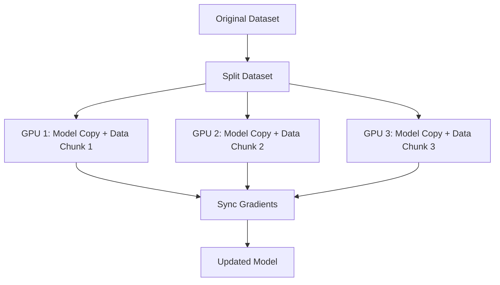
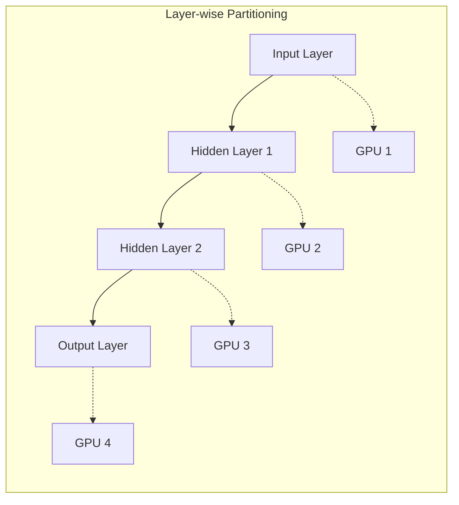
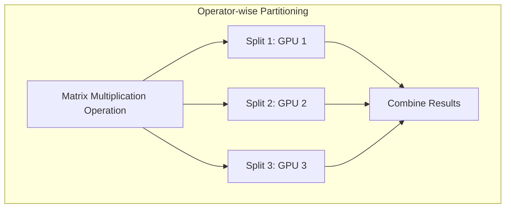
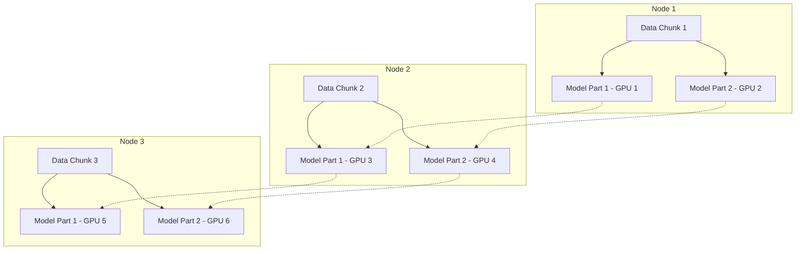
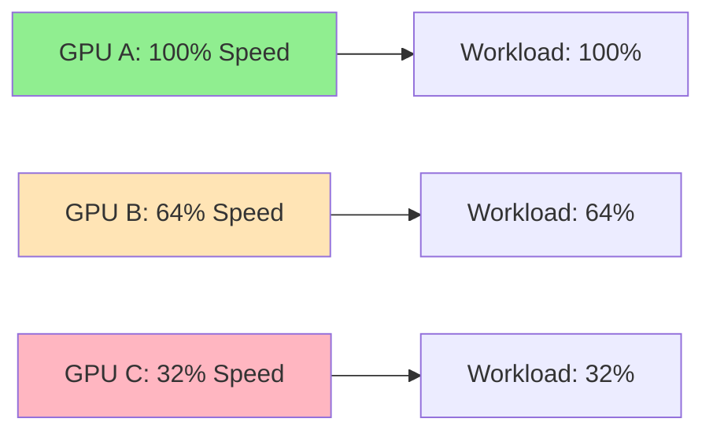
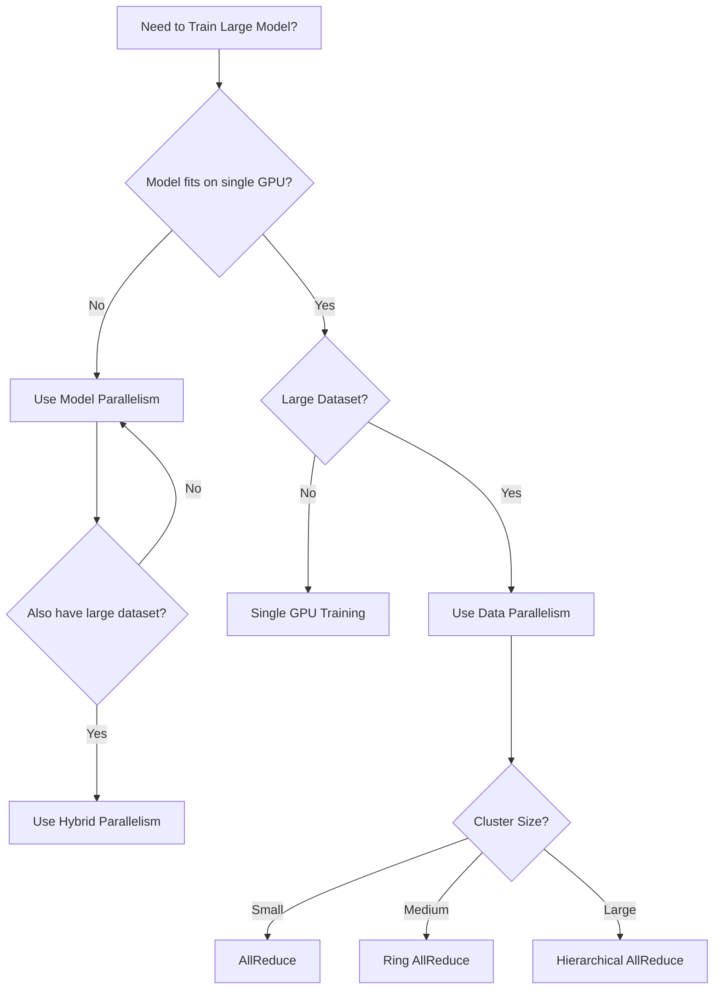

# Parallelism in GenAI Models - Complete Guide

## 🎯 Quick Overview

**The Problem**: Training massive AI models (like GPT-3 with 175B parameters) would take 350+ years on a single GPU.

**The Solution**: Distributed Machine Learning (DML) - Split the work across multiple machines/GPUs.

**Result**: GPT-3 can now be trained in just 34 days using 1,024 GPUs instead of 350+ years!

---

## 📊 Types of Parallelism Comparison

| Type | What Gets Split | When to Use | Pros | Cons |
|------|----------------|-------------|------|------|
| **Data Parallelism** | Dataset across GPUs | Large datasets, same model fits on each GPU | Simple, widely supported | Communication overhead |
| **Model Parallelism** | Model layers/operations across GPUs | Model too big for single GPU | Handles huge models | Complex coordination |
| **Hybrid Parallelism** | Both data AND model | Extremely large models + datasets | Best of both worlds | Most complex setup |

---

## 🔄 Data Parallelism Deep Dive

### Core Concept

### Synchronization Methods Comparison

| Method | Architecture | Communication | Scalability | Fault Tolerance | Complexity |
|--------|-------------|---------------|-------------|-----------------|------------|
| **Parameter Server** | Centralized | Hub-and-spoke | Limited | Poor (single point of failure) | Low |
| **AllReduce** | Peer-to-peer | All-to-all | Good for small clusters | Good | Medium |
| **Ring AllReduce** | Ring topology | Neighbor-to-neighbor | Better scaling | Good | Medium |
| **Hierarchical AllReduce** | Multi-level groups | Cluster + coordinator | Excellent (1000s of GPUs) | Excellent | High |

### 🔍 Memory Aid for Synchronization

**Think of it like group projects:**

- **Parameter Server** = Teacher collects all homework, grades it, gives feedback to everyone
- **AllReduce** = Everyone shares answers with everyone else directly
- **Ring AllReduce** = Pass answers around in a circle
- **Hierarchical** = Group leaders collect from their teams, then leaders meet together

---

## 🧩 Model Parallelism

### When You Need It
- Model is **too big** to fit on a single GPU
- Want to **speed up inference** by splitting compute

### Partitioning Strategies

| Partitioning Type | Granularity | Setup Complexity | Communication Overhead |
|-------------------|-------------|------------------|----------------------|
| **Layer-wise** | Coarse (whole layers) | Simple | Moderate |
| **Operator-wise** | Fine (operations within layers) | Complex | High |

---

## 🔥 Hybrid Parallelism

### The Best of Both Worlds

**When to Use**: When you have both massive datasets AND models that don't fit on single GPUs.

---

## ⚠️ Key Challenges & Solutions

### 1. Fault Tolerance

| Problem | Solution | Implementation |
|---------|----------|----------------|
| Node failures | **Checkpointing** | Save model state every N steps |
| Communication errors | **Redundancy** | Backup workers, mirrored replicas |
| Silent failures | **Monitoring** | Health checks, error reporting |

### 2. Hardware Heterogeneity

**Key Principle**: Assign work proportional to compute capability (6.4x faster GPU gets 6.4x more work)

### 3. Load Imbalance

| Cause | Impact | Solution |
|-------|--------|----------|
| Uneven data distribution | Some GPUs idle while others overworked | **Dynamic work allocation** |
| Poor layer assignment | Bottlenecks at certain devices | **Partition optimization** |
| Varying batch processing times | Synchronization delays | **Adaptive scheduling** |

---

## 🧠 Memory Techniques for Long-term Retention

### The "Restaurant Kitchen" Analogy

**Data Parallelism** = Multiple chefs making the same dish with different ingredients
- Each chef (GPU) has the same recipe (model)
- Different ingredients (data chunks)
- Share techniques periodically (gradient sync)

**Model Parallelism** = Assembly line cooking
- Chef 1: Prep ingredients (input layer)
- Chef 2: Cook protein (hidden layers)
- Chef 3: Plate and garnish (output layer)

**Hybrid** = Multiple assembly lines running in parallel

### Key Numbers to Remember

| Metric | Value | Context |
|--------|-------|---------|
| GPT-3 Parameters | 175 billion | Massive scale |
| Single V100 Training Time | 350+ years | Why we need parallelism |
| Parallel Training Time | 34 days | 1,024 A100 GPUs |
| Speed Improvement | ~3,700x | Power of distributed training |

---

## 🚀 Quick Decision Tree

---

## 💡 Key Takeaways

1. **Scale Matters**: Modern AI requires distributed training - single GPUs aren't enough
2. **Choose Your Strategy**: Data parallelism for large datasets, model parallelism for large models, hybrid for both
3. **Communication is Key**: Synchronization method choice affects scalability and fault tolerance
4. **Plan for Failures**: Checkpointing and redundancy are essential at scale
5. **Balance the Load**: Distribute work based on hardware capabilities

---

## 📚 Further Reading

- **Data Parallelism**: Start here for most use cases
- **Model Parallelism**: Essential for models that don't fit on single GPUs
- **Hybrid Approaches**: The future for extremely large-scale training
- **Fault Tolerance**: Critical for production deployments

---

*This guide provides a foundation for understanding parallelism in GenAI. Start with data parallelism for most projects, and scale up complexity as your models and datasets grow.*