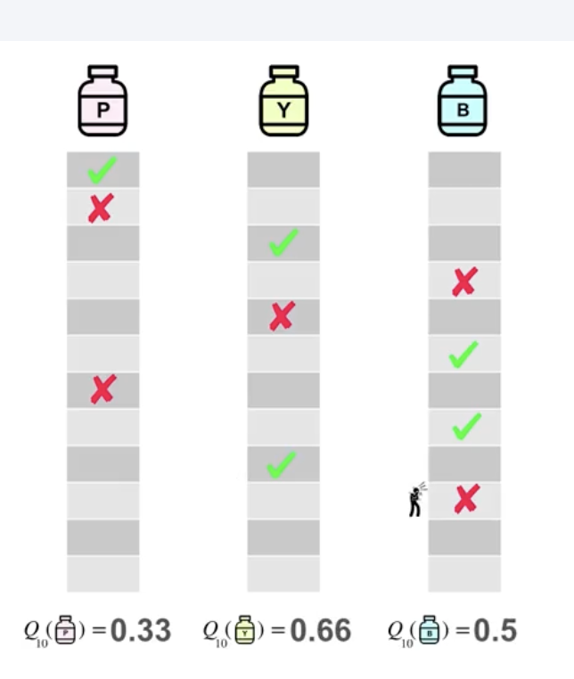

# Incremental Update Rule for Sample Average

In reinforcement learning (e.g., bandits), we estimate the value of an action by the **sample average** of rewards received.

Doctor may choose greedy action and may choose maximum. (Most reward as of now Arg Max). Agent may choose to explore more by choosing non greedy action. Agent may sacrifise immediate reward by exploring more.

---

## Step 1: Definition of the Average

The estimate after \$n\$ plays is:

$$
Q_{n+1} = \frac{1}{n}\sum_{i=1}^{n} R_i
$$

where:

* \$R\_i\$ = reward received on the \$i^{th}\$ play
* \$Q\_{n+1}\$ = estimated value after \$n\$ plays

---

## Step 2: Split the Sum

$$
Q_{n+1} = \frac{1}{n}\Big(R_n + \sum_{i=1}^{n-1} R_i\Big)
$$

---

## Step 3: Replace the Sum with the Old Average

We know that:

$$
Q_n = \frac{1}{n-1}\sum_{i=1}^{n-1} R_i
$$

So:

$$
\sum_{i=1}^{n-1} R_i = (n-1)Q_n
$$

Substitute:

$$
Q_{n+1} = \frac{1}{n}\Big(R_n + (n-1)Q_n\Big)
$$

---

## Step 4: Expand \$(n-1)Q\_n\$

$$
(n-1)Q_n = nQ_n - Q_n
$$

So:

$$
Q_{n+1} = \frac{1}{n}\Big(R_n + nQ_n - Q_n\Big)
$$

---

## Step 5: Break Into Separate Fractions

$$
Q_{n+1} = \frac{1}{n}R_n + \frac{1}{n}(nQ_n) - \frac{1}{n}Q_n
$$

---

## Step 6: Simplify the Middle Term

$$
\frac{1}{n}(nQ_n) = Q_n
$$

So:

$$
Q_{n+1} = Q_n + \frac{1}{n}R_n - \frac{1}{n}Q_n
$$

---

## Step 7: Factor the Last Two Terms

$$
Q_{n+1} = Q_n + \frac{1}{n}(R_n - Q_n)
$$

---

## ✅ Final Incremental Update Rule

$$
\boxed{Q_{n+1} = Q_n + \frac{1}{n}(R_n - Q_n)}
$$

---

### 🔎 Interpretation

* Start from old estimate \$Q\_n\$.
* Compare new reward \$R\_n\$ with it.
* Adjust a little (step size \$1/n\$) toward the new reward.

This avoids recalculating the whole average every time.

---

# Incremental Update with Constant Step Size (\$\alpha\$)

When rewards **change over time** (non-stationary problems), the sample average method (using \$1/n\$ as step size) is too slow to adapt.
Instead, we use a **fixed step size** \$\alpha\$.

---

## Update Rule

$$
Q_{n+1} = Q_n + \alpha (R_n - Q_n)
$$

* \$Q\_n\$: old estimate
* \$R\_n\$: new reward
* \$\alpha\$: step size (constant, e.g., 0.1)

---

## How It Works (Recursive Form)

Rearranging:

$$
Q_{n+1} = (1-\alpha)Q_n + \alpha R_n
$$

This shows a **weighted sum**:

* The old estimate \$Q\_n\$ keeps weight \$(1-\alpha)\$
* The new reward \$R\_n\$ has weight \$\alpha\$

Because the formula is recursive, older rewards keep getting multiplied by \$(1-\alpha)\$ each step → their influence fades **exponentially with time**.

---

## Unrolling the Equation Step by Step

1. Start with:
   $Q_{n+1} = (1-\alpha)Q_n + \alpha R_n$

2. Substitute for \$Q\_n\$:
   $Q_n = (1-\alpha)Q_{n-1} + \alpha R_{n-1}$

   So:
   $Q_{n+1} = (1-\alpha)[(1-\alpha)Q_{n-1} + \alpha R_{n-1}] + \alpha R_n$

3. Expand:
   $Q_{n+1} = (1-\alpha)^2 Q_{n-1} + (1-\alpha)\alpha R_{n-1} + \alpha R_n$

4. Substitute again for \$Q\_{n-1}\$:
   $Q_{n-1} = (1-\alpha)Q_{n-2} + \alpha R_{n-2}$

   So:
   $Q_{n+1} = (1-\alpha)^3 Q_{n-2} + (1-\alpha)^2\alpha R_{n-2} + (1-\alpha)\alpha R_{n-1} + \alpha R_n$

Continuing this way leads to:

$$
Q_{n+1} = (1-\alpha)^{n} Q_1 + \alpha \sum_{k=0}^{n-1} (1-\alpha)^k R_{n-k}
$$

This shows explicitly how weights decrease exponentially with time.

---

## Example Walkthrough

Suppose \$\alpha = 0.1\$ and the last three rewards were:

* \$R\_1 = 0.2\$, \$R\_2 = 0.8\$, \$R\_3 = 1.0\$

Then:

$$
Q_4 = 0.1(1.0) + 0.1(0.9)(0.8) + 0.1(0.9^2)(0.2) + \dots
$$

Calculating:

* \$0.1 \times 1.0 = 0.1\$
* \$0.1 \times 0.9 \times 0.8 = 0.072\$
* \$0.1 \times 0.9^2 \times 0.2 \approx 0.0162\$

Adding → \$Q\_4 \approx 0.188\$

✅ The most recent reward (\$1.0\$) dominates, older ones contribute much less.

---

## Why Use This?

* **Stationary problems** → use sample average (\$\alpha = 1/n\$).
* **Non-stationary problems** → use constant \$\alpha\$.

  * Older data fades away.
  * Estimates adapt quickly to the current reality.

---

## Example (\$\alpha = 0.1\$)

* Old estimate \$Q\_n = 0.5\$
* New reward \$R\_n = 1\$

$$
Q_{n+1} = 0.5 + 0.1(1 - 0.5) = 0.55
$$

✅ The estimate moves 10% closer to the new reward.

No matter what α you pick, older rewards will always decay in influence. The difference is how fast they fade.

### Case 1: Large α (e.g., α = 0.9)

Newest reward weight = 0.9

One step back = 
0.9(0.1) = 0.09
0.9(0.1)=0.09

Two steps back = 0.9(0.1)^2=0.009

Three steps back = 0.0009

👉 Old rewards vanish very quickly. Almost only the latest matters.

### Case 2: Small α (e.g., α = 0.1)

Newest reward weight = 0.1

One step back = 
0.1(0.9) = 0.09
0.1(0.9)=0.09

Two steps back = 
0.1(0.9)^2 = 0.081

Three steps back = 0.0729

Old rewards still fade, but more slowly. You keep a long memory.

# Understanding Q(a), q\*(a), the Update Rule, and Exploration–Exploitation

In reinforcement learning, we balance two key ideas:

* **Estimating values** incrementally (Q vs q\*)
* **Choosing actions** (explore vs exploit)

This README explains both concepts together.

---

## 1. The Hidden Truth: q\*(a)

* Each action (e.g., a meal or a treatment) has a true average reward \**q*(a)\*\*.
* Example: Meal A always gives on average **3 points of satisfaction** → q\*(A) = 3.
* We never know q\*(a) exactly — it is hidden.

---

## 2. Our Estimate: Q(a)

* We keep a running estimate **Q(a)**.
* After each trial, we update Q(a) using the incremental update rule:

$$
Q_{n+1}(a) = Q_n(a) + \alpha (R_n - Q_n(a))
$$

* **Rₙ** = observed reward
* **α** = step size (1/n for sample average, or constant for non-stationary problems)

Over time, Q(a) gets closer to q\*(a).

---

## 3. Why Updating Matters

* If reward is higher than our estimate, Q(a) goes up.
* If reward is lower, Q(a) goes down.
* With enough trials, Q(a) ≈ q\*(a).

---

## 4. Exploration vs Exploitation

* **Exploitation** = pick the action with the highest current Q(a) → short-term benefit.
* **Exploration** = try other actions to gather data → long-term benefit.

👉 Example: At a restaurant:

* Meal A: tried 5 times, Q(A) = 3 (true q\*(A) = 3)
* Meal B: never tried, Q(B) = 0 (true q\*(B) = 4)
* Meal C: never tried, Q(C) = 0 (true q\*(C) = 2)

If we only exploit, we keep ordering Meal A. But exploring Meal B could reveal it’s even better.

---

## 5. The Epsilon-Greedy Strategy

A simple way to balance exploration and exploitation:

$$
A_t =
\begin{cases}
\text{argmax}_a Q_t(a), & \text{with probability } 1-\varepsilon \\
a \sim \text{Uniform(all actions)}, & \text{with probability } \varepsilon
\end{cases}
$$

* With probability **1 – ε**, choose the best-known action (exploit).
* With probability **ε**, choose a random action (explore).

Example: If ε = 0.1 → 90% exploit, 10% explore.

---

## 6. Step-by-Step Example (Restaurant Visits)

Suppose true values are:

* q\*(A) = 3
* q\*(B) = 4
* q\*(C) = 2

We don’t know this upfront. Let’s simulate a few visits with ε = 0.2 (20% explore, 80% exploit).

**Visit 1:**

* Start with Q(A) = Q(B) = Q(C) = 0.
* Random explore → try Meal A.
* Reward R = 3.
* Update: Q(A) = 3.

**Visit 2:**

* ε-greedy → exploit (Meal A looks best).
* Try A again, R = 2.
* Update: Q(A) = (3 + 2)/2 = 2.5.

**Visit 3:**

* ε-greedy → explore this time.
* Try Meal B, R = 4.
* Update: Q(B) = 4.

**Visit 4:**

* Exploit → Q(B) = 4 is best.
* Try B, R = 5.
* Update: Q(B) = (4 + 5)/2 = 4.5.

**Visit 5:**

* Exploit → still choose B.
* R = 3.
* Update: Q(B) = (4 + 5 + 3)/3 ≈ 4.0.

---

## 7. Performance on the 10-Armed Testbed

To test exploration–exploitation methods, researchers use the **10-armed testbed**:

* 10 actions (slot machines or treatments), each with a hidden average reward q\*(a).
* Each reward is noisy, sampled from a normal distribution.

* 

In the 10-armed testbed benchmark:

* Each **run** is carried out for **1000 time steps**.
* That means the agent chooses an action, gets a reward, and updates its estimates **1000 times**.
* This whole process (1000 steps) is repeated across **2000 independent runs**, each with different randomly generated true action values $q\*(a)$.

---

### Summary

* **Steps per run:** 1000
* **Number of runs:** 2000
* **Result:** average performance curve across all 2000 runs

### Single Run Example

* A run of ε = 0.1 shows noisy rewards with an upward trend.
* One run is too noisy to conclude much.

### Averaging Runs

* Averaging **20 runs** smooths the curve a bit.
* Averaging **100 runs** shows a clear increasing pattern.
* Averaging **2000 runs** gives a stable curve → average reward over time.

### Comparing Different ε Values

* ε = 0 (pure greedy): quickly gets stuck, low long-term reward.
* ε = 0.01: slowly improves, almost always finds the optimal action eventually.
* ε = 0.1: learns faster at first, achieves higher early reward, but plateaus.

---

## 8. Key Intuition

* q\*(a) = the hidden truth about how good an action is.
* Q(a) = our moving estimate that improves with updates.
* If we only exploit → we might get stuck on Meal A and never discover Meal B.
* If we only explore → we waste chances to enjoy the best meal.
* Epsilon-greedy finds the middle ground: *occasionally try something new, mostly stick to the best so far*.
* Averaging many runs helps us compare strategies fairly, since randomness makes single runs noisy.

# Optimistic Initial Values

---

## 1. The Core Idea

* Normally, action-value estimates $Q(a)$ are initialized at 0.
* Instead, we can set all initial estimates very high, e.g., +5.
* Since the true values $q\*(a)$ are sampled from a distribution with mean 0 (and variance 1), +5 is overly optimistic.
* This **optimism enforces exploration** because the first few rewards will always be lower than the initial guesses, creating **disappointment**.
* The disappointment makes the agent switch to other actions that still look unrealistically good.

👉 This is different from **epsilon-greedy**, which enforces exploration by injecting randomness.

---

## 2. How It Works

1. **Start:** All actions look equally great (Q(a) = +5).
2. **First pull:** Suppose action A gives reward 1.

   * Update: Q(A) drops below 5.
   * Other actions are still at 5, so they look better than A.
3. **Switch:** The agent moves to another action, say B, because it still has Q=5.
4. **Disappointment cycle:** Each action tried produces a reward < 5, lowering its estimate.

   * The agent keeps jumping to unexplored actions that still appear optimistic.
5. **Result:** The greedy policy explores all actions, even without randomness.

---

## 3. Example from the 10-Armed Bandit Testbed

* True values $q\*(a)$ are sampled from $N(0, 1)$.
* Initial Q-values are set to +5.

### Exploration by Disappointment

* First few pulls → rewards < 5 → estimates fall.
* Actions not yet tried still have Q=5 → agent chooses them next.
* Eventually, all actions are sampled, then estimates settle closer to reality.

### Performance Comparison

* **Optimistic greedy (Q1(a) = +5):**

  * Performs worse early (because it over-explores due to disappointment).
  * Performs better later, because exploration naturally stops when values converge.
* **Epsilon-greedy (Q1(a) = 0, ε = 0.1):**

  * Uses randomness to enforce exploration.
  * Keeps exploring forever, even after learning the best action.
 

---

## 4. Strengths

* Enforces exploration **systematically** (via disappointment).
* Simple to implement — just pick high initial values.
* Good for stationary problems where rewards don’t change.

---

## 5. Limitations

* Only drives exploration **early on**. Once optimism is corrected, exploration stops.
* Not suited to **non-stationary problems** (where true values change).
* Choosing the “right” optimistic value is hard in practice.
* Can lead to poor early performance while over-exploring.

---

## ✅ Takeaway

* **Optimistic initial values** enforce exploration through **disappointment**: each action starts unrealistically high, and the agent keeps testing new ones until estimates fall.
* Unlike ε-greedy, this exploration is **deterministic and systematic** rather than random.
* Works well for stationary settings, but limited for changing environments.

# Upper Confidence Bound (UCB) — Detailed Notes

---

### 1. The Idea

In bandit problems, we want to balance:

* **Exploitation**: pick the action with the best estimated reward so far.
* **Exploration**: test actions we are uncertain about (maybe they’re better).

UCB does this automatically by combining two terms:

$$
\text{Score}(a) = Q_t(a) + C \cdot \sqrt{\frac{\ln t}{N_t(a)}}
$$

Where:

* **Q\_t(a)** = estimated value of action *a* at time *t* (average observed reward).
* **N\_t(a)** = number of times action *a* has been chosen.
* **t** = total number of steps so far.
* **C** = exploration parameter (bigger C = more exploration).

We choose the action with the **highest score**.

---

### 2. How It Works

* **First term Q\_t(a):** exploitation — trust what we know.
* **Second term:** exploration bonus.

  * If N\_t(a) is small → bonus is large (high uncertainty).
  * If N\_t(a) is large → bonus shrinks (low uncertainty).

So:

* Frequently sampled actions rely mostly on their Q-value.
* Rarely sampled actions get a “boost,” encouraging exploration.

* In another words:
  - If N_t(a) is small → the action hasn’t been tried much → bonus is large → encourages exploration.
  - If N_t(a) is large → the action has been tried often → bonus is small → encourages exploitation of good actions.

If t increases but N_t(a) stays small → bonus for that action slowly grows again → guarantees it will eventually be tried.

This way, all actions are eventually tested

---

### 3. Step-by-Step Example (Restaurant 🍽️)

We have 3 meals: A, B, C.
Exploration constant: C = 2.
At the start, force trying each meal once.

**Observed rewards:**

* Meal A → 2
* Meal B → 5
* Meal C → 1

**Estimates after first round:**

* Q(A) = 2, N(A) = 1
* Q(B) = 5, N(B) = 1
* Q(C) = 1, N(C) = 1
* t = 3

**Step 1: Calculate scores**

$$
\text{Bonus for all} = C \cdot \sqrt{\tfrac{\ln 3}{1}} \approx 2 \cdot 1.05 = 2.1
$$

* Score(A) = 2 + 2.1 = 4.1
* Score(B) = 5 + 2.1 = 7.1
* Score(C) = 1 + 2.1 = 3.1

👉 UCB picks **B** (highest score).
Here, all uncertainty bonuses were equal, so B was chosen because it had the best observed reward → **exploitation**.

---

**Step 2: Try B again**
Reward = 3. Update:

$$
Q(B) = \frac{5 + 3}{2} = 4, \quad N(B) = 2, \quad t = 4
$$

New scores:

* Score(A) = 2 + 2 · √(ln4 / 1) ≈ 2 + 2 · 1.18 = 4.36
* Score(B) = 4 + 2 · √(ln4 / 2) ≈ 4 + 2 · 0.83 = 5.66
* Score(C) = 1 + 2 · 1.18 = 3.36

👉 Still pick **B**.

---

**Step 3: Try B again**
Reward = 4. Update:

$$
Q(B) = \frac{5 + 3 + 4}{3} = 4, \quad N(B) = 3, \quad t = 5
$$

New scores:

* Score(A) = 2 + 2 · √(ln5 / 1) ≈ 2 + 2 · 1.27 = 4.54
* Score(B) = 4 + 2 · √(ln5 / 3) ≈ 4 + 2 · 0.74 = 5.48
* Score(C) = 1 + 2 · 1.27 = 3.54

👉 Still pick **B**, but notice A’s score (4.54) is slowly catching up.

---

### 4. Intuition from This Example

* **Initially:** all meals have equal uncertainty. The one with the highest observed reward (B) is chosen → looks greedy.
* **Later:** B’s bonus term shrinks because N(B) increases.
* **Meanwhile:** A and C still have small N → their bonuses stay large.
* Eventually, UCB will try A or C again → **exploration driven by uncertainty**.

---

### 5. Key Takeaways

* UCB balances exploitation (Q) and exploration (bonus).
* Early: looks greedy, but that’s okay — still samples everything once.
* Later: bonus ensures less-sampled actions are revisited.
* Smarter than ε-greedy, because exploration is **targeted**, not random.

👉 **Optimism in the face of uncertainty**: if you don’t know much about an option, assume it might be good, and test it.

UCB generally performs better than "-greedy action selection, except in the first k steps, when
it selects randomly among the as-yet-untried actions.

