# Markov Decision Process (MDP): Complete Guide

## Table of Contents
1. [What is MDP?](#what-is-mdp)
2. [Core Components](#core-components)
3. [Understanding Notation](#understanding-notation)
4. [State Transitions](#state-transitions)
5. [Calculating Returns](#calculating-returns)
6. [Discounting](#discounting)
7. [Policies](#policies)
8. [Key Equations](#key-equations)
9. [Real Examples](#real-examples)

---

## What is MDP?

An **MDP** is a mathematical framework for making decisions in uncertain environments where outcomes depend on current choices.

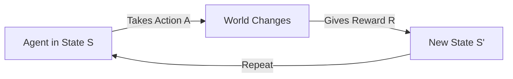

**Key idea:** We want to find the best sequence of actions to maximize total reward.

---

## Core Components

### The 5 Essential Parts of an MDP

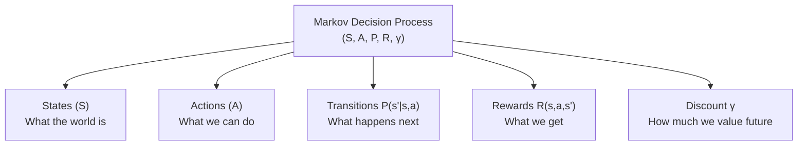

---

## Understanding Notation

### Essential Symbols Explained

| Symbol | Means | Example |
|--------|-------|---------|
| $s$ | Current state (RIGHT NOW) | $s = \text{HIGH}$ |
| $s'$ | Next state (what we END UP in) | $s' = \text{LOW}$ |
| $a$ | Action we CHOOSE | $a = \text{Search}$ |
| $R_t$ | Reward at time $t$ | $R_0 = +10$ |
| $t$ | Time step | $t = 0, 1, 2, ...$ |
| $\mid$ | GIVEN THAT (conditional) | $P(s' \mid s, a)$ = "prob. of $s'$ given $s$ and $a$" |

---

## Concrete Example: Recycling Robot

### Problem Setup

A robot collects cans and must manage its battery:

**States:**
- $s = \text{HIGH}$: Battery fully charged
- $s = \text{LOW}$: Battery nearly dead

**Actions:**
- $a = \text{Search}$: Look for cans (drains battery, +10 reward)
- $a = \text{Wait}$: Wait for cans (safe, +1 reward)
- $a = \text{Recharge}$: Charge battery (0 reward)

**Rewards:**
- Search success: $+10$
- Wait success: $+1$
- Battery dies: $-20$
- Recharge: $0$

---

## State Transitions

### What Happens When We Take Actions?

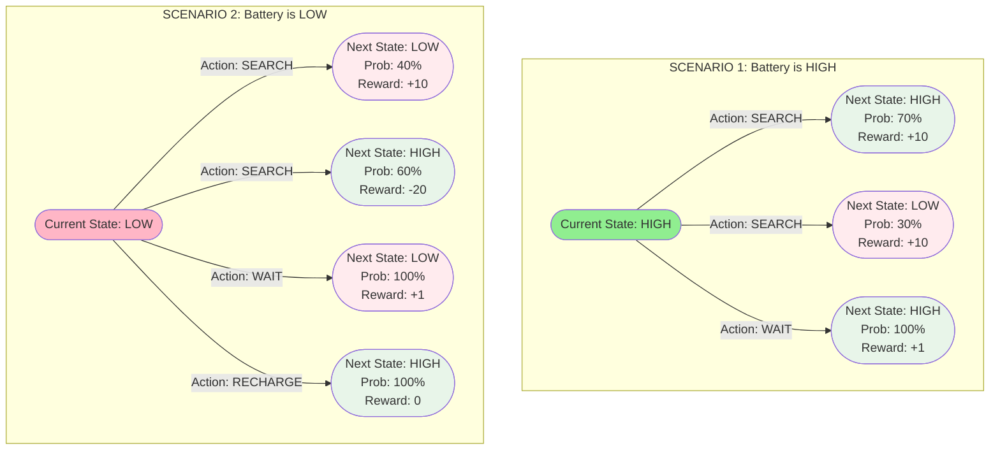

### Transition Probabilities Explained

**Searching in HIGH state:**
$$P(s' = \text{HIGH} \mid s = \text{HIGH}, a = \text{Search}) = 0.7$$

**Read as:** "Prob. of staying HIGH, GIVEN we're HIGH and Search, is 70%"

**Breakdown:**
- $P(\cdot)$ = probability (0 to 1)
- $s'$ = NEXT state (where we end up)
- $s$ = CURRENT state (where we are)
- $a$ = ACTION we take
- $\mid$ = GIVEN THAT

---

### What If We Search in LOW? (Risky!)

$$P(s' = \text{LOW} \mid s = \text{LOW}, a = \text{Search}) = 0.4$$
$$P(s' = \text{HIGH} \mid s = \text{LOW}, a = \text{Search}) = 0.6$$

**Expected reward:**
$$E[R \mid s = \text{LOW}, a = \text{Search}] = 0.4(10) + 0.6(-20) = -8$$

**This is NEGATIVE!** Searching when LOW is bad on average.

---

## Calculating Returns

### What is $G_t$?

**$G_t$ = Total reward we expect from time $t$ onwards**

**Simple formula (without discounting):**
$$G_t = R_{t+1} + R_{t+2} + R_{t+3} + \cdots$$

### Timeline Example

```
Time t=0 (RIGHT NOW): Start
    ↓ Takes action → R₁ = +10
Time t=1 (Next): State changes
    ↓ Takes action → R₂ = +10
Time t=2 (Later): State changes again
    ↓ Takes action → R₃ = +5

G₀ = R₁ + R₂ + R₃ + ... = 10 + 10 + 5 + ... = total reward
```

### Real Example: Hospital Patient

```
Month 1 (t=0): Start treatment → R₁ = +10 (patient improves)
Month 2 (t=1): Continue       → R₂ = +5  (patient stable)
Month 3 (t=2): Adjust         → R₃ = +7  (complication avoided)
Month 4 (t=3): Final          → R₄ = +5  (continuing well)

G₀ = 10 + 5 + 7 + 5 + ... = Total health benefit
```

---

## The Problem: Infinite Tasks

### Episodic vs Continuing Tasks

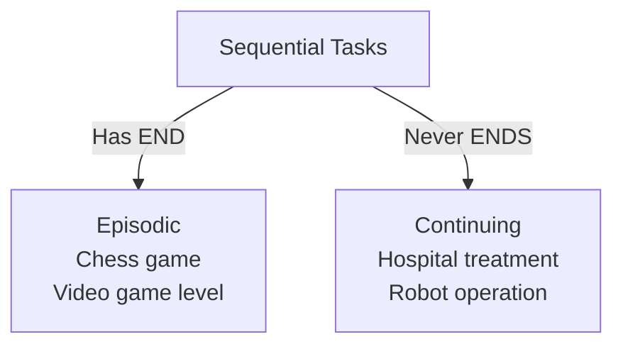

**Episodic:**
- Breaks into episodes
- Each ends at terminal state
- Return is finite: $G_t = \sum_{k=0}^{T} R_{t+k+1}$

**Continuing:**
- Never ends
- No terminal state
- Problem: $G_t = \sum_{k=0}^{\infty} R_{t+k+1} = \infty$ (infinite!)

---

## Discounting

### Why We Discount Future Rewards

**Problem:** In continuing tasks, returns are infinite.
```
Treatment A: 10 + 10 + 10 + ... = ∞
Treatment B: 11 + 11 + 11 + ... = ∞
Can't compare! Both infinite.
```

**Solution:** Use discount factor $\gamma$ where $0 \leq \gamma < 1$

### The Discounting Formula

$$G_t = R_{t+1} + \gamma R_{t+2} + \gamma^2 R_{t+3} + \gamma^3 R_{t+4} + \cdots = \sum_{k=0}^{\infty} \gamma^k R_{t+k+1}$$

**Interpretation:** Future rewards matter less and less

### How $\gamma = 0.95$ Decays Rewards

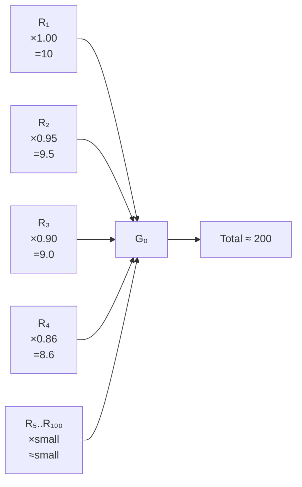

| Step | Power | Decay Factor | Reward Value |
|------|-------|--------------|--------------|
| Month 1 | $(0.95)^0$ | 1.000 | 10.00 |
| Month 2 | $(0.95)^1$ | 0.950 | 9.50 |
| Month 5 | $(0.95)^4$ | 0.815 | 8.15 |
| Month 10 | $(0.95)^9$ | 0.599 | 5.99 |
| Month 50 | $(0.95)^{49}$ | 0.0074 | 0.074 |
| Month 100 | $(0.95)^{99}$ | ~0 | ~0 |

**Key insight:** By month 50, future rewards are essentially worthless!

---

### Why Discounting Solves the Problem

**Now we can compare:**

With discounting ($\gamma = 0.95$):
$$G_t(\text{Treatment A}) = \frac{10}{1-0.95} = 200$$
$$G_t(\text{Treatment B}) = \frac{11}{1-0.95} = 220$$

**Treatment B wins!** (220 > 200) ✓

---

### Mathematical Proof: Returns are Always Finite

**Upper bound:**
$$G_t \leq \frac{R_{\max}}{1-\gamma}$$

**Example:** If max reward is 10 and $\gamma = 0.95$:
$$G_t \leq \frac{10}{0.05} = 200$$

**Conclusion:** $G_t$ is always FINITE! ✓

---

## Two Ways to Calculate $G_t$ in Practice

### Approach 1: Model-Based (Planning)

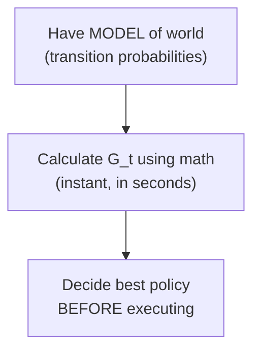

**Example: Doctor treating patient**

**Doctor knows:**
- If we use INSULIN in MODERATE state:
  - 50% → EARLY stage
  - 30% → MODERATE stage
  - 20% → SEVERE stage

**Doctor calculates:**
$$E[R_2] = 0.5(10) + 0.3(5) + 0.2(-5) = 5.5$$
$$G_1 = 5.5 + 0.95 E[R_3] + \cdots$$

**Doctor decides treatment NOW, without waiting months!**

---

### Approach 2: Model-Free (Learning from Experience)

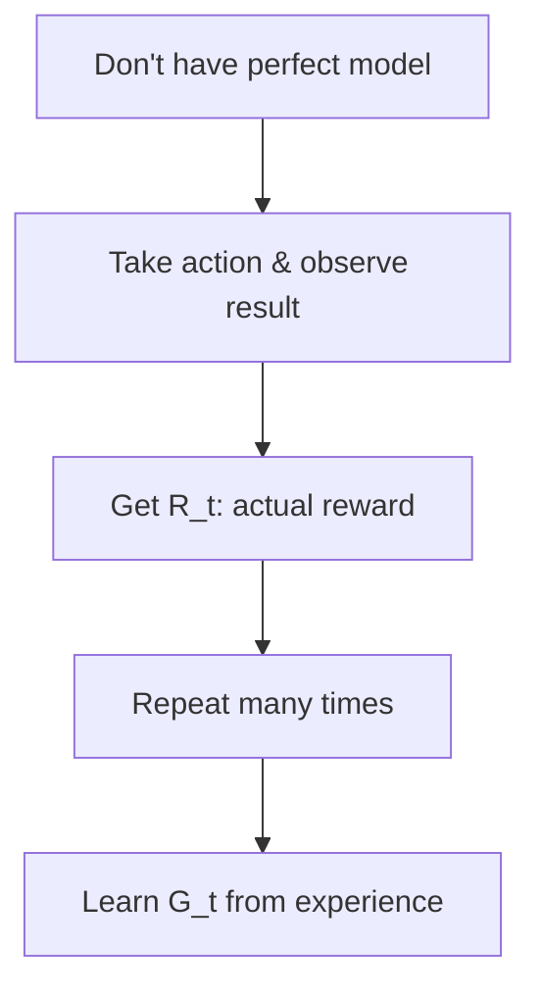

**Example: Recycling robot learning**

**Timeline:**
```
Episode 1: Searched → +10, Searched → +10, Got rescued → -20
           G₀ = 10 + 0.95(10) + 0.95²(-20) = ...

Episode 2: Searched → +10, Recharged → 0, Searched → +10
           G₀ = 10 + 0.95(0) + 0.95²(10) = ...

After 1000 episodes: Average G₀ ≈ 25 (learned!)
```

---

### Comparison

| Aspect | Model-Based | Model-Free |
|--------|-------------|-----------|
| **When do we know $G_t$?** | BEFORE acting (instant) | AFTER acting (must wait) |
| **Need a model?** | YES | NO |
| **Speed** | Fast (seconds) | Slow (many episodes) |
| **Example** | Doctor (medical knowledge) | Robot (trial & error) |

---

## Recursive Formula: The Key Insight

### Standard vs Recursive

**Standard form:**
$$G_t = R_{t+1} + \gamma R_{t+2} + \gamma^2 R_{t+3} + \cdots$$

**Recursive form:**
$$G_t = R_{t+1} + \gamma G_{t+1}$$

**They're identical!** The second is just factored differently.

### Why This Matters

We only need to know:
1. Immediate reward: $R_{t+1}$ (we get this soon)
2. Future return: $G_{t+1}$ (we can estimate)

We DON'T need all future rewards!

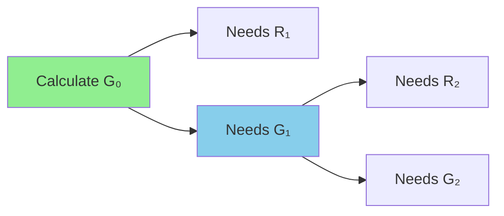

---

## Policies: Decision Strategies

### What is a Policy?

A **policy** $\pi$ tells us what action to take in each state.

$$\pi(s) = a$$

**Read as:** "In state $s$, take action $a$"

---

### Bad Policy vs Good Policy

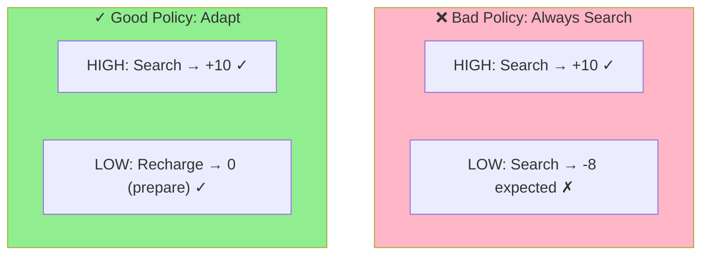

**Bad Policy:**
$$\pi_{\text{bad}}(s) = \text{Search} \quad \text{for all } s$$

Expected value in LOW: $-8$ (negative!)

**Good Policy:**
$$\pi^*(s) = \begin{cases}
\text{Search} & \text{if } s = \text{HIGH} \\
\text{Recharge} & \text{if } s = \text{LOW}
\end{cases}$$

---

### Value Function: How Good is a Policy?

$$V^\pi(s) = E\left[\sum_{k=0}^{\infty} \gamma^k R_{t+k+1} \mid S_t = s, \text{ follow } \pi\right]$$

**Read as:** "Expected total reward starting from state $s$ and following policy $\pi$"

### Comparing Policies Numerically

```
Policy A: "Always Search"
  V^A(HIGH) ≈ 150
  V^A(LOW) ≈ -160  ← BAD in LOW state

Policy B: "Smart Policy"
  V^B(HIGH) ≈ 300
  V^B(LOW) ≈ 285   ← GOOD in both states

Winner: Policy B! ✓
```

---

### Optimal Policy

$$\pi^* = \arg\max_\pi V^\pi(s)$$

**Read as:** "Find the policy that maximizes the value function"

---

## Key Equations

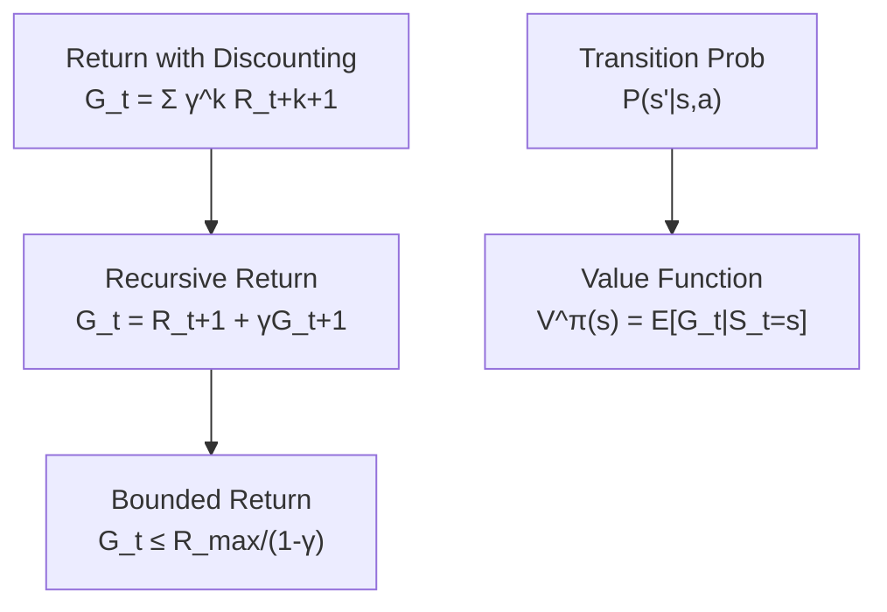

---

## Real Examples

### Example 1: Hospital Treatment (Model-Based)

**Setup:**
- Patient state: MODERATE diabetes
- Treatment: INSULIN
- Doctor has medical MODEL

**Doctor's calculation:**
```
Expected reward: E[R₂] = 0.5(+10) + 0.3(+5) + 0.2(-5) = 5.5

G₁ = 5.5 + 0.95(E[R₃]) + ...

Doctor decides INSULIN is best, without waiting!
```

**Timeline:**
```
Month 1: Doctor decides INSULIN (based on prediction)
Month 2: Patient improves! R₂ = +10 ✓ (prediction correct)
Month 3: Continue improving
Doctor made right choice before seeing results!
```

---

### Example 2: Recycling Robot (Model-Free)

**Setup:**
- Robot doesn't have perfect model
- Must learn by doing

**Learning process:**
```
Episode 1: Actions → [+10, +10, -20] → G₀ = 10 + 0.95(10) + ...

Episode 2: Actions → [+10, 0, +10] → G₀ = 10 + 0.95(0) + ...

After 1000 episodes: Average G₀ ≈ learned value
```

---

### Example 3: Discount Factor Effects

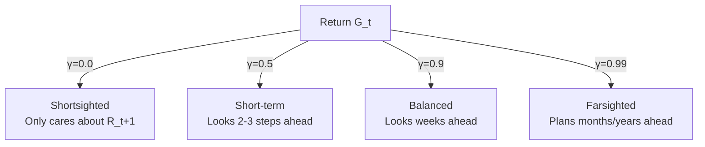

---

## Summary

### Complete MDP Flow

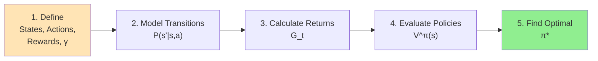

### Key Takeaways

✅ **MDP = Sequential decision-making framework**

✅ **$G_t$ = Total expected future reward from time $t$**

✅ **Discounting** = Makes infinite returns finite

✅ **Policies** = Decision strategies we can compare

✅ **Model-based** = Calculate fast using knowledge

✅ **Model-free** = Learn from experience

✅ **Recursive formula** = Key to efficient learning

---

## References

- Bellman, R. (1957). Dynamic Programming
- Sutton, R. S., & Barto, A. G. (2018). Reinforcement Learning: An Introduction
- Littman, M. L. (2015). Reinforcement Learning Hypothesis
